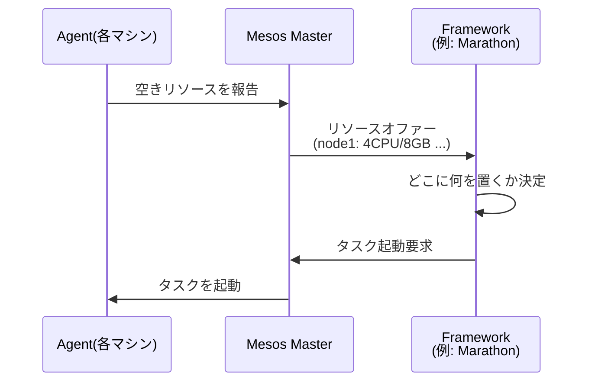

# Apache Mesos

データセンター内の多数のマシンを1つのリソースプールに抽象化するクラスタマネージャ。UC Berkeleyの研究プロジェクトとして始まり、NSDI 2011の論文「Mesos: A Platform for Fine-Grained Resource Sharing in the Data Center」で発表された。Googleの[[google-borg|Borg]]やFacebookのTupperwareといった先行のモノリシックなクラスタ管理システムに学びつつ、対照的にモジュラーな設計を採ったのが特徴。2013年6月にApacheのTop-Level Projectになった。 #infrastructure

## Two-level scheduling

Mesosの設計の核。Mesos本体（master）はスケジューリングの全権を持たず、「リソースオファー」だけを行う。masterが各フレームワークに空きリソース（CPU・メモリ）を提示し、それを使ってタスクをどこに配置するかはフレームワーク側のスケジューラが決める、という2階層の分業になっている。

これにより、性質の異なるワークロード（バッチ処理・長時間稼働サービス・cronジョブなど）が同じクラスタを共有でき、フレームワークごとに最適なスケジューリング戦略を実装できる。

## フレームワーク

Mesos単体ではコンテナやサービスは動かせず、上に載せるフレームワークが必要。

- **Marathon** — 長時間稼働サービス用。「Mesosがデータセンターのカーネルなら、Marathonはinit/upstartデーモン」と説明された
- **Chronos** — 分散cron
- **Spark** — のちのApache Spark。NSDI 2011のMesos論文自体の中で、Mesos上に構築した新フレームワークの実例として登場している

## 盛衰

2010年代半ば、コンテナオーケストレーションの主導権をDocker Swarm・[[kubernetes|Kubernetes]]と争った。TwitterやAirbnbなどでの大規模採用で知られたが、競争はKubernetesの勝利に終わる。

- 商用化を担ったMesosphere社は2018年からDC/OSにKubernetesサポートを追加し始め、2019年8月には社名を**D2iQ**（Day Two IQ）に変更してKubernetes中心の事業へピボットした
- 2021年4月、活動低下を受けてApache Atticへの移行が提案・投票されたが、このときはコミュニティの反対で一旦回避された
- 2025年8月に正式にretireし、同年10月にAttic移行が完了。以後リポジトリはread-onlyで、リリースもセキュリティパッチも提供されない

## 出典

- [Mesos - The Apache Attic](https://attic.apache.org/projects/mesos.html)
- [Mesos: A Platform for Fine-Grained Resource Sharing in the Data Center (NSDI 2011)](https://www.usenix.org/legacy/events/nsdi11/tech/full_papers/Hindman_new.pdf)
- [Apache Mesos Narrowly Avoids a Move to the Attic (for Now) - The New Stack](https://thenewstack.io/apache-mesos-narrowly-avoids-a-move-to-the-attic-for-now/)
- [Mesosphere changes name to D2IQ, shifts focus to Kubernetes, cloud native - TechCrunch](https://techcrunch.com/2019/08/05/mesosphere-changes-name-to-d2iq-shifts-focus-to-kubernetes-cloud-native/)
- [Kubernetes vs. Mesos: Why the Comparison Ended - CyberDefenders](https://cyberdefenders.org/cybersecurity-glossary/kubernetes-vs-mesos/)
