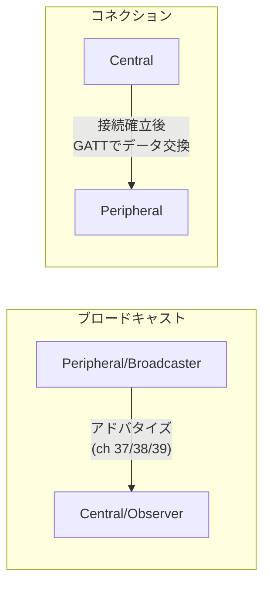

# Bluetooth Low Energy (BLE)

#bluetooth #network #wireless

Bluetooth 4.0 (2010) で導入された低消費電力向けの無線通信規格。従来のBluetooth (BR/EDR, いわゆるClassic Bluetooth) とブランドと2.4GHz帯を共有するが、無線プロトコルとしては別物で互換性はない（両対応のデュアルモードチップが多いので同じものに見える）。コイン電池1個で月〜年単位動くことを狙った設計で、ビーコン・トラッカー・センサー・キーボードなどに広く使われる。[[find-my-network|Find My ネットワーク]]や[[openhaystack|OpenHaystack]]の土台もBLEのアドバタイズ。

## 物理層

- 2.4GHz ISM帯を 2MHz間隔 × 40チャネルに分割
- うち3つ (ch 37: 2402MHz, ch 38: 2426MHz, ch 39: 2480MHz) が**アドバタイジングチャネル**、残り37がコネクション確立後のデータチャネル
- Bluetooth 4.0では1M PHY (1Mbps)。5.0で2M PHY (2Mbps) と、レンジ重視のCoded PHY (Long Range) が追加された。5.1では方向探知 (AoA/AoD) による測位もサポート

## アドバタイズとコネクション

BLEの通信は大きく2モードある。

- **ブロードキャスト** — アドバタイジングチャネルに小さなパケットを一方的に垂れ流す。接続不要で誰でも受信できる。iBeaconやFind My系トラッカーはこれだけで動く
- **コネクション** — Centralがアドバタイズを見つけて接続し、以後はデータチャネル上でGATTによる双方向通信を行う

## GAP: デバイスの役割

GAP (Generic Access Profile) がデバイス間のふるまいを定義する。主な役割は4つ。

| 役割 | ふるまい |
|---|---|
| Peripheral | アドバタイズし、接続を受け付ける（センサー、キーボード等） |
| Central | スキャンして接続しにいく（スマホ、PC等） |
| Broadcaster | アドバタイズのみ、接続は受けない（ビーコン） |
| Observer | スキャンのみ、接続しない（スキャナ） |

## GATT: データモデル

接続後のデータ交換は GATT (Generic Attribute Profile) のクライアント・サーバーモデルで行う。サーバー（通常Peripheral側）が **Service > Characteristic** の階層でデータを公開し、クライアントがread/write/notifyでアクセスする。Service や Characteristic は UUID で識別され、Bluetooth SIG 標準のもの（Battery Service等）は16bit短縮UUID、独自のものは128bit UUIDを使う。16bit UUIDはSIGメンバー企業への割り当て枠もある（例: `0xFCF1` = Google LLC）。

## プライバシー: ランダムアドレス

アドバタイズは誰でも受信できるため、固定MACアドレスを流し続けるとデバイス（≒持ち主）を追跡できてしまう。対策としてBLEには定期的に変わる**ランダムアドレス**の仕組みがあり、アドレス上位2bitで種別が区別される（`01`=resolvable private、`00`=non-resolvable private、`11`=static random）。iPhoneやAirTagがアドレスと鍵をローテーションして第三者追跡を防いでいるのはこの仕組みの上に載っている。逆に[[openhaystack|OpenHaystack]]の自作トラッカーが固定鍵ゆえに追跡され得るのは、この対策を実装していないため。

実際に手元でスキャンして周囲のアドバタイズを観察した記録は [[ble-scan-experiment]] を参照。

## 出典

- [How Bluetooth Low Energy Works: Advertisements (Part 1) — Novel Bits](https://novelbits.io/bluetooth-low-energy-advertisements-part-1/)
- [Bluetooth Low Energy (BLE): A Complete Guide — Lansitec](https://www.lansitec.com/blogs/bluetooth-low-energy-ble-a-complete-guide/)
- [How BLE Actually Works: Architecture, GAP, GATT and Device Roles — Medium](https://medium.com/@sukhdeephunjan/bluetooth-low-energy-ble-how-it-really-works-in-production-systems-1-2091163d08da)
- [Bluetooth SIG Assigned Numbers: Member UUIDs](https://bitbucket.org/bluetooth-SIG/public/raw/main/assigned_numbers/uuids/member_uuids.yaml)
