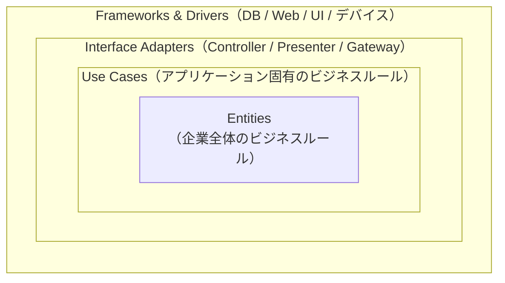
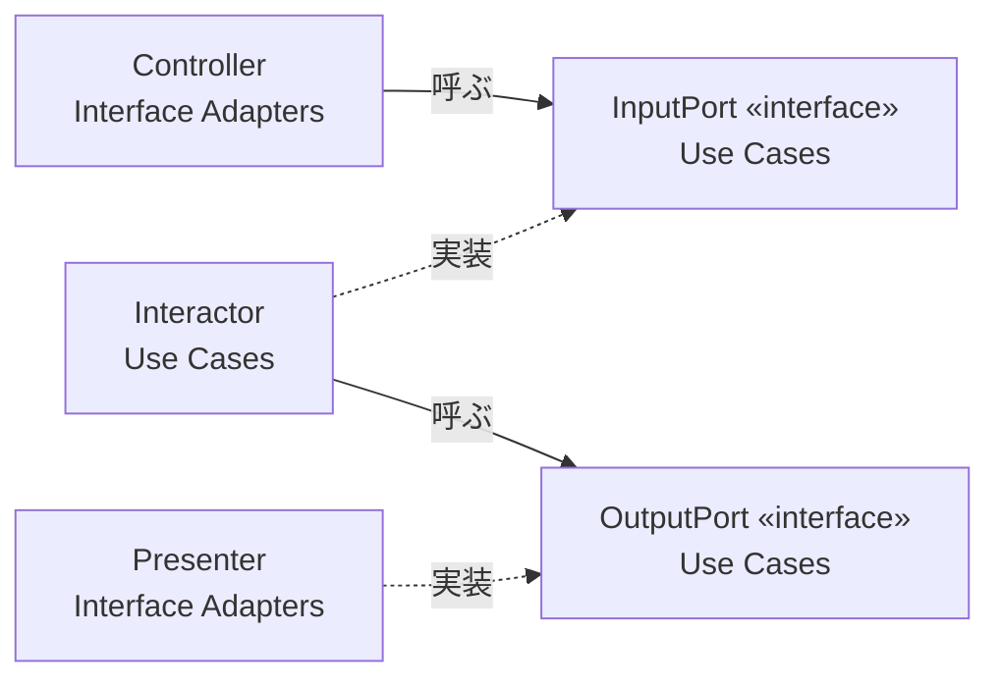

# クリーンアーキテクチャ (Clean Architecture)

#software-engineering #architecture

Robert C. Martin (Uncle Bob) が2012年8月のブログ記事「The Clean Architecture」で提示したアーキテクチャ。2017年の書籍『Clean Architecture: A Craftsman's Guide to Software Structure and Design』（邦訳『[Clean Architecture 達人に学ぶソフトウェアの構造と設計](https://www.amazon.co.jp/dp/4048930656?tag=tokuhirom-22)』）で体系化された。

Martin自身が記事の冒頭で書いている通り、これはゼロから発明されたものではない。[[hexagonal-architecture|ヘキサゴナルアーキテクチャ（ポートとアダプタ）]]、[[onion-architecture|オニオンアーキテクチャ]]、DCI、BCE といった既存のアーキテクチャが「どれも同じ関心の分離を、層への分割によって達成しようとしている」ことに気づき、それらを1枚の同心円図に統合したもの、という位置づけ。

## 依存性ルール (The Dependency Rule)

このアーキテクチャの中心にあるルールは1行で言える。

> source code dependencies can only point inwards.
> （ソースコードの依存は内側にしか向かってはならない）

内側の円は外側の円について何も知らない。外側で定義された名前（クラス名・関数名・変数名、データフォーマット）が内側のコードに現れてはいけない。

## 4つの円

| 円 | 中身 | 変化しやすさ |
|---|---|---|
| Entities | 企業全体で通用する最も汎用的・高レベルなビジネスルール。複数のアプリケーションで共有されうる | 最も変わりにくい |
| Use Cases | このアプリケーション固有のビジネスルール。Entity間のデータの流れをオーケストレーションする | |
| Interface Adapters | ユースケースに都合のよい形式と、外部（DB・Web）に都合のよい形式との相互変換。Controller / Presenter / View / DBマッパーがここ。GUIのMVCはまるごとこの層に入る | |
| Frameworks &amp; Drivers | DB、Webフレームワークなどの具体。「詳細はここに置く」層 | 最も変わりやすい |

Martin自身が念を押しているが、**円は4つとは限らない**。ルールはあくまで「依存は内向き」であって、層の数は設計次第。

## 境界を越える (Crossing Boundaries)

制御フローは「外 → 内 → 外」と往復するのに、依存は内向きにしか張れない。この矛盾を解くのが[[solid-principles|依存性逆転の原則（DIP）]]。「動的ポリモーフィズムを使って、制御の流れと逆向きのソースコード依存を作る」。

具体的には、Use Case層が入力・出力それぞれのインターフェース（Input Port / Output Port）を**自分の側で**定義し、外側のControllerがそれを呼び、外側のPresenterがそれを実装する。

矢印（依存）はすべて外側から内側を向いているのに、制御は Controller → Interactor → Presenter と外へ抜けていく。これが依存性ルールを守ったまま処理を進める仕掛け。

## 境界を越えるデータ

境界をまたぐデータは**単純なデータ構造**にする。Entityオブジェクトやデータベースの行構造をそのまま外へ渡さない。ORMが返す行オブジェクトを内側へ持ち込むと、内側が外側の都合（テーブル定義やフレームワークの型）を知ってしまい、依存性ルールが壊れるため。

## Screaming Architecture

同じ文脈でMartinが2011年に書いた記事。トップレベルのディレクトリ構成を見たとき、それは「Health Care System」と叫んでいるか、それとも「Rails」「Spring/Hibernate」と叫んでいるか、という問いかけ。

> Frameworks are tools to be used, not architectures to be conformed to.
> （フレームワークは使う道具であって、それに合わせるべきアーキテクチャではない）

> The Web is a delivery mechanism ... The fact that your application is delivered over the web is a *detail*.
> （Webは配送手段にすぎない。Web経由で届けているという事実は「詳細」である）

そこから導かれるテストの主張が「Webサーバを起動しなくても全ユースケースをユニットテストできるべき」。テスト容易性が、この構造を採る動機のかなりの部分を占めている（[[tdd|TDD]]と相性がよいとされる理由でもある）。

## 効用として挙げられているもの

- **フレームワーク非依存** — フレームワークを道具として使い、それに縛られない
- **テスト可能** — UI・DB・Webサーバなしにビジネスルールをテストできる
- **UI非依存** — ビジネスルールを変えずにWeb UIをコンソールUIに差し替えられる
- **データベース非依存** — Oracle/SQL Serverを他に差し替えられる
- **外部エージェント非依存** — ビジネスルールが外界について何も知らない

## 批判・限界

事実として指摘されている論点をいくつか。

- **投機的な一般化** — 「DBやフレームワークを差し替えられる」という利点は、実際には要求されないことが多い。かつ単一の実装しか存在しない状態で作った抽象は漏れやすく、差し替え時に結局役に立たない、という指摘（James McKay, 2018）。
- **モデルの多重定義** — 層ごとにほぼ同じ形のDTOを定義してマッピングするため、DRYに反し記述量が増える。Entityが元々ただのデータ構造である言語では、テスト容易性の面での見返りも小さい、という論点。
- **「ビジネスルールは外界から独立」への疑問** — 税制や物流など、ビジネスルールこそ外界の事情そのものである、という反論。
- **規模に対する過剰設計** — 単純なCRUDアプリに全層を適用すると、層とマッピングだけが増える。[[yagni|YAGNI]]や[[technical-debt|技術的負債]]の議論と同じ土俵で、どこまで適用するかの判断が要る。

Martinの原文自体も「これらのルールに従えば」という条件付きの主張であり、[[architecture-decision-record|ADR]]のような形でどこまで適用するかを明示的に決めておく方が扱いやすい。

## [[software-architecture-styles]]の中での位置づけ

[[hexagonal-architecture|ヘキサゴナル]]・[[onion-architecture|オニオン]]の後発の統合版。ヘキサゴナルが「内と外の非対称性」だけを言うのに対し、クリーンアーキテクチャは内側をEntities/Use Casesに割ってあり、[[domain-driven-design|DDD]]の戦術的構成要素と対応づけやすい形になっている。

## 出典

- [The Clean Architecture - Clean Coder Blog (Robert C. Martin, 2012)](https://blog.cleancoder.com/uncle-bob/2012/08/13/the-clean-architecture.html)
- [Screaming Architecture - Clean Coder Blog (Robert C. Martin, 2011)](https://blog.cleancoder.com/uncle-bob/2011/09/30/Screaming-Architecture.html)
- [Just how clean is Uncle Bob's Clean Architecture? - james mckay dot net (2018)](https://jamesmckay.net/2018/09/just-how-clean-is-uncle-bobs-clean-architecture)
- [Hexagonal architecture (software) - Wikipedia](https://en.wikipedia.org/wiki/Hexagonal_architecture_(software))
