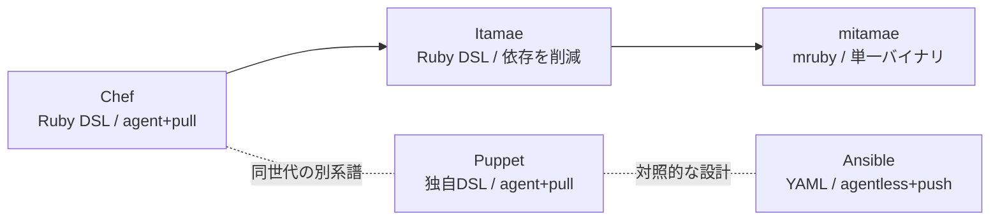

# 構成管理ツール

サーバーのセットアップ・状態維持を自動化する「Infrastructure as Code」系ツール群のハブノート。設計上の主な軸は次の3つ。

- **agent型 vs agentless型** — 管理対象ノードに常駐エージェントを置き、サーバー(master)からpullで設定を取得する方式か、SSHなどでサーバー側からpushする方式か。
- **DSLの種類** — Rubyのような汎用言語の内部DSLで書くか、独自の宣言的言語やYAMLで書くか。
- **対象ノードに何を要求するか** — 常駐エージェントか、Pythonのような処理系か、あるいは転送する単一バイナリだけか。

## 構成管理ツール本体

- [[chef|Chef]] — Ruby DSL、agent/master・pull型。2020年にProgress Softwareが買収し「Progress Chef」に。
- [[puppet|Puppet]] — 独自の宣言的言語、agent/master・pull型。2022年にPerforceが買収、2025年の配布方針変更でコミュニティの反発とフォークの動きを招いた。
- [[ansible|Ansible]] — Red Hat開発、YAML Playbook、agentless・push型。SSH/WinRMでモジュール(Pythonスクリプト)を転送して対象ノード上で実行する。
- [[itamae|Itamae]] — ChefのDSLに影響を受けた日本発の軽量実装。Chef Serverなどの依存を持たない。`itamae ssh`でSSH越しの適用もできる。
- [[mitamae|mitamae]] — Itamaeをmrubyで書き直し、単一バイナリ化・高速化した派生実装。リモート適用の仕組みは持たず、配布は外部ツールに委ねる。

### 比較

| | DSL | 適用方向 | 対象ノードへの要求 | 開発元・出自 |
|:---|:---|:---|:---|:---|
| Chef | Ruby内部DSL | pull (agent) | `chef-client` 常駐 | Progress Software |
| Puppet | 独自宣言的言語 | pull (agent) | Puppet agent 常駐 | Perforce |
| Ansible | YAML + Jinja2 | push (SSH/WinRM) | Python(またはPowerShell) | Red Hat |
| Itamae | Ruby内部DSL | local / push (SSH) | なし(SSH経由でコマンド実行) | 日本のコミュニティ発 |
| mitamae | mruby内部DSL | local(配布は外部委任) | なし(単一バイナリを転送) | 同上 |

## 冪等性のとらえ方

どのツールも「何度流しても同じ状態に収束する」ことを掲げるが、それを保証する主体はツール本体ではなく個々の**リソース/モジュールの実装**である点は共通している。現在の状態を調べて必要なときだけ変更する処理が、`package`や`file`といった単位ごとに書かれている。逆に、素のコマンドを叩くリソース([[ansible|Ansible]]の`command`/`shell`、Itamae系の`execute`)は書き手が`not_if`/`only_if`/`creates`/`changed_when`などで冪等性を与えないと、毎回変更扱いになる。

## 隣接する検証ツール

- [[serverspec|Serverspec]] — 上記ツール(あるいは手作業)で設定した結果をRSpec構文でテストする、構成管理ツールとは異なるカテゴリの検証ツール。Itamae/mitamaeは基盤ライブラリSpecinfraをServerspecと共有している。

## 隣接する領域

「サーバーの中身を望む状態にする」構成管理ツールに対して、別レイヤで同じ問題に触れるツール群。

- [[terraform|Terraform]] — クラウド上のリソース(VM・ネットワーク・マネージドサービス)そのものを宣言的に作る。作られたVMの中身をどうするかは構成管理ツールの領分。
- [[ignition|Ignition]] — initramfsの段階で初回起動時に1回だけ走るプロビジョニング。継続的に状態を維持するのではなく、最初の一撃を担当する。
- [[nixos|NixOS]] — システム全体の状態を宣言的な設定から丸ごと再構築する。個々のリソースを収束させるのではなく、システム構成そのものを関数的に生成するアプローチ。

## 系譜のまとめ

[[chef|Chef]]のRuby DSLという発想は日本の[[itamae|Itamae]]に受け継がれ、さらに[[mitamae|mitamae]]がmrubyで書き直して単一バイナリ・高速化を実現するという派生関係にある。一方、[[puppet|Puppet]]は独自DSL・agent型という点でChefと共通の設計思想を持ちながら別系譜。[[ansible|Ansible]]はagentless・push型・YAMLという、これらとは異なる設計を選んだツールという位置づけになる。

Chef → Itamae → mitamae の系譜は「削っていく」方向に一貫している。ChefはChef Server・Cookbook・Role・Data Bagsといった仕組み一式を持ち、Itamaeはそれらを落としてレシピ機能だけにし、mitamaeはさらに処理系をmrubyに置き換えてRubyGemsもリモート実行機能も外した。

#infrastructure-as-code #moc
