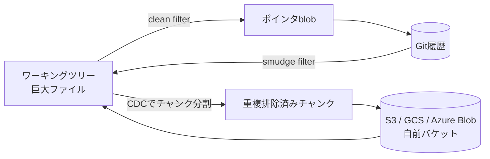

# Crab (サーバーレスな大容量ファイル向けGit)

MLモデル・データセット・メディア・ゲームアセット・ビルド成果物といった大きなファイルを、Gitのblobに入れずに**自分が管理するオブジェクトストレージ**へ置き、Git側にはポインタファイルだけを残すRust製CLI。開発元はBeyondnote Technology Inc、Apache-2.0。

Git LFSと目的は同じだが、LFSがホストされたLFSエンドポイント(GitHubの従量課金や自前サーバー)を必要とするのに対し、Crabは**サーバーを立てずにS3/GCS/Azure Blobへ直接**書き込む。「Own your storage」を掲げている。

同名の[CrabLang](https://github.com/crablang/crab)(2023年のRustのフォーク)とは無関係の別プロジェクト。

## 仕組み

Gitへの統合点は2つだけ。

1. **フィルタドライバ** — 追跡対象ファイルをclean/smudgeでポインタblobに変換する
2. **`git-remote-crab`** — `crab://`リモート用のremote helper。Gitオブジェクトと実体を転送する

つまりclone/branch/commit/merge/pushといった普段のGitコマンドはそのまま使える。

実体はXetプロトコル(Hugging Faceが使っているものと同系統)でチャンク分割され、同一チャンクは一度しかアップロードされない。分割はGearhashによるcontent-defined chunking(CDC)。ここがファイル丸ごとを送るGit LFSとの一番の差で、巨大な`.safetensors`を少し書き換えただけなら差分チャンクだけの転送で済む。



## 使い方

```sh
brew install crabbuild/tap/crab
# または curl -fsSL https://crab.build/install.sh | bash

crab configure s3://my-bucket/my-project   # gs:// / azure:// も指定できる
crab track '*.safetensors'
crab ship . -m "Initial commit"
```

日常操作は`crab clone`(遅延クローン)・`crab push`・`crab pull`・`crab status`。

特徴的なのが**hydrate / dehydrate**。

```sh
crab hydrate '*.safetensors'   # 必要なファイルだけ実体化する
crab dehydrate --all           # リモートを消さずにローカルディスクを解放する
```

## 設定ファイル

コミットする`crab.toml`と、マシン固有でコミットしない`.crab/local.toml`に分かれている。

```toml
# crab.toml
[remote]
url = "crab://my-bucket/my-project"

[auth]
storage_provider = "s3"

[track]
patterns = ["*.safetensors", "*.bin", "datasets/**"]

[hydrate]
default = "lazy"
```

`.crab/local.toml`にはAWSプロファイル・キャッシュパス・チューニング値が入る。

## 対応ストレージ

| バックエンド | 指定 | 認証 |
| --- | --- | --- |
| Amazon S3 | `s3://bucket/repo` | AWSプロファイル / SSO / ロール |
| S3互換 | `crab://bucket/repo --provider s3` | 環境変数のキー + エンドポイント |
| Google Cloud Storage | `gs://bucket/repo` | ADC または `GOOGLE_APPLICATION_CREDENTIALS` |
| Azure Blob | `azure://container/repo` | Identity / 接続文字列 / SAS |

## その他の機能

- `crab mount` — [[fuse-filesystem-in-userspace|FUSE]]/NFSによる仮想ファイルシステム
- `crab run` / `crab repro` / `crab exp` — DVC的なワークフロー実行・再現・実験管理
- `crab lfs` — Git LFSとの相互運用
- `crab gc` / `crab fsck` / `crab compact` — メンテナンス
- `--json` / `--jsonl` — 自動化向けの構造化出力

大規模チーム向けにはオプションのCrab Auth ServiceとCrab Cache Serviceがある。

## 似た発想のもの

サーバーレスにS3をGitリモートとして使う先行例に[git-remote-s3](https://github.com/awslabs/git-remote-s3)(AWS Labs)がある。Crabはそれに加えてチャンク単位の重複排除と遅延ハイドレートまで持っている点で、Git LFSよりDVC/Xet寄りの機能セットになっている。

## 出典

- [crabbuild/crab (GitHub)](https://github.com/crabbuild/crab)
- [Crab — Git for any file at any scale](https://crab.build/)
- [About Us | Crab](https://crab.build/about-us)
- [awslabs/git-remote-s3](https://github.com/awslabs/git-remote-s3)

#git #rust #aws #data-engineering #cli
