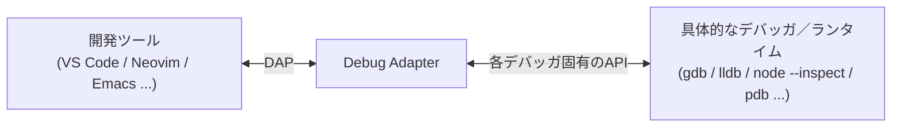
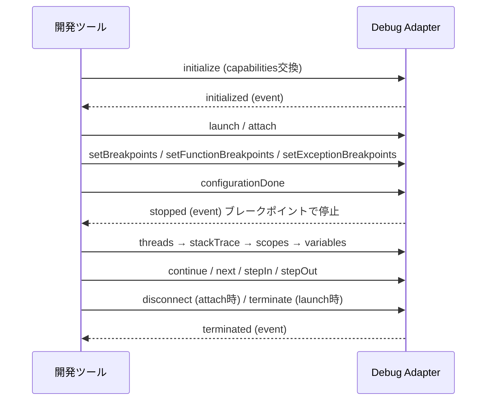

# DAP (Debug Adapter Protocol)

エディタ／IDEとデバッガの間に挟まる共通プロトコル。ブレークポイントの設定、ステップ実行、変数の覗き見、コールスタックの表示といった**デバッグUIの操作**を、言語や実行環境に依存しない抽象的なメッセージとして定義する。 #protocol

[[lsp|LSP]]が「言語のインテリジェンス」に対してやったことを、DAPは「デバッグ」に対してやっている。実際DAPはLSPの2016年のアプローチを踏襲したもので、コード補完側の標準化がLSP、デバッグ側の標準化がDAP、という対になっている。現行の仕様バージョンは **1.71.0**。

## 解いている問題

デバッガをIDEに新しく組み込むのは重い作業で、しかもその労力はそのIDE1つぶんにしか効かない。ブレークポイントのUI・変数ビュー・ウォッチ式・マルチスレッド表示・デバッグコンソール（REPL）といった部品を、IDEごと × デバッガごとに作り直すことになる。DAPは間にプロトコルを挟むことでこれをN+Mにする。LSPやMCPと同じ発想。

## アーキテクチャ



「debug adapter」は、既存のデバッガのAPIをDAPのメッセージに翻訳する層。デバッガ自体を書き直す必要はない。

起動形態は2つある。

- **single session** — 開発ツールがアダプタを子プロセスとして起動し、stdin/stdoutで話す（LSPと同じ形）
- **multi session** — すでに動いているアダプタに、指定ポートで接続しにいく

## メッセージの形

土台は[[json-rpc|JSON-RPC]]ではなく、（今はもう廃れた）V8 Debugging Protocolに由来する独自のJSON形式。ただしフレーミングはLSPと同じくHTTPライクな `Content-Length` ヘッダ方式。

```
Content-Length: 79\r\n
\r\n
{"seq": 153, "type": "request", "command": "next", "arguments": {"threadId": 3}}
```

メッセージの `type` は3種類。

- `request` — 開発ツールからアダプタへの要求（`command` と `arguments` を持つ）
- `response` — その返答
- `event` — アダプタ側から非同期に飛んでくる通知（`stopped`、`terminated` など）

LSPの `id` にあたるのが `seq`。

## ライフサイクル



- `launch` はデバッガ側がプロセスを起動する形、`attach` はすでに動いているプロセスに繋ぐ形。終了時にどちらを使うか（`terminate` か `disconnect` か）もこれに対応する。
- `stopped` イベントが来たら、開発ツールは `threads` → `stackTrace` → `scopes` → `variables` と**階層的に問い合わせて**画面を埋める。全部を先読みで送らず、ユーザーがツリーを開いたぶんだけ取りにいく設計になっている。

## reverse request

アダプタから開発ツール**へ**要求を出せる仕組みもある。代表例が `runInTerminal` で、「デバッグ対象のプロセスを、統合ターミナル（または外部ターミナル）で起動してくれ」とアダプタが開発ツールに頼む。アダプタが単純に子プロセスとして起動してしまうと標準入出力が繋がらずインタラクティブなプログラムをデバッグできない、という制約を回避するためのもの。

## LSPとの違い

| | LSP | DAP |
|---|---|---|
| 対象 | 静的な言語解析（補完・定義ジャンプ・診断） | 実行中プロセスの制御と観察 |
| 土台 | JSON-RPC 2.0 | V8 Debugging Protocol由来の独自JSON |
| フレーミング | `Content-Length` ヘッダ | 同じく `Content-Length` ヘッダ |
| ドキュメントの正 | エディタのバッファ | 実行中のプロセスの状態 |
| 抽象度 | 言語ごとの概念が漏れやすい | 言語非依存で、ユーザーに見える情報に絞っている |

DAPの仕様が「高レベルかつ言語非依存」を明示的に掲げているのが特徴で、デバッガ内部の都合ではなくユーザーが画面で見るもの（スタックフレーム、スコープ、変数）を単位にしている。

## 出典

- [Official page for Debug Adapter Protocol](https://microsoft.github.io/debug-adapter-protocol/)
- [Debug Adapter Protocol - Overview](https://microsoft.github.io/debug-adapter-protocol/overview)
- [Debug Adapter Protocol - Specification](https://microsoft.github.io/debug-adapter-protocol/specification)
