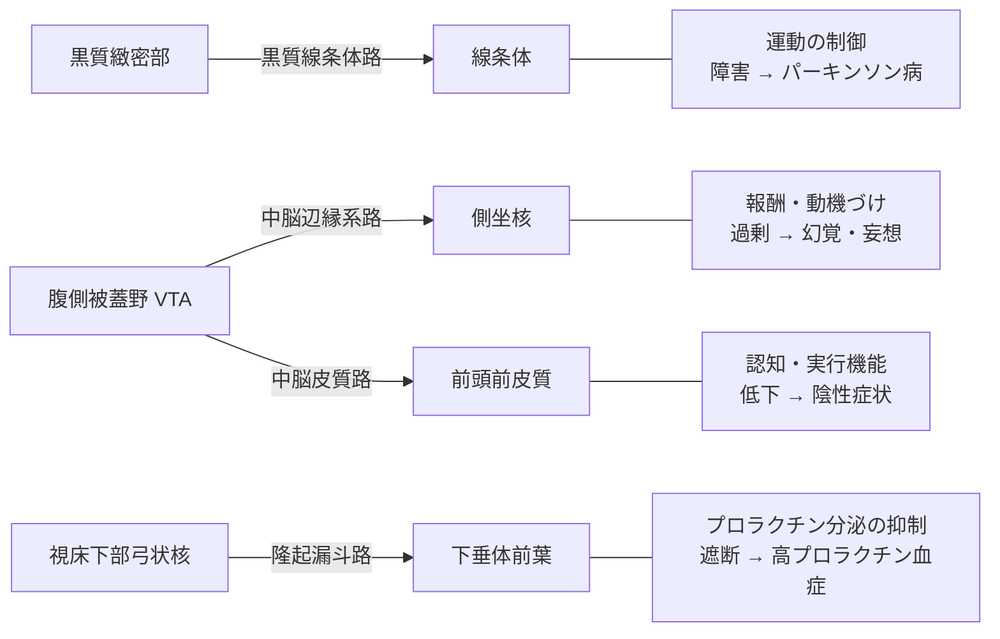

# ドーパミン

カテコール核を持つモノアミン系の神経伝達物質。カテコールアミン（ドーパミン・ノルアドレナリン・アドレナリン）の一員で、生合成上はノルアドレナリン・アドレナリンの前駆体でもある。分子式 C8H11NO2、分子量約153。

医学・薬学の分野では**ドパミン**という表記が使われることが多い（e-ヘルスネットや添付文書もこの表記）。一般向けには「ドーパミン」が定着している。

「快楽物質」として紹介されることが多いが、後述のとおり研究上はむしろ**快そのものではなく「欲しい」という動機づけや予測の誤差**を担う物質として理解されている。運動制御・ホルモン分泌にも関わり、報酬系に閉じた話ではない。

## 生合成と分解

原料はアミノ酸のL-チロシン。

```
L-チロシン
  ↓ チロシン水酸化酵素 (TH)   ← 律速段階
L-DOPA
  ↓ 芳香族L-アミノ酸脱炭酸酵素 (AADC)
ドーパミン
  ↓ ドーパミンβ水酸化酵素 (DBH)      ※ノルアドレナリン作動性ニューロン・副腎髄質のみ
ノルアドレナリン → アドレナリン
```

AADCは[[serotonin|セロトニン]]の合成にも使われる共通の脱炭酸酵素で、5-HTPからセロトニンを作るのと同じ酵素がL-DOPAからドーパミンを作る。

分解はMAO（モノアミン酸化酵素）経路とCOMT（カテコール-O-メチル基転移酵素）経路の2通りがあり、最終代謝産物は**ホモバニリン酸 (HVA)**。セロトニンの5-HIAAに相当する指標として使われる。

## 4つの投射系

ドーパミン作動性ニューロンの投射先は大きく4系統に分けられ、それぞれ担う機能も、破綻したときに出る症状も異なる。この「経路ごとに役割が違う」という点が、ドーパミン系の薬の副作用を理解する鍵になる。



## 受容体

D1〜D5の5サブタイプがあり、すべてGタンパク質共役受容体 (GPCR)。薬理学的な性質から2群に分けられる。

| 群 | サブタイプ | Gタンパク質 | 備考 |
| --- | --- | --- | --- |
| D1様 | D1, D5 | Gs（cAMP↑） | 線条体では主に直接路の投射ニューロンに分布 |
| D2様 | D2, D3, D4 | Gi（cAMP↓） | 抗精神病薬の主要標的。D1よりアフィニティが約100倍高い |

## 報酬予測誤差

中脳ドーパミンニューロンの位相性（phasic）発火は、**報酬予測誤差 (reward prediction error, RPE)** を符号化していると考えられている。Schultzらの一連の研究（1997年〜）で示されたもので、挙動は次のようになる。

- 予期しない報酬が得られた → 発火が増える（正の誤差）
- 予測どおりの報酬 → 発火はほぼ変化しない
- 予測した報酬が得られなかった → 発火が抑制される（負の誤差）

「報酬そのもの」ではなく「予想と実際のズレ」を伝えているという点が重要で、これは強化学習のTD誤差 (temporal difference error) とほぼ同じ形をしている。計算論的神経科学と機械学習が接続する代表的な事例としてよく引かれる。

## 「快感」ではなく「欲しい」

Berridgeらは、報酬を **liking（快の感覚そのもの）** と **wanting（インセンティブ・サリエンス、対象に引きつけられる動機づけ）** に分離できることを示した。彼らの結論は、中脳辺縁系ドーパミンが担っているのは wanting の方であり、liking はドーパミンに依存しない、より小さく脆弱な神経系が担っている、というもの。

この区別は依存症の説明として説得力がある。依存が進行した状態では「もはや大して快くないのに、強烈に欲しい」という乖離が起きるが、wanting と liking が別系統だとすればこれは自然な帰結になる（インセンティブ感作理論）。

「ドーパミンが出る＝気持ちいい」という通俗的な理解が、この線でずれている部分になる。

## パーキンソン病とL-DOPA

黒質緻密部のドーパミンニューロンが変性・脱落し、黒質線条体路のドーパミンが枯渇することで、無動・筋強剛・振戦といった運動症状が生じる。

治療にはドーパミンそのものではなく前駆体の**L-DOPA（レボドパ）**を用いる。ドーパミンは血液脳関門 (BBB) を通過できないが、L-DOPAはアミノ酸トランスポーターを介して通過できるため。

ただしL-DOPAは末梢にもAADCがあるため、そのまま投与すると大部分が脳に届く前に末梢でドーパミンに変換されてしまい、悪心や起立性低血圧の原因にもなる。そこで**カルビドパやベンセラジドといった末梢性脱炭酸酵素阻害薬 (PDI) を併用する**のが標準になっている。PDI自体はBBBを通過しないので、末梢の変換だけを選択的に止められる。PDIなしでは中枢に到達するL-DOPAは1〜5%程度とされ、併用によって生物学的利用能はおよそ2倍になる。

## 統合失調症のドーパミン仮説

抗精神病薬の効果がD2受容体遮断作用と相関することから、統合失調症をドーパミン過剰で説明する仮説が古くから唱えられてきた。仮説は段階的に改訂されている。

- **version I** — 全般的なドーパミン過剰が原因
- **version II** — 皮質下（線条体）のドーパミン過剰と、前頭前皮質のドーパミン低下の併存
- **version III**（Howes & Kapur, 2009） — 病因の焦点をD2受容体そのものではなく、**シナプス前のドーパミン合成・放出の制御異常**に置く。妊娠・分娩合併症、ストレス、薬物使用、遺伝といった多様なリスク因子が、線条体のシナプス前ドーパミン機能亢進という「最終共通経路」に収束し、**アバラント・サリエンス（aberrant salience: 本来意味を持たない刺激に過剰な重要性が付与される）**を通じて精神病症状を生むとする枠組み。

version IIIの含意として、現行の抗精神病薬（D2遮断）は異常の下流に作用しているにすぎず、上流の因子を標的にすべきだと論じられている。

なお前述の4経路の話に戻ると、D2遮断薬は目的とする中脳辺縁系路だけでなく他の経路も一律に遮断してしまうため、黒質線条体路の遮断による錐体外路症状、隆起漏斗路の遮断による高プロラクチン血症が副作用として現れる。

## 出典

- [ドパミン | e-ヘルスネット（厚生労働省）](https://www.e-healthnet.mhlw.go.jp/information/dictionary/alcohol/ya-047.html)
- [ドーパミン - 脳科学辞典](https://bsd.neuroinf.jp/wiki/%E3%83%89%E3%83%BC%E3%83%91%E3%83%9F%E3%83%B3)
- [Current Concepts on the Physiopathological Relevance of Dopaminergic Receptors - Frontiers in Cellular Neuroscience](https://www.frontiersin.org/journals/cellular-neuroscience/articles/10.3389/fncel.2017.00027/full)
- [Predictive Reward Signal of Dopamine Neurons (Schultz, 1998) - Journal of Neurophysiology](https://journals.physiology.org/doi/full/10.1152/jn.1998.80.1.1)
- [Dopamine reward prediction-error signalling: a two-component response - Nature Reviews Neuroscience](https://www.nature.com/articles/nrn.2015.26)
- [Neuroscience of Liking and Wanting - Berridge Lab, University of Michigan](https://sites.lsa.umich.edu/berridge-lab/research-overview/neuroscience-of-linking-and-wanting/)
- [The debate over dopamine's role in reward: the case for incentive salience - PubMed](https://pubmed.ncbi.nlm.nih.gov/17072591/)
- [Peripheral decarboxylase inhibitors paradoxically induce aromatic L-amino acid decarboxylase - npj Parkinson's Disease](https://www.nature.com/articles/s41531-021-00172-z)
- [Carbidopa - StatPearls, NCBI Bookshelf](https://www.ncbi.nlm.nih.gov/books/NBK554552/)
- [The Dopamine Hypothesis of Schizophrenia: Version III—The Final Common Pathway - PMC](https://pmc.ncbi.nlm.nih.gov/articles/PMC2669582/)

#生物 #医療 #神経科学
