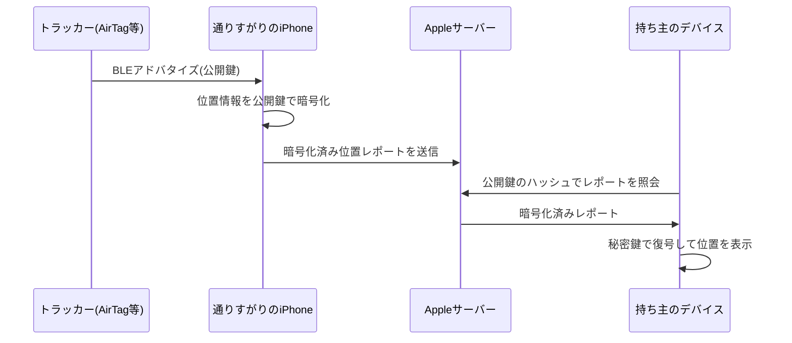

# Find My ネットワーク

#apple #bluetooth #security

Apple の「探す」(Find My) アプリの背後にある、クラウドソーシング型の位置特定ネットワーク。世界中の Apple デバイス（iPhone/iPad/Mac）が匿名のリレーとして働き、オフラインのデバイスやアクセサリ（AirTag など）の位置を持ち主に届ける。数億台規模のデバイスが参加しているため、事実上世界最大級の位置特定網になっている。

## 仕組み

1. トラッカーは楕円曲線 (P-224) の公開鍵を BLE (Bluetooth Low Energy) アドバタイズとして常時発信する
2. 近くを通りかかった他人の iPhone が、それを拾って自分の現在位置をその公開鍵で暗号化し、Apple のサーバーへ自動アップロードする（ユーザーは意識しない）
3. 持ち主は対応する秘密鍵でレポートを復号し、位置を知る

## 設計上のポイント

- **エンドツーエンド暗号化** — 位置レポートは発信元の iPhone 上で公開鍵暗号化されるため、Apple 自身もレポートの中身（位置）を読めない。またどの公開鍵がどのアカウント・デバイスに対応するかも Apple は知らない。
- **鍵のローテーション** — AirTag などの正規アクセサリは発信する公開鍵を定期的にローテーションし、BLE アドレスも変えることで、第三者による長期追跡（トラッキング）を防いでいる。
- **裏返すと** — 「公開鍵を知っていれば誰でも対応するレポートを取得できる」設計なので、リバースエンジニアリングにより Apple 製ハードウェア以外からこのネットワークに相乗りできる。これを実装したのが [[openhaystack|OpenHaystack]]。

## ストーカー対策

AirTag の登場後、意図しない追跡（持ち物に勝手に AirTag を仕込まれる等）が問題になり、「知らない AirTag が一緒に移動しています」という通知や、AirTag 自身のスピーカー鳴動などの対策が入っている。Google も Android 側で同種の Find My Device ネットワークを構築しており、Apple/Google は不明トラッカー検出のための業界仕様 (DULT: Detecting Unwanted Location Trackers) を IETF で共同策定した。

## 出典

- [Apple Platform Security: Find My のセキュリティ](https://support.apple.com/ja-jp/guide/security/sec6cbc80fd0/web)
- [OpenHaystack: A Framework for Tracking Personal Bluetooth Devices via Apple's Massive Find My Network (WiSec 2021)](https://dl.acm.org/doi/10.1145/3448300.3468251)
