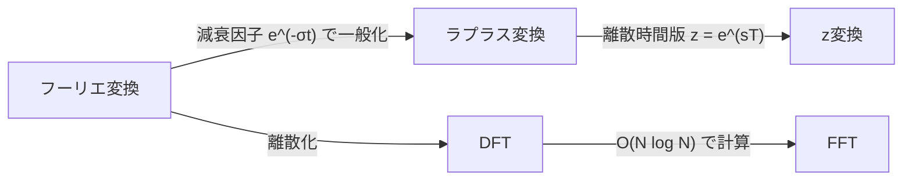

# 周波数領域の変換

時間領域（あるいは空間領域）の信号・関数を、周波数領域に写してから扱う手法群のハブノート。「時間領域では難しい操作（微分方程式・畳み込み・スペクトル分析）が、変換先では簡単な代数演算になる」という共通の発想でつながっている。

#math #signal-processing #moc

## 配下ノート

- [[fourier-transform]] — 信号を正弦波の重ね合わせに分解する、この分野の基本となる積分変換
- [[laplace-transform]] — フーリエ変換に減衰因子を加えて発散する信号にも適用できるようにした一般化。微分方程式の求解・制御理論・回路解析向き
- [[fft]] — 離散版（DFT）を \(O(N \log N)\) で計算するアルゴリズム。連続の理論を計算機で実用にした立役者

## まだ独立ノートになっていない隣接概念

DFT・フーリエ級数・z変換・DCT（JPEG/MP3で使われる）・OFDM など。
