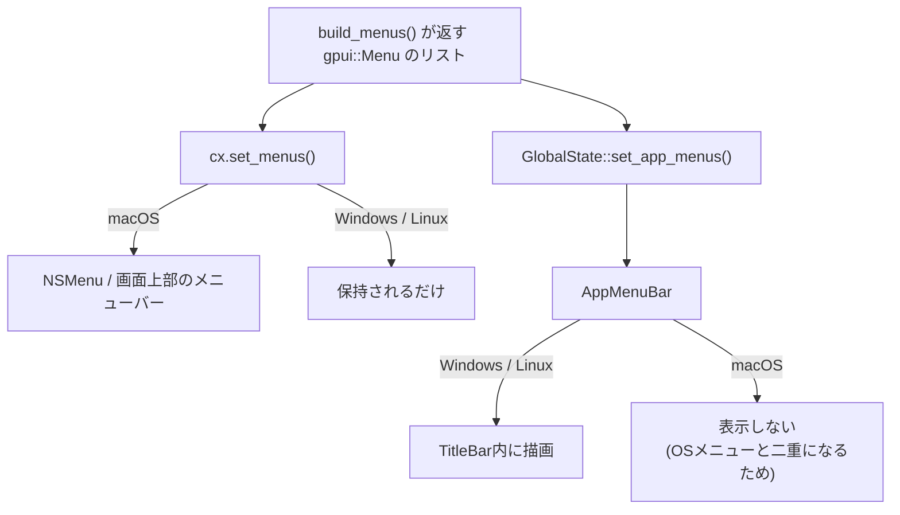

# GPUI Kitでのクロスプラットフォームなメニュー

#rust #gui

[[gpui-kit|GPUI Kit]]でmacOS/Windows/Linuxの3つを対象にデスクトップアプリを作るとき、メニューをどう組むかの整理。結論としては、

1. アプリケーションメニュー(File/Edit/Help…)は`gpui::Menu`で**一度だけ定義**し、macOSでは`cx.set_menus()`でOSのメニューバーに、Windows/Linuxでは`AppMenuBar`コンポーネントでタイトルバーの中に描く。
2. 右クリックメニュー・ドロップダウンは、既定ではGPUIが自前で描く`PopupMenu`を使う。ウィンドウの外にはみ出したいときだけ`NativeMenu`にする。
3. どちらも`Action`をdispatchする仕組みは共通なので、メニュー項目の定義自体はプラットフォームで分岐しない。分岐するのは「どこに描くか」だけ。

## GPUIの`set_menus`はmacOSでしか実体を持たない

[[gpui|GPUI]]の`App::set_menus()`は`Platform::set_menus()`に委譲される。この実装がプラットフォームごとにまるで違う。

| プラットフォーム | `set_menus`の挙動 |
| --- | --- |
| macOS | `NSMenu`を組み立てて`NSApplication::setMainMenu_`に渡す。画面上部に本物のメニューバーが出る |
| Windows | 受け取った`Menu`を`OwnedMenu`に変換して構造体に保持するだけ。UIは一切出ない |
| Linux | 同じく保持するだけ。UIは一切出ない |

Windows/Linuxの実装(`crates/gpui_linux/src/linux/platform.rs`、`crates/gpui_windows/src/platform.rs`)は文字通りこれだけ。

```rust
fn set_menus(&self, menus: Vec<Menu>, _keymap: &Keymap) {
    self.inner.with_common(|common| {
        common.menus = menus.into_iter().map(|menu| menu.owned()).collect();
    })
}
```

保持された内容は`cx.get_menus()`で読み出せる。つまり[[gpui|GPUI]]は「メニューの定義を持っておくストア」までは面倒を見るが、**macOS以外ではそれを描画する責任をアプリ側に投げている**。[[tauri]]のTAOのようにOSのメニューバー抽象を持っているわけではない。

Zed本体も同じ構造で、`crates/title_bar/src/application_menu.rs`の`ApplicationMenu`が`cx.get_menus()`を読んで自前で描いている。macOSではこれを作らない(`ZED_USE_CROSS_PLATFORM_MENU`環境変数を付けたときだけ描く)分岐が入っている。



## `AppMenuBar` — Windows/Linux向けのアプリケーションメニュー

GPUI Kitはこの穴を埋める`gpui_kit::component::menu::AppMenuBar`を持っている。ドキュメンテーションコメントにもそのまま「The application menu bar, for Windows and Linux.」と書かれている。

注意点として、`AppMenuBar`が読むのは`cx.get_menus()`ではなく**GPUI Kit側の`GlobalState`**である。したがってメニューを更新するときは2箇所に同じものを流し込む必要がある。story(公式のデモアプリ)の`crates/story/src/app_menus.rs`がその手本になっている。

```rust
fn update_app_menu(title: impl Into<SharedString>, app_menu_bar: Entity<AppMenuBar>, cx: &mut App) {
    let title: SharedString = title.into();

    // macOS: 本物のメニューバーを作る
    cx.set_menus(build_menus(title.clone(), cx));
    // Windows/Linux: AppMenuBarが読むストアにも同じものを入れる
    let menus = build_menus(title, cx)
        .into_iter()
        .map(|menu| menu.owned())
        .collect();
    GlobalState::global_mut(cx).set_app_menus(menus);

    app_menu_bar.update(cx, |menu_bar, cx| {
        menu_bar.reload(cx);
    })
}
```

メニュー定義自体は素の`gpui::Menu` / `gpui::MenuItem`。

```rust
Menu {
    name: title.into(),
    items: vec![
        MenuItem::action("About", About),
        MenuItem::Separator,
        MenuItem::Submenu(Menu {
            name: "Appearance".into(),
            items: vec![
                MenuItem::action("Light", SwitchThemeMode(ThemeMode::Light))
                    .checked(!cx.theme().mode.is_dark()),
                MenuItem::action("Dark", SwitchThemeMode(ThemeMode::Dark))
                    .checked(cx.theme().mode.is_dark()),
            ],
            disabled: false,
        }),
        MenuItem::Separator,
        MenuItem::action("Quit", Quit),
    ],
    disabled: false,
}
```

### 表示の分岐は`cfg!(target_os = "macos")`で

storyでは「タイトルバーの中にメニューバーを描くか」をアプリの状態として持ち、既定値をmacOSかどうかで切り替えている。macOSで両方出すとOSのメニューバーと同じものが2つ並ぶことになるので、これが基本形。

```rust
// macOS draws the app menus in the system menu bar, so an in-window
// menu bar would be a second copy of them. Off by default there,
// but still switchable so the component stays demoable on a Mac.
show_app_menu_bar: !cfg!(target_os = "macos"),
```

`AppMenuBar`は`TitleBar`の子として置く。

```rust
TitleBar::new()
    .child(div().flex().items_center().child(app_menu_bar.clone()))
```

タイトルバーを自前で描くので、ウィンドウ生成時に`TitleBar::window_options()`を使う(`titlebar`オプションと、macOS向けの`app_owns_titlebar_drag: true`がセットされる)。

### 動的な更新は作り直して`reload()`

チェック状態(テーマのLight/Dark)や、ロケール切替でのラベル変更は、`Menu`を組み直して`update_app_menu`を呼び直すのが公式storyのやり方。`cx.observe_global::<Theme>()`や`cx.on_action(|s: &SelectLocale, ...|)`にフックしている。メニュー項目を部分的に書き換えるAPIは無い。

### フォーカスの引き継ぎ

Edit系のメニュー(Copy/Paste/Undo)を`AppMenuBar`から出すときの落とし穴。メニューを開くとフォーカスがメニュー側に移るので、そのままactionをdispatchすると入力欄に届かない。`AppMenuBar`はメニューを開く直前の`window.focused(cx)`を`action_context`として覚えておき、`PopupMenu::set_action_context()`経由で「元のフォーカス先に戻してからdispatchする」ようになっている。自前でメニューバーを実装する場合はここを再発明する必要がある。

## 右クリックメニュー・ドロップダウン

こちらはアプリケーションメニューと別系統で、2つの選択肢がある。

### `PopupMenu`(GPUIが描く)

`ContextMenuExt::context_menu()`(右クリック)と`DropdownMenu::dropdown_menu()`(ボタン等)が、内部で共通の`PopupMenu`を使う。全プラットフォームで同一の見た目・同一のテーマ・同一のキーボード操作(↑↓で項目、←→でサブメニュー、Enter/Space決定、Escape閉じる)になる。キーバインドが張られているactionには自動でショートカット表記が付く。

```rust
Button::new("menu-btn")
    .label("Open Menu")
    .dropdown_menu(|menu, window, cx| {
        menu.menu("New File", Box::new(NewFile))
            .menu("Open File", Box::new(OpenFile))
            .separator()
            .menu("Exit", Box::new(Exit))
    })
```

`context_menu()`は`std::panic::Location::caller()`から安定したElementIdを作るので、明示的なIDを付けなくても再レンダリングでメニューが閉じない。

欠点は**ウィンドウの内側にクリップされること**。小さいウィンドウの下端付近で右クリックすると、メニューが切れる。

### `NativeMenu`(OSが描く)

その欠点を埋めるのが`gpui_kit::component::native_menu::NativeMenu`。ウィンドウ境界を超えて出せる。

```rust
NativeMenu::new()
    .menu("Copy", Box::new(Copy))
    .menu("Paste", Box::new(Paste))
    .separator()
    .menu("Delete", Box::new(Delete))
    .show(position, window, cx);
```

バックエンドはプラットフォームごとに違う。

| プラットフォーム | 実装 |
| --- | --- |
| macOS | objc2で`NSMenu`を組み、`popUpMenuPositioningItem_atLocation_inView`で表示 |
| Windows | `CreatePopupMenu` + `AppendMenuW` + `TrackPopupMenuEx` |
| Linuxほか | ネイティブポップアップが無いので**`PopupMenu`による描画にフォールバック**(`native_menu/fallback.rs`)。ウィンドウにクリップされる制約は戻ってくるが、APIは全プラットフォームで通る |

アイコンの扱いも分かれる。macOSはテンプレート画像として`NSMenuItem::image`に、Windowsは`HBITMAP`にして`MENUITEMINFOW::hbmpItem`に入る(SVGは`resvg`でラスタライズ、他形式はGDI+がデコード)。Linuxのフォールバックでは通常の`Icon`として描かれる。

`NativeMenu`は`gpui::Menu`から`From`で変換できるので、アプリケーションメニューの定義を右クリックメニューに使い回すこともできる。ただし`SystemMenu`(macOSのServices)は対応物が無いので黙って落ちる。

`show()`はOSのトラッキングループをGPUIのコールスタックの外で回すので、開いている間GPUIをborrowしない設計になっている。

## タイトルバーそのものの差異

`TitleBar`はOS標準のタイトルバーを置き換えるコンポーネントなので、メニューを載せる土台としてプラットフォーム差を吸収してくれる。

- **macOS** — 信号機ボタン(traffic lights)はネイティブのものが`(9px, 9px)`に出る。そのぶん左パディングが80px入るので、`AppMenuBar`を左端に置くとボタンと重ならないよう寄る。ダブルクリックは`window.titlebar_double_click()`。
- **Windows** — 最小化/最大化/閉じるを自前で描く(各34px幅)。`WindowControlArea`でOSにスナップレイアウト等を伝える。左パディングは12px。
- **Linux** — コントロールボタンを自前で描き、クリックも自前で処理する。閉じる動作は`on_close_window()`で差し替えられる(Linux専用API)。タイトルバー上の右クリックで`window.show_window_menu(position)`を呼び、コンポジタのウィンドウメニューを出す。

## 落とし穴まとめ

- `cx.set_menus()`だけ書いてWindows/Linuxで「メニューが出ない」となるのが最初の罠。無視されているのではなく、描画する側が居ないだけ。
- GPUI Kitの`AppMenuBar`は`cx.get_menus()`ではなく`GlobalState`を見るので、**`cx.set_menus()`と`GlobalState::set_app_menus()`の両方を呼ぶ**。片方だけだとmacOSとそれ以外で内容がずれる。
- `MenuItem::os_action(name, action, OsAction::Copy)`の`OsAction`(Cut/Copy/Paste/SelectAll/Undo/Redo)はmacOSのメニュー構築でしか参照されない。`MenuItem::SystemMenu(OsMenu { menu_type: SystemMenuType::Services })`も同様にmacOS専用で、`AppMenuBar`側の変換では`OwnedMenuItem::SystemMenu(_) => {}`と読み飛ばされる。
- 逆にmacOSに無いものもある。`cx.set_dock_menu()`はmacOSではDockアイコンの右クリックメニュー、Windowsではタスクバーのジャンプリストになり、Linuxでは`// todo(linux)`で未実装。
- Linuxにはグローバルメニュー(Unity/KDEのDBus appmenu)への対応が無い。GNOME/KDEのパネル側にメニューを出したいという要求は現状GPUIでは満たせず、ウィンドウ内に描くしかない。
- ドキュメントサイトの例は`AppMenuBar::new(window, cx)`になっているが、実際のシグネチャは`AppMenuBar::new(cx: &mut App)`(0.6.0時点)。

## 出典

- [longbridge/gpui-kit - GitHub](https://github.com/longbridge/gpui-kit) — `crates/component/src/menu/app_menu_bar.rs`、`crates/component/src/native_menu/`、`crates/story/src/app_menus.rs`、`crates/story/src/title_bar.rs`
- [Menu · GPUI Kit ドキュメント](https://gpui-kit.com/docs/components/menu)
- [TitleBar · GPUI Kit ドキュメント](https://gpui-kit.com/docs/components/title-bar)
- [AppMenuBar - docs.rs](https://docs.rs/gpui-component/latest/gpui_component/menu/struct.AppMenuBar.html)
- [zed-industries/zed - GitHub](https://github.com/zed-industries/zed) — `crates/gpui/src/platform/app_menu.rs`、`crates/gpui_macos/src/platform.rs`、`crates/gpui_linux/src/linux/platform.rs`、`crates/gpui_windows/src/platform.rs`、`crates/title_bar/src/application_menu.rs`
