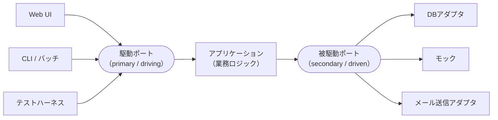

# ヘキサゴナルアーキテクチャ (Ports and Adapters)

#software-engineering #architecture

Alistair Cockburnが考案し、2005年に「Ports and Adapters（ポートとアダプタ）」と改称したアーキテクチャパターン。意図は本人の言葉では次の1文に集約される。

> Allow an application to equally be driven by users, programs, automated test or batch scripts, and to be developed and tested in isolation from its eventual run-time devices and databases.
> （アプリケーションが、人間・プログラム・自動テスト・バッチスクリプトのいずれからも等しく駆動でき、最終的な実行時のデバイスやデータベースから切り離した状態で開発・テストできるようにする）

## 元にあった問題

Cockburnが挙げている症状は、業務ロジックがプレゼンテーション層とデータ層に染み出すこと。そこから3つの問題が連鎖する。

1. 業務ロジックが「フィールドサイズやボタンの位置」といった頻繁に変わる見た目の詳細に依存するため、自動テストができない
2. 同じ理由で、人が操作する処理をバッチ処理に切り替えられない
3. あるプログラムから別のプログラムを駆動しようとすると破綻する

加えて「DBサーバが落ちたり、大きく作り直されたりすると、プログラマの作業が止まる」ことも挙げている。

## なぜ六角形なのか

従来の階層図（上からUI・ロジック・DB）は「一次元の見え方」になり、層の飛び越しを誘発する。六角形は**内と外の非対称性**を視覚的に示しつつ、外部にあるものを（UIもDBもテストも）すべて対等に扱える。

そして重要なのは、6という数字に意味はないこと。

> the hexagon is not a hexagon because the number six is important, but rather to allow the people doing the drawing to have room to insert ports and adapters as they need.
> （六角形なのは6が重要だからではなく、図を描く人がポートとアダプタを必要なだけ書き込める余白を持てるようにするため）

## ポートとアダプタ

- **ポート (port)** — アプリケーションと外部との「目的を持った会話（a purposeful conversation）」を表す。技術を指定しないプロトコル／APIの定義。
- **アダプタ (adapter)** — 技術固有の実装。ポートのAPI定義を、その機器に必要な信号へ相互変換する。1つのポートに対して複数のアダプタ（本番DB用・GUI用・テストハーネス用…）を差せる。

## 駆動側と被駆動側

会話をどちらが始めるかで、ポート／アダプタは2種類に分かれる。ユースケース分析における主アクター・副アクターの区別に対応する。

- **primary（駆動側 / driving）** — UIやテストフレームワークなど、アプリケーションの振る舞いを起動する側。
- **secondary（被駆動側 / driven）** — DBや外部サービスなど、アプリケーションから問い合わせる側。テストではここにモックを差し込むのが自然になる。

## 例

- **割引計算**: `discount(amount) = amount × rate(amount)` で、`amount` は利用者（駆動ポート）から、`rate` はDB（被駆動ポート）から来る。
- **気象警報システム**: 気象データの入力・管理者インターフェース・購読者への通知・購読者DBへのアクセスという4つのポートが自然に現れる。「技術ではなく目的で」設計し直したことで、HTTP版とメール版をアダプタの差し替えで実現でき、システムのバージョンが増殖せずに済んだ、という事例。
- **コーヒーマシンの制御**: 利用者・レシピDB・ディスペンサ・コイン機構の4ポート。

## [[software-architecture-styles]]の中での位置づけ

内と外の非対称性だけを言う、最もミニマルな形。内側をこれ以上割らないので、内側をさらに層に割った[[onion-architecture|オニオンアーキテクチャ]]、Entities/Use Casesに割った[[clean-architecture|クリーンアーキテクチャ]]の先祖にあたる。Martinもクリーンアーキテクチャの元ネタの筆頭としてこれを挙げている。

「ポートを技術ではなく目的で切る」という発想は、[[microservices|マイクロサービス]]でのサービス境界の議論にも影響を与えたとされる。

## 出典

- [Hexagonal architecture (原文, Alistair Cockburn)](https://alistair.cockburn.us/hexagonal-architecture/)
- [Hexagonal architecture (software) - Wikipedia](https://en.wikipedia.org/wiki/Hexagonal_architecture_(software))
