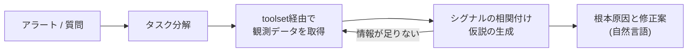

# HolmesGPT

本番障害の調査（root cause analysis）を自動化するオープンソースのAIエージェント。Robusta.devが開発し、Microsoftが主要コントリビュータとして参加している。2025年10月8日に[[cncf|CNCF]] Sandboxプロジェクトとして採択された。ライセンスはApache 2.0。

#ai-agent #observability #sre #cncf #devops

## 何をするものか

アラートやユーザーの質問を起点に、エージェント自身が観測データを取りに行って原因を特定する。CLIの基本形は次の通り。

```sh
holmes ask "what is wrong with the user-profile-import pod?"
```

内部では自律的なタスク分解のループが回る。

1. 質問の意図を理解する
2. 問題を小さなタスクに分解する
3. [[prometheus|Prometheus]]のメトリクス、[[kubernetes|Kubernetes]]のイベントやログなどを自動でクエリする
4. 集めたシグナルを相関させる（例: 直近のデプロイと事象の時刻を結びつける）
5. 診断結果と改善案を自然言語で返す



静的なダッシュボードや、単に会話するだけのチャットボットとの違いは、**データソースに能動的にクエリを投げて仮説を反復的に改善する**点にある。狙いは、複数ツール間のコンテキストスイッチと手動での相関付けという[[toil|トイル]]を減らすこと。

## Toolset

データソースへの接続は「toolset」というプラグイン単位で表現され、50以上がbuilt-inで用意されている。

| 領域 | 例 |
|---|---|
| インフラ | Kubernetes, Docker, AKS, OpenShift |
| メトリクス | Prometheus, Grafana, Datadog, New Relic |
| ログ | Loki, Elasticsearch, VictoriaLogs, Coralogix |
| データベース | PostgreSQL, MySQL, MongoDB, MariaDB |
| クラウド | AWS, Azure, GCP |
| CI/CD | GitHub, GitLab, Jenkins |
| アラート・チケット | AlertManager, PagerDuty, OpsGenie, Jira, Slack |

AWS・Azure・GitHub・GitLab・Jenkinsなど多くのtoolsetは[[mcp|MCP]]に対応しており、社内の独自ツールもMCPサーバとして公開すれば同じ枠組みで繋げられる。自前のtoolsetはYAMLでコマンドを宣言する形でも書ける。

```yaml
kubernetes/pod_status:
  tools:
    - name: "get_pod"
      command: "kubectl get pod {{ pod }} -n {{ namespace }}"
```

DNS障害の切り分けやPVCの扱いといったランブック（運用手順）をコード化して食わせられるのも特徴で、組織固有の運用知識を再利用可能な形で持ち込める。

## その他の特徴

- **LLMプロバイダ非依存** — OpenAI・Anthropic・Azure・Bedrock・Geminiなどに対応
- **Kubernetes必須ではない** — VM・クラウド・データベース・SaaSも調査対象にできる
- **アラート系との双方向連携** — AlertManagerやPagerDutyからアラートを取得して調査し、結果を元のシステムに書き戻す
- **Operator mode** — 24/7でバックグラウンド常駐し、問題を先回りして検知してSlackに通知する。デプロイ検証やスケジュール実行のヘルスチェックも行う
- ペタバイト級のデータを扱うためのサーバサイドフィルタリングやJSONツリー走査、ツールごとのメモリ上限といった実装がある

## Robustaプラットフォームとの関係

HolmesGPT本体はOSSのエージェントで、その上に商用のRobustaプラットフォーム（SaaSまたはセルフホスト）が乗る構成になっている。プラットフォーム側は複数のエージェントを集中管理し、チャットUIを提供する役割を持つ。AWS Marketplaceには「Robusta SRE Agent (HolmesGPT Enterprise)」として出品されている。

## 出典

- [HolmesGPT/holmesgpt (GitHub)](https://github.com/HolmesGPT/holmesgpt)
- [HolmesGPT | CNCF](https://www.cncf.io/projects/holmesgpt/)
- [HolmesGPT: Agentic troubleshooting built for the cloud native era | CNCF Blog](https://www.cncf.io/blog/2026/01/07/holmesgpt-agentic-troubleshooting-built-for-the-cloud-native-era/)
- [HolmesGPT Documentation](https://holmesgpt.dev/)
- [AWS Marketplace: Robusta SRE Agent (HolmesGPT Enterprise)](https://aws.amazon.com/marketplace/pp/prodview-cxjrsak2gtpji)
