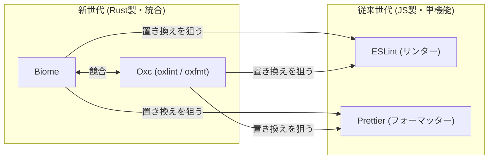

# JavaScriptのリンター・フォーマッター

JavaScript/TypeScriptエコシステムのコード品質ツール（リンター・フォーマッター）を束ねるハブノート。

#javascript #moc

## 全体の構図

「JS製・単機能特化の従来世代デファクト」と「Rust製・高速・オールインワンの新世代」という対立軸で見ると整理しやすい。新世代ツールはいずれも従来世代の置き換え（ドロップイン互換）を狙っており、性能を「ESLint比・Prettier比で何倍」という形でアピールする。

## 各ツール

- [[eslint|ESLint]] — 2013年から続くプラガブルなリンターのデファクト標準。近年はJSON/CSS/Markdownなど言語非依存化を進めている
- [[prettier|Prettier]] — オピニオン型（設定最小主義）のフォーマッターのデファクト標準
- [[biome|Biome]] — Rust製オールインワンツールチェーン。Romeのコミュニティフォークという系譜。ESLint+Prettierの一括置き換えを狙う
- [[oxc|Oxc]] — Rust製ツールチェーン（VoidZero社）。ゼロから開発され、oxlint・oxfmtなど各コンポーネントを個別採用できる点がBiomeと異なる
- [[typescript-eslint]] — ESLintのプラグイン機構の上でTypeScript対応を担う拡張。type-aware lintingが特徴

## リンターの系譜

ESLint以前の歴史。「設定不可」→「設定可能」→「プラガブル」という進化の流れ。

- [[jslint|JSLint]] — 2002年、Douglas Crockford作。最初期のJSリンター。オピニオン型で設定不可
- [[jshint|JSHint]] — 2011年、JSLintの柔軟性のなさに反発したコミュニティフォーク。設定可能だが独自ルールは書けない
- [[eslint|ESLint]] — 2013年、独自ルールを書けない不満から誕生。すべてをプラグイン化

## 関連

Pythonエコシステムでは[[ruff|Ruff]]が「Rust製・高速・既存ツール統合」というまったく同じムーブメントを体現している。
