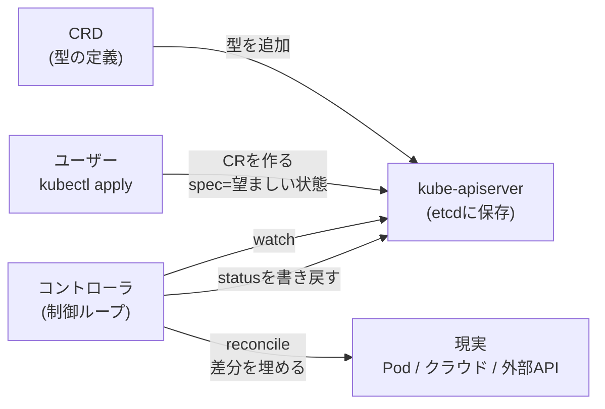

# Kubernetes拡張まわりの用語整理

CRD・CR・コントローラ・Operator・reconcileあたりの用語が混ざりやすいので、関係を一枚にまとめるハブノート。深掘りは各ノートで。 #kubernetes #moc

## 用語

| 用語 | 一言で | プログラミングでいうと |
|---|---|---|
| リソース / Kind | APIが扱うものの種類（Pod, Deployment, …） | 型・クラス |
| オブジェクト | その種類の個々の実体（`my-pod`など） | インスタンス |
| `spec` | ユーザーが書く「望ましい状態」 | 入力 |
| `status` | コントローラが書く「実際の状態」 | 出力 |
| [[kubernetes-custom-resource\|CRD]] | 独自の型を追加する定義 | クラス定義を追加 |
| CR（カスタムリソース） | CRDで作った個々のオブジェクト | 独自クラスのインスタンス |
| [[kubernetes-controller\|コントローラ]] | watchして差分を埋め続けるループ | 常駐プロセス |
| reconcile | 差分を埋める1回分の処理 | ループの1イテレーション |
| [[kubernetes-operator\|Operator]] | CRD + 専用コントローラで特定アプリの運用を自動化したもの | ライブラリ化された運用手順 |

## 関係の要点

- CRDだけでは何も起きない（データが保存されるだけ）。動かすのはコントローラ。
- 組み込みリソース（Deploymentなど）も、組み込みのコントローラが動かしているだけで、構造はCRと同じ。
- 「CRD + コントローラ」で特定アプリを管理するものがOperator。
- この仕組みをクラスタ自体に当てはめたのが[[cluster-api|Cluster API]]、クラウド連携部分を切り出したのが[[kubernetes-cloud-controller-manager|Cloud Controller Manager]]。

親ハブ: [[kubernetes]]
