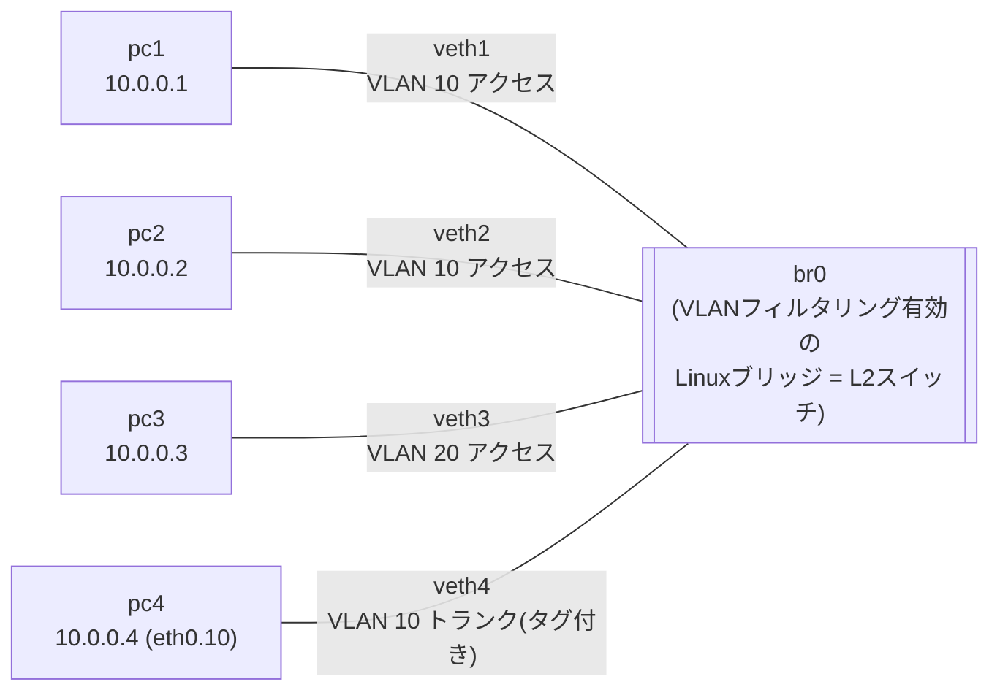
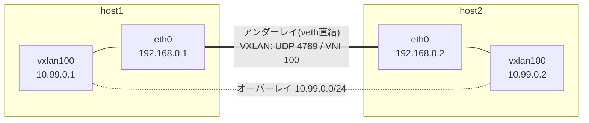

# Linuxだけで作る仮想ネットワークラボ

[[vlan|VLAN]]や[[vxlan|VXLAN]]を実際に構築して遊ぶのに物理機材は不要。Linuxカーネル自体が両方をネイティブ実装しているので、network namespaceを使えばマシン1台で完結する。しかも**unprivileged user namespaceを使えばsudoすら不要**。以下はClaude Codeに実際にsudoなしで構築・動作確認させたときの実ログ（Pop!_OS、kernel 6.18）。 #network #linux

## sudoなしで動かす鍵: unprivileged user namespace

```sh
unshare --user --map-root-user --net --mount bash
```

これで入ったシェルは「そのnamespace内限定のroot」なので、`ip link add`（bridge/veth/vxlanいずれも）や`ip netns add`が素で通る。ホストのネットワークには一切影響せず、exitすれば全部消える。ハマりどころは2つあった。

- `ip netns add`は`/run/netns`を使うので、`--mount`を付けた上で`mount -t tmpfs tmpfs /run`しておく必要がある
- tcpdumpはデフォルトで`tcpdump`ユーザーへ権限降格しようとするが、userns内ではそのuidがマップされておらず`Couldn't change to 'tcpdump' uid=114: Operation not permitted`で死ぬ。**`-Z root`を付けて降格を止める**

## ラボ1: VLAN — 同じスイッチ上でL2セグメントが分かれることを確認

netnsを「PC」、VLANフィルタリングを有効にしたLinuxブリッジを「L2スイッチ」に見立て、次の構成を作った。



構築コマンド（userns内。抜粋）:

```sh
ip link add br0 type bridge vlan_filtering 1
ip link set br0 up

# pc1〜pc3を作ってブリッジに接続(pc2, pc3も同様)
ip netns add pc1
ip link add veth1 type veth peer name eth0 netns pc1
ip link set veth1 master br0 up
ip netns exec pc1 ip link set eth0 up
ip netns exec pc1 ip addr add 10.0.0.1/24 dev eth0

# veth1,2をVLAN 10、veth3をVLAN 20のアクセスポートに
bridge vlan add dev veth1 vid 10 pvid untagged
bridge vlan del dev veth1 vid 1

# veth4はVLAN 10をタグ付きで通すトランクポートに。pc4側はVLANサブインターフェースで受ける
bridge vlan add dev veth4 vid 10 tagged
bridge vlan del dev veth4 vid 1
ip netns exec pc4 ip link add link eth0 name eth0.10 type vlan id 10
ip netns exec pc4 ip link set eth0.10 up
ip netns exec pc4 ip addr add 10.0.0.4/24 dev eth0.10
```

ポートのVLAN割り当てはこうなる。

```
$ bridge vlan show
port              vlan-id
br0               1 PVID Egress Untagged
veth1             10 PVID Egress Untagged
veth2             10 PVID Egress Untagged
veth3             20 PVID Egress Untagged
veth4             10
```

同一VLAN間はpingが通る。

```
$ ip netns exec pc1 ping -c 2 10.0.0.2   # pc1 -> pc2 (同じVLAN 10)
64 bytes from 10.0.0.2: icmp_seq=1 ttl=64 time=0.061 ms
64 bytes from 10.0.0.2: icmp_seq=2 ttl=64 time=0.041 ms
2 packets transmitted, 2 received, 0% packet loss, time 1021ms
```

別VLANへは同じスイッチ・同じIPサブネットに居るのに届かない。これがVLAN＝ブロードキャストドメイン分割の本質。

```
$ ip netns exec pc1 ping -c 2 -W 1 10.0.0.3   # pc1 -> pc3 (別VLAN)
2 packets transmitted, 0 received, 100% packet loss, time 1019ms
```

トランクポートで観察すると、802.1Qタグ（`ethertype 802.1Q`、`vlan 10`）が付いたフレームが実際に流れているのが見える。アクセスポート(veth1)から入ったタグなしフレームに、スイッチがトランクから出すときタグを付けている。

```
$ ip netns exec pc4 tcpdump -Z root -e -n -i eth0 -c 4
9e:c6:65:df:45:62 > ff:ff:ff:ff:ff:ff, ethertype 802.1Q (0x8100), length 46: vlan 10, p 0,
    ethertype ARP (0x0806), Request who-has 10.0.0.4 tell 10.0.0.1, length 28
12:20:80:28:ae:0f > 9e:c6:65:df:45:62, ethertype 802.1Q (0x8100), length 46: vlan 10, p 0,
    ethertype ARP (0x0806), Reply 10.0.0.4 is-at 12:20:80:28:ae:0f, length 28
9e:c6:65:df:45:62 > 12:20:80:28:ae:0f, ethertype 802.1Q (0x8100), length 102: vlan 10, p 0,
    ethertype IPv4 (0x0800), 10.0.0.1 > 10.0.0.4: ICMP echo request, id 30761, seq 1, length 64
```

## ラボ2: VXLAN — MAC over UDPを実際に覗く

「物理サーバ2台」をnetns(host1/host2)で用意してvethで直結し（これがL3アンダーレイ 192.168.0.0/24）、その上にVNI 100のVXLANオーバーレイ(10.99.0.0/24)を張った。



```sh
ip netns exec host1 ip link add vxlan100 type vxlan id 100 dstport 4789 \
    local 192.168.0.1 remote 192.168.0.2 dev eth0
# host2側はlocal/remoteを逆にして同様に作成し、10.99.0.1/24, 10.99.0.2/24を割り当て
```

アンダーレイをtcpdumpしながらオーバーレイのアドレスにpingすると、ARPもICMPも**EthernetフレームまるごとUDP(4789)にカプセル化されて飛ぶ**様子がそのまま見える。

```
$ ip netns exec host1 ping -c 2 10.99.0.2   # オーバーレイ側でping
$ ip netns exec host1 tcpdump -Z root -n -i eth0 -c 4 udp port 4789   # アンダーレイ側で観察
IP 192.168.0.1.43502 > 192.168.0.2.4789: VXLAN, flags [I] (0x08), vni 100
ARP, Request who-has 10.99.0.2 tell 10.99.0.1, length 28
IP 192.168.0.2.43502 > 192.168.0.1.4789: VXLAN, flags [I] (0x08), vni 100
ARP, Reply 10.99.0.2 is-at be:e1:fe:0e:36:4c, length 28
IP 192.168.0.1.56075 > 192.168.0.2.4789: VXLAN, flags [I] (0x08), vni 100
IP 10.99.0.1 > 10.99.0.2: ICMP echo request, id 31448, seq 1, length 64
IP 192.168.0.2.56075 > 192.168.0.1.4789: VXLAN, flags [I] (0x08), vni 100
IP 10.99.0.2 > 10.99.0.1: ICMP echo reply, id 31448, seq 1, length 64
```

細かいが面白いのは送信元UDPポートで、ARPのフロー(43502)とICMPのフロー(56075)で違う値になっている。[[vxlan|VXLANの仕様]]どおり、内部フレームのハッシュから送信元ポートを決めてECMPで経路分散させる挙動が実際に確認できた。

なお最初に実行したときはIPv6のneighbor solicitationなどがカプセル化される様子ばかりが録れたので、ログを見やすくするため`sysctl net.ipv6.conf.vxlan100.disable_ipv6=1`してから録り直した。

## 制約と、その先

unprivileged usernsの制約:

- namespace内に閉じているので、**ホストの実NICは触れない**。実マシン2台間でVXLANを張るような実験にはやはり実NICへの権限が必要
- ディストリによってはunprivileged usernsが制限されている（Ubuntuは23.10でAppArmorによる制限を導入し、24.04からデフォルト有効。`sysctl kernel.apparmor_restrict_unprivileged_userns`で確認できる）

もっと本格的にやるなら:

- **containerlab + FRRouting** — leaf-spine構成でBGP EVPNをコントロールプレーンにしたVXLANファブリックをYAML一発で構築できる。お手本: [martimy/clab_vxlan_frr](https://github.com/martimy/clab_vxlan_frr)、[darnodo/VXLAN-EVPN](https://github.com/darnodo/VXLAN-EVPN)（いずれもDockerが必要なのでsudoなし縛りだとrootless dockerで）
- **[[open-vswitch|Open vSwitch]]** — Linux標準ブリッジより本格的な仮想スイッチ。OpenStackなどが実際に使っている
- **GNS3 / EVE-NG** — Cisco IOSなどベンダーOSのイメージを動かすエミュレータ。「実機のCLI操作」の練習向けだが、イメージ入手にライセンスの壁がある

## 出典

- [Networking Lab: Setting Up a VLAN Using a Linux Bridge - iximiuz Labs](https://labs.iximiuz.com/courses/computer-networking-fundamentals/simple-vlan)
- [Introduction to Linux interfaces for virtual networking - Red Hat Developer](https://developers.redhat.com/articles/2026/04/03/introduction-to-linux-interfaces-for-virtual-networking)
- [What Is ContainerLab? The Complete 2026 Guide - NetPilot](https://www.netpilot.io/blog/what-is-containerlab)
- [Understanding AppArmor User Namespace Restriction - Ubuntu Community Hub](https://discourse.ubuntu.com/t/understanding-apparmor-user-namespace-restriction/58007)
