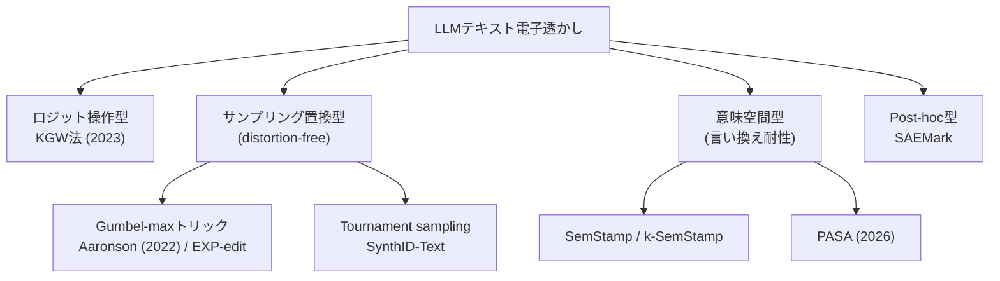

# LLMテキストの電子透かし

#llm #ai #security #watermarking

LLMが生成したテキストに、人間には知覚できない統計的な「印」を埋め込み、後から「このテキストはこのモデルが生成したものか」を検定できるようにする技術。ゼロ幅文字やメタデータを付加する方式とは違い、**トークン選択そのものに偏りを仕込む**ので、コピペしても印がテキストと一緒に運ばれる。

発端は [Kaito Sugimotoさんの解説記事](https://zenn.dev/hellorusk/articles/3328866ca9e922)（2026-08、[[claude-text-watermark|Claudeの透かし導入]]を受けたもの）。以下はそこで紹介されていた研究群を一次情報で裏取りしつつ整理したメモ。

## 基本原理

LLMは次トークンを確率分布からサンプリングしている。「ここは this でも that でも自然」という揺らぎのある場面で、秘密鍵由来の疑似乱数を使って選択を微妙に偏らせる。1トークンあたりの偏りはごく僅かでも、数百トークン集まれば統計的検定（z検定など）で「偶然ではありえない癖」として検出できる。

- 埋め込みに使えるのはエントロピー（選択の揺らぎ）だけ。事実の列挙やコードのような**低エントロピー出力には埋め込む余地が少ない**という原理的制約がある。
- 検出には秘密鍵（と検出アルゴリズム）が必要で、モデル本体は不要。安価に検定できる。

## 手法の系譜

### KGW法（ロジット操作型）

Kirchenbauer, Geiping, Wen らの "A Watermark for Large Language Models"（ICML 2023）。この分野の火付け役。

- 直前トークン列のハッシュ＋秘密鍵で語彙を「グリーンリスト」（割合γ）と「レッドリスト」に分割し、グリーン側のロジットにバイアスδを加算して優遇する。
- 検出はテキスト中のグリーントークン比率が期待値γをどれだけ超えるかのz検定。
- 弱点: ロジットを直接いじるので**出力分布が歪む**（品質劣化しうる）。

### distortion-free系（サンプリング置換型）

「分布を歪めずに透かす」方向。サンプリングに使う乱数そのものを秘密鍵由来の疑似乱数に置き換える。

- **Gumbel-maxトリック**: Aaronson（OpenAI, 2022年に講演で公表）の exponential minimum sampling。各トークン i に疑似乱数 r_i を割り当て、`r_i^(1/p_i)` が最大のトークンを選ぶと、鍵に関する期待値では元の分布どおりのサンプリングになる（単一トークンでは非歪曲）。検出時は同じ鍵で r_i を再現し、選ばれたトークンの r_i が不自然に大きいことを検定する。
- **EXP-edit**: Kuditipudi ら "Robust Distortion-free Watermarks for Language Models"（2023, Stanford）。同じくGumbel系で、編集距離ベースのアラインメントにより挿入・削除への頑健性を持たせた。
- 弱点: 乱数が鍵から決定的に決まるため、同じプロンプトに対して**出力が毎回同じになりがち**（多様性の喪失）。Gumbel-Soft（Fu ら 2024）などが緩和策。

### Tournament sampling

Google DeepMind の [[synthid-text|SynthID-Text]] が採用。候補トークンを複数サンプリングして秘密鍵由来のスコアで勝ち抜き戦にかける。本物のサンプリングが基礎に残るので多様性が保たれ、非歪曲設定も歪曲設定（検出力優先）も選べる。Nature掲載＋Gemini本番投入という点で実用化の転換点になった。

### 意味空間型（言い換え耐性）

トークン表層の偏りは**パラフレーズ（言い換え）でかなり消える**。これが実用上の最大の攻撃面で、対策として意味表現に透かしを入れる研究がある。

- **SemStamp**（Hou ら, NAACL 2024）: 文単位で生成し、文埋め込みが LSH（locality-sensitive hashing）で区切った意味空間の「当たり領域」に落ちるまで棄却サンプリングする。言い換えても文の意味（＝埋め込みの落ちる領域）は変わりにくいことを利用。後続の k-SemStamp はLSHをk-meansクラスタリングに置き換えて精度を改善。
- **PASA**（Ai & He, ICML 2026）: 意味クラスタと秘密鍵由来の乱数を紐付け、distortion-free と言い換え耐性の両立を理論的な枠組み（検出精度・頑健性・歪みのトレードオフの特徴付け）ごと提示した。

### マルチビット透かし

「AI生成か否か」の1ビット判定を超えて、**ユーザーIDなどのペイロード**を埋め込む方向。

- Qu ら "Provably Robust Multi-bit Watermarking for AI-generated Text"（USENIX Security 2025）: ペイロードを Reed-Solomon 誤り訂正符号でエンコードし、疑似乱数で決めたテキストセグメントにシンボルを分散埋め込み。編集ノイズが乗っても最近傍の符号語に復号できる。
- **SAEMark**（NeurIPS 2025）: post-hoc型。モデルのロジットに一切触れず、生成済みテキストから Sparse Autoencoder で特徴を抽出し、特徴統計が鍵由来のターゲットに最も近い候補を採択する（推論時の棄却サンプリング）。**APIしか触れないブラックボックスモデルにも適用できる**のが特徴で、多言語・コードでも動く。

## 限界・論点

- 強い言い換え・翻訳・人間の文章との混合で検出力は落ちる。意味空間型はここへの対策だが、商用システムにはまだ本格実装されていない（[[claude-text-watermark|Claude]]も編集・言い換えで消えうると明言している）。
- 低エントロピー出力（コード、定型文）には原理的に埋め込みにくい。
- オープンウェイトモデルには強制できない。サンプリング実装を握っているホスト型APIでしか成立しない。
- 検出に秘密鍵が要るため、「誰でも検定できる公開検出」と「鍵が漏れると除去攻撃が容易になる」のあいだに緊張がある。
- 検出できても分かるのは「そのモデルが生成（処理）した」ことまでで、**著者性の証明にはならない**。逆に「検出されない＝人間が書いた」の証明にもならない。

## 実運用

- Google: [[synthid-text|SynthID-Text]] を Gemini に本番投入（2024〜）。
- Anthropic: [[claude-text-watermark|Claudeのテキスト透かし]]（2026-08、[[eu-ai-act|EU AI Act]]第50条対応）。

## 出典

- [30年後の未来では、AIの出力したテキストに電子透かしが入っているかもしれない](https://zenn.dev/hellorusk/articles/3328866ca9e922) — 発端となった解説記事
- [A Watermark for Large Language Models (Kirchenbauer et al., 2023)](https://arxiv.org/abs/2301.10226)
- [Robust Distortion-free Watermarks for Language Models (Kuditipudi et al., 2023)](https://arxiv.org/abs/2307.15593) / [解説ブログ (Stanford CRFM)](https://crfm.stanford.edu/2023/07/30/watermarking.html)
- [Scalable watermarking for identifying large language model outputs (Nature, 2024)](https://www.nature.com/articles/s41586-024-08025-4)
- [SemStamp: A Semantic Watermark with Paraphrastic Robustness for Text Generation (NAACL 2024)](https://aclanthology.org/2024.naacl-long.226/) / [k-SemStamp](https://arxiv.org/abs/2402.11399)
- [PASA: A Principled Embedding-Space Watermarking Approach (ICML 2026)](https://arxiv.org/abs/2605.10977)
- [Provably Robust Multi-bit Watermarking for AI-generated Text (USENIX Security 2025)](https://www.usenix.org/system/files/conference/usenixsecurity25/sec25cycle1-prepub-446-qu-watermarking.pdf)
- [SAEMark: Steering Personalized Multilingual LLM Watermarks with Sparse Autoencoders (NeurIPS 2025)](https://arxiv.org/abs/2508.08211)
