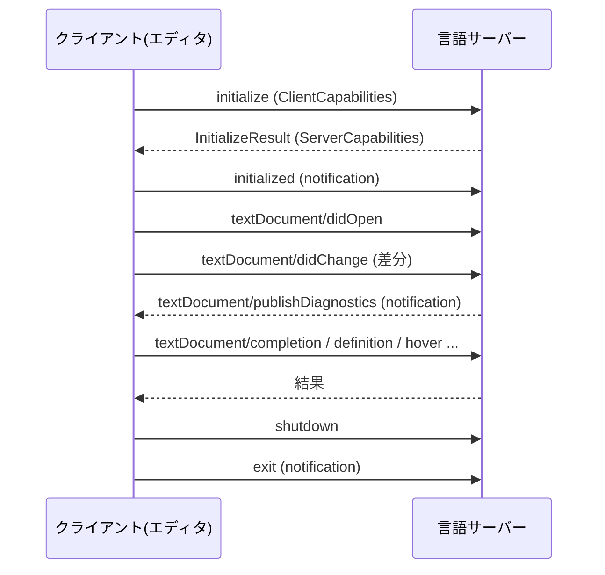

# LSP (Language Server Protocol)

エディタ/IDEと「言語サーバー」の間で通信するためのプロトコル。コード補完・定義へのジャンプ・参照検索・診断（エラー表示）などの言語機能を、エディタ本体から切り離して独立プロセス（言語サーバー）に持たせ、[[json-rpc|JSON-RPC]]ベースの標準化されたメッセージでやり取りする。 #lsp #protocol

## 目的

言語ごとの解析ロジック（言語サーバー）をエディタごとに再実装せずに済むようにすること。「N個のエディタ × M個の言語」の組み合わせ問題を、共通プロトコルを挟むことで「N + M」の実装量に減らせる。

## 成り立ち

2015年、MicrosoftがVS Code向けに開発。元々はOmniSharpがC#向けの高度な編集機能を提供するために採用した「言語サーバー」という概念がベースになっている。2016年6月27日、Red Hat・Codenvyと協業してプロトコル仕様を標準化すると発表し、以降はVS Codeに限らないオープンな仕様として展開されている。

## 仕組み

### base protocol とフレーミング

土台は[[json-rpc|JSON-RPC 2.0]]（`jsonrpc` は常に `"2.0"` 固定）。トランスポートはstdio・ソケット・named pipe・Node.jsのIPCなどから選べるが、実際にはstdioが圧倒的に多い。

JSON-RPCはメッセージの区切り方を規定していないので、LSPはHTTPライクなヘッダを自前で被せている。

```
Content-Length: 52\r\n
\r\n
{"jsonrpc":"2.0","id":1,"method":"shutdown"}
```

- `Content-Length`（バイト数）が必須ヘッダ。`Content-Type` は任意で、デフォルトは `application/vscode-jsonrpc; charset=utf-8`
- **ヘッダ部はascii、`\r\n` の区切りもascii**。ボディだけがUTF-8のJSON

### ライフサイクル



- `initialize` は**最初の1回だけ**送れる。サーバーが `InitializeResult` を返すまで、クライアントは他のリクエストもnotificationも送ってはいけない。
- `initialize` より前にリクエストが来た場合、サーバーはエラーコード `-32002`（`ServerNotInitialized`）を返す。notificationは `exit` を除いて捨てる。

### capability negotiation

LSPの機能はほぼすべてオプショナルで、何が使えるかは起動時に交渉して決まる。

- クライアントが `InitializeParams.capabilities`（`ClientCapabilities`）で「自分はこれを表示できる」を宣言
- サーバーが `InitializeResult.capabilities`（`ServerCapabilities`）で「自分はこれを提供できる」を返す

さらに `client/registerCapability` / `client/unregisterCapability` により、**起動後に動的に機能を出し入れ**することもできる（プロジェクトの設定を読んだ結果、フォーマッタが有効になったら登録する、など）。

### ドキュメント同期

重要なのは、**ファイル内容の正はディスクではなくエディタのバッファ側にある**という設計。

- `textDocument/didOpen` — 開いた時点で `uri` / `languageId` / `version` / `text` を丸ごと渡す
- `textDocument/didChange` — 以降の変更を通知する。**full**（全文を毎回送る）と**incremental**（変わった範囲だけ送る）の2モードがあり、どちらを使うかはサーバーが `ServerCapabilities` で指定する
- `textDocument/didClose` — 閉じたことを通知し、サーバーはディスク上の状態に戻して扱う

保存しなくても診断が出るのはこのため。逆に言うと、サーバーは自前でバッファの状態を持ち続ける必要がある。

### position encoding

行内の位置（`character`）を何で数えるかという厄介な問題がある。3.17より前は**UTF-16のコードユニット固定**だった（JavaScript実装であるVS Codeの都合）。UTF-8で文字列を持つ言語で書かれたサーバーは、毎回変換が必要になる。

3.17で交渉できるようになった。クライアントが `general.positionEncodings` で対応エンコーディングを並べ、サーバーが `capabilities.positionEncoding` でどれを使うか返す。`utf-16` / `utf-8` / `utf-32` の3種があるが、**`utf-16` のサポートは必須**（互換性のため）。

### キャンセルと進捗

- `$/cancelRequest` — 打鍵のたびに補完リクエストを投げると古いものが無駄になるので、リクエストidを指定してキャンセルする
- `$/progress` — 「プロジェクト全体のインデックス中 40%」のような長時間処理の進捗を、`token` と `value` で報告する

`$/` で始まるメソッド名はプロトコル実装自体のためのもので、サーバーが未知の `$/` メソッドを受け取った場合は `MethodNotFound` を返してよいことになっている。

## バージョン

安定版は **3.17**。type hierarchy・inline values・inlay hints・ノートブックドキュメント対応・position encodingの交渉などが3.17で追加された。**3.18は現在策定中**で、新機能には `@since 3.18.0` のアノテーションが付いている。

## エコシステム(2026年時点)

- 400以上の言語サーバーが開発されている。Goの[[gopls|gopls]]のように言語チーム自身が公式サーバーを出しているケースも多い。
- VS Code、JetBrains系IDE、Neovim、Eclipseなど主要エディタが対応。[[biome|Biome]]もCLIに加えてLSP経由での利用に対応している。
- 近年はGitHub Copilot Language Server SDKのようにAIアシスタント側でも採用が広がり、Jupyter Notebookやデータベースツールなど従来のコードエディタ以外にも拡大している。[[mojo|Mojo]]もLSPサーバーを提供しており、Modular 26.5でその安定性が向上した。

## LSPから派生した「N×Mを潰すプロトコル」

LSPの「共通の線を1本引いて組み合わせ爆発を潰す」という型は、別ドメインにそのまま持ち込まれている。

- [[dap|DAP (Debug Adapter Protocol)]] — デバッガ側の同じ問題を解く。フレーミングはLSPと同じ `Content-Length` 方式だが、土台はJSON-RPCではなくV8 Debugging Protocol由来の独自形式
- [[mcp|MCP (Model Context Protocol)]] — AIアプリケーションと外部ツール／データソースを繋ぐ。公式ドキュメントがLSPに直接インスパイアされたと明言している。JSON-RPC 2.0ベースなのはLSPと同じだが、stdioでのフレーミングは改行区切り（`Content-Length` ではない）

## 出典

- [Language Server Protocol - Wikipedia](https://en.wikipedia.org/wiki/Language_Server_Protocol)
- [Official page for Language Server Protocol](https://microsoft.github.io/language-server-protocol/)
- [Language Server Protocol Specification - 3.17](https://microsoft.github.io/language-server-protocol/specifications/lsp/3.17/specification/)
- [Language Server Protocol Specification - 3.18](https://microsoft.github.io/language-server-protocol/specifications/lsp/3.18/specification/)
- [Language Server Protocol Ecosystem 2026 | Zylos Research](https://zylos.ai/research/2026-01-13-language-server-protocol-ecosystem/)
