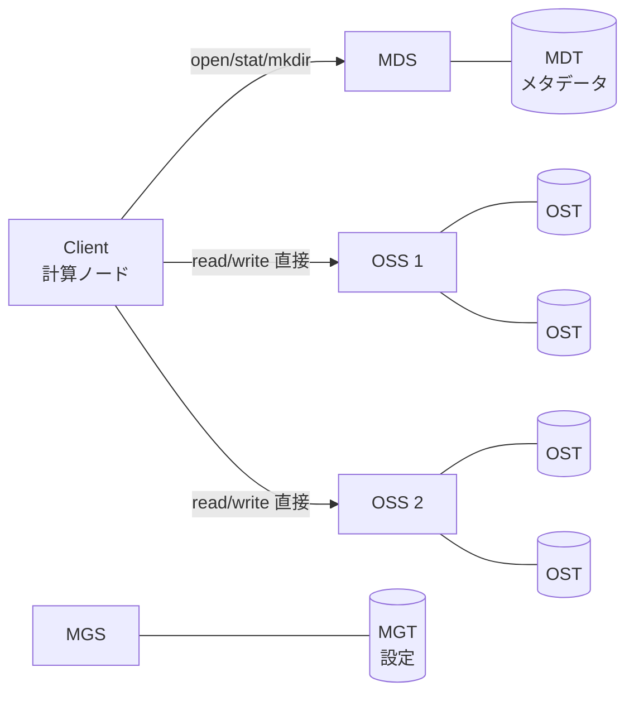

# Lustre

HPC向けのオープンソース並列分散ファイルシステム。名前は Linux + cluster のかばん語。大量の計算ノードから1つのPOSIXファイルシステムとして見え、データを多数のストレージサーバーに分散（ストライピング）して集約帯域を稼ぐ。[[slurm|Slurm]]で動くスパコンの`/scratch`や`/work`の裏にいることが多い。

## 歴史

- 1999年、Peter J. Braam がカーネギーメロン大学で研究プロジェクトとして設計を開始。
- 2001年、Braam が Cluster File Systems, Inc. を設立。
- 2007年9月、Sun Microsystems が Cluster File Systems の資産を取得。
- 2010年12月、Sunを買収したOracleが Lustre 2.x の開発を止めると発表。これを受けてコミュニティ側で開発を続ける動きが出て、Whamcloud などが立ち上がる。
- 2012年7月、Intel が Whamcloud を買収。
- 2018年6月、DDN (DataDirect Networks) が Intel から Lustre チームを取得し、Whamcloud を独立部門として復活。
- ライセンスは GPLv2 / LGPL。
- 2005年6月以降、TOP500のトップ10の少なくとも半数、トップ100の60以上で使われている（Wikipedia）。Frontier（2022年11月の1位）もLustre。

## アーキテクチャ

メタデータとデータの経路が分かれているのが肝。



- **MGS / MGT** — Management Server。クラスタ内のLustreファイルシステム全部の設定を保持する。MDSとHAペアで同居させることもある。
- **MDS / MDT** — Metadata Server / Metadata Target。ディレクトリ階層・ファイル属性・どのOSTにデータがあるか（レイアウト）を持つ。
- **OSS / OST** — Object Storage Server / Object Storage Target。ファイルの中身をオブジェクトとして持つ。1ファイルシステムで数百OSS・数千OSTまでスケールし、1台のOSSは通常2〜8個のOSTを担当する。
- **Client** — POSIXインターフェースを提供。MDSでファイルをopenしてレイアウトを得たら、あとはOSSと直接I/Oする。POSIXテストスイートがローカルext4と同様に通るとのこと。
- **LNet** — Lustre専用のネットワーク層。Ethernet、InfiniBand、Omni-Path、Crayのファブリックなどに対応し、RDMAも使える。

バックエンドのディスクフォーマットは **ldiskfs**（ext4ベース）か **ZFS**。上限値もこれで変わる（最大ファイルサイズ ldiskfs 31.25PB / ZFS 512PB、最大ファイルシステムサイズ 512PB / 8EB、MDTあたりのファイル数 40億 / 256兆）。

## ストライピング

ファイルを1MB以上のチャンクに切り、複数OSTのオブジェクトにラウンドロビンで配置する（RAID 0と同じ考え方）。デフォルトは stripe count 1（1つのOSTだけ）、stripe size 1MB。巨大ファイルを多数ノードから並列に読み書きするならstripe countを増やすと帯域が伸びる。小さいファイル大量なら1のままが無難。

```sh
lfs setstripe -c 4 -S 4M /lustre/work/bigdir   # 以後このディレクトリに作るファイルは4 OSTに4MB単位で分散
lfs setstripe -c -1 /lustre/work/huge          # -1 = 全OSTに分散
lfs getstripe /lustre/work/bigdir/file.dat     # レイアウト確認
lfs df -h                                       # MDT/OSTごとの使用量
```

## メタデータ側のスケール・その他の機能

- **DNE (Distributed Namespace Environment)** — メタデータを複数MDSに分散。ディレクトリのサブツリーを別MDTに置ける。
- **PFL (Progressive File Layout)** — 2.10で導入。ファイルの領域ごとに異なるレイアウトを持てる（先頭は1ストライプ、後半は多ストライプ、のように）。ファイルサイズが事前に読めなくてもそこそこ良いレイアウトになる。
- **HSM** — テープなどへのアーカイブ・階層ストレージ管理。

## クラウドでは

AWSはマネージドLustreとして FSx for Lustre を提供していて、HPC向けと位置づけられている（[[aws-s3-files|S3 Files]]のノート参照）。

## 出典

- [Introduction to Lustre - Lustre Wiki](https://wiki.lustre.org/Introduction_to_Lustre)
- [Lustre (file system) - Wikipedia](https://en.wikipedia.org/wiki/Lustre_(file_system))
- [Lustre Operations Manual](https://doc.lustre.org/lustre_manual.xhtml)

#hpc #filesystem #storage
