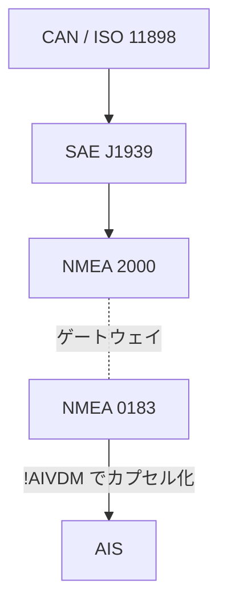

# 舶用データ通信プロトコル

船の上で、GNSSレシーバ・魚探・オートパイロット・チャートプロッタ・AIS機器といった電子機器同士がデータをやりとりするための規格群の見取り図。策定元はいずれも米国の業界団体 NMEA (National Marine Electronics Association) か、その周辺。

- **[[nmea-0183]]** — 1983年策定。ASCIIの1行テキスト（センテンス）を4800bpsのシリアル回線に一方向で垂れ流す。単純すぎるほど単純だが、そのおかげでGNSSレシーバの出力フォーマットとして舶用以外にも広まり、事実上の共通語になった。
- **[[nmea-2000]]** — 0183の後継。[[can-bus|CAN]]ベースの250kbps・バイナリ・双方向マルチドロップネットワークで、電源もケーブルで供給する。中身は0183と全くの別物で、名前の連続性に騙されない方がよい。
- **[[ais]]** — 船舶が自分の位置・船名などをVHFでブロードキャストし続ける仕組み。プロトコルスタックとしては独立しているが、受信結果を機器から取り出す部分は0183の`!AIVDM`センテンスに乗っている。
- **[[can-bus|CAN]]** — 舶用専用ではなく自動車由来の汎用フィールドバス。NMEA 2000 の土台。

## 構図

## 共通する事情

3つとも **規格書が有料・非公開**で、実装の多くがリバースエンジニアリング由来のドキュメント（0183なら gpsd の "NMEA Revealed"、2000なら canboat）に依存している。仕様が読まれないぶん方言と非互換が生まれやすく、パーサ側が現実のデータに合わせて守りを固める必要がある、という点も共通している。

#moc #marine #nmea #protocol
