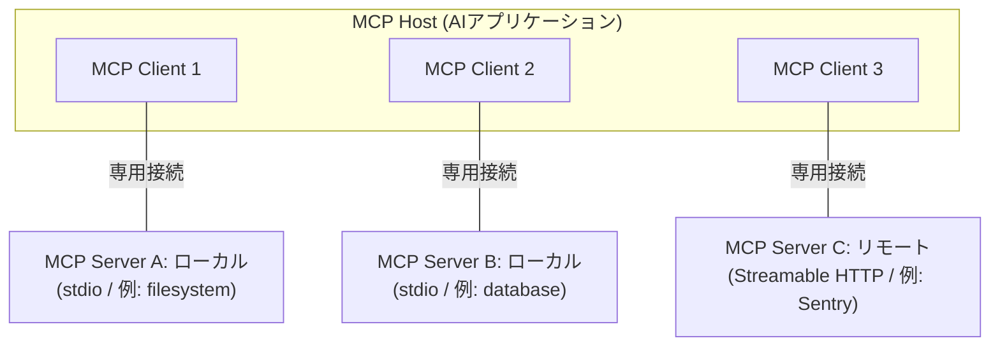

# MCP (Model Context Protocol)

AIアプリケーションを外部のシステム（データソース・ツール・ワークフロー）に接続するためのオープンな標準プロトコル。Anthropicが2024年11月25日に仕様バージョン `2024-11-05` として公開した。公式ドキュメントは「AIアプリケーションにとってのUSB-Cポート」と喩えている。

#ai-agent #ai

## 解こうとしている問題（M×N問題）

MCP以前は、M個のAIアプリケーションとN個のデータソース／ツールを繋ごうとすると、M×N本の専用コネクタを書く必要があった。MCPはクライアント側（AIアプリ／エージェント）とサーバー側（データ・ツールのコネクタ）の両方に単一のプロトコルを定義することで、これをM+Nに落とす。それぞれ1回実装すれば、準拠したクライアントは準拠したどのサーバーとも話せる。

この発想はMCP独自のものではなく、公式ドキュメントも[[lsp|LSP (Language Server Protocol)]]から直接インスパイアされたと明言している。LSPが「エディタ × プログラミング言語」の組み合わせ問題を1本のプロトコルで潰したのと同じことを、「AIアプリケーション × ツール／データソース」に対してやる、という構図。

[[llms-txt|llms.txt]]が「Webサイトの側からLLM向けにコンテンツを整える」静的な提案であるのに対し、MCPは双方向のRPCプロトコルとして、ツール実行まで含めた動的なやり取りを規定する点が違う。

## アーキテクチャ

- **MCP Host** — 複数のMCPクライアントを束ねて管理するAIアプリケーション本体（Claude Code、Claude Desktop、VS Codeなど）
- **MCP Client** — 1つのサーバーとの接続を維持し、そこからコンテキストを取得してホストに渡すコンポーネント
- **MCP Server** — コンテキストを提供するプログラム。ローカルで動くかリモートで動くかは問わない

ホストは接続するサーバーの数だけクライアントを生成する。「サーバー」という語はどこで動くかではなく役割を指す点に注意が必要で、stdioでローカルプロセスとして起動されるものも立派なMCPサーバー。

MCPが規定するのは**コンテキスト交換のプロトコルだけ**で、AIアプリがLLMをどう使うか、受け取ったコンテキストをどう管理するかには踏み込まない。

## 2つのレイヤー

- **Data layer** — [[json-rpc|JSON-RPC 2.0]]ベースの交換プロトコル。メッセージ構造とセマンティクス、capability/バージョンのdiscovery、primitives、notificationsを定義する
- **Transport layer** — 通信路と認証。**stdio**（同一マシン上のプロセス間、ネットワークオーバーヘッドなし）と**Streamable HTTP**（HTTP POST + 必要に応じてSSE、リモート接続向け。認証はOAuthが推奨）の2種類

## Primitives

MCPの中心概念。クライアントとサーバーが互いに何を提供できるかを定義する。

**サーバーが公開するもの:**

- **Tools** — AIが呼び出して実行できる関数（ファイル操作、API呼び出し、DBクエリなど）
- **Resources** — コンテキストとして読み込ませるデータソース（ファイル内容、DBレコード、APIレスポンスなど）
- **Prompts** — 対話を構造化する再利用可能なテンプレート（システムプロンプト、few-shot例など）

それぞれに `*/list`（discovery）、`*/get`（取得）、`tools/call`（実行）といったメソッドが対応する。リストは動的に変わってよい設計になっている。

**クライアントが公開するもの:**

- **Elicitation** — サーバーがユーザーに追加情報を求めたり、操作の確認を取ったりする（`elicitation/create`）

なお **Sampling**（サーバーがクライアント側のLLMに補完を依頼する）、**Roots**、**Logging** は仕様バージョン `2026-07-28` で正式にdeprecatedになった。最低12ヶ月のサポート期間を置いた移行が予定されており、新規実装はLLMプロバイダのAPIを直接叩く、ログは `stderr` かOpenTelemetryを使う、という方針が示されている。

## 仕様バージョンの変遷

| バージョン | 主な内容 |
|---|---|
| `2024-11-05` | 初版。Python/TypeScript SDKと、Google Drive・Slack・GitHub・Git・Postgres・Puppeteerなどの参照サーバーが同時公開 |
| `2025-03-26` | Streamable HTTP transportの導入（従来のHTTP+SSEを置き換え） |
| `2025-06-18` | 構造化されたツール出力、OAuthセキュリティの強化、サーバー起点のユーザー操作 |
| `2025-11-25` | 安定版 |
| `2026-07-28` | ステートレス化・MRTR・Tasks拡張・認可の強化（後述） |

### `2026-07-28` のステートレス化

この改訂は方向性としてかなり大きい。

- **プロトコルレベルのセッションを廃止** — `initialize`/`initialized` ハンドシェイクと `Mcp-Session-Id` ヘッダを削除。各リクエストが自己完結し、プロトコルバージョン・クライアントのcapability・identityを `_meta` フィールドに載せて毎回送る。サーバーは必須の `server/discover` で自分の対応バージョンとcapabilityを公開する
- **MRTR (Multi Round-Trip Requests)** — 双方向の開きっぱなしストリームを必要としていた「サーバー起点のリクエスト」を置き換える。サーバーは `resultType: "input_required"` を返すことで呼び出しの途中でユーザー入力を要求できる
- **ヘッダベースのルーティング** — `Mcp-Method` / `Mcp-Name` ヘッダにより、ゲートウェイやロードバランサがJSONボディを解析せずにルーティング・認可できる
- **リスト結果のキャッシュ** — `ttlMs` と `cacheScope`（HTTPのCache-Control由来）が付き、ツールカタログの再取得を減らせる
- **認可の強化** — RFC 9207によるissuer検証、Dynamic Client RegistrationからClient ID Metadata Documents (CIMD) への移行、issuerに紐づいたクライアント資格情報
- **Tasks拡張** — 長時間かかるリクエストに対して耐久性のあるハンドルを返し、`tasks/get` / `tasks/update` でポーリングできる

要するに「長寿命の双方向接続を前提とするプロトコル」から「ふつうのHTTPインフラに載るステートレスなプロトコル」への移行で、既存のロードバランサ・ゲートウェイ・キャッシュ層をそのまま活かせるようにする方向。

## ガバナンス — Agentic AI Foundationへ

2025年12月9日、AnthropicはMCPをLinux Foundation傘下に新設された **Agentic AI Foundation (AAIF)** へ寄贈した。AAIFはAnthropic・Block・OpenAIが共同設立し、Google・AWS・Microsoft・Cloudflare・Bloombergが支援する。MCPはBlockの goose、OpenAIの AGENTS.md と並ぶ創設プロジェクトのひとつ。

ガバナンスの分担は、AAIF理事会が戦略投資・予算・メンバー勧誘・新規プロジェクト承認を担い、MCPを含む各プロジェクトは技術的方向性と日々の運営について完全な自律性を保つ、という形。これは[[cncf|CNCF]]がクラウドネイティブ領域で果たしてきた「ベンダー中立の受け皿」と同じ構図で、単一ベンダーが握る標準への警戒に対する回答になっている。

寄贈時点での規模は、月間9,700万回のSDKダウンロード、1万のアクティブなサーバー、そしてChatGPT・Claude・Cursor・Gemini・Microsoft Copilot・VS Codeといった主要クライアントでのファーストクラスサポート。

## セキュリティ

MCPは「LLMのコンテキストに外部から文字列を流し込む」構造そのものなので、固有の攻撃面がある。OWASPはこれらの収束をMCPセキュリティの中核的懸念として挙げている。

- **Tool poisoning** — ツールの**説明文**に悪意ある指示を埋め込む攻撃。ユーザーには見えないがモデルには見える。登録フェーズでLLMのコンテキストに注入され、エージェントの推論を誘導する
- **ツール結果経由のprompt injection** — 戻り値やパラメータスキーマに仕込まれた指示
- **Confused deputy** — MCPサーバーが「要求したユーザーの権限」ではなく「サーバー自身の広い権限」で動作してしまう問題。対策としてMCPサーバーをOAuth 2.0のリソースサーバーとして扱い、OAuth 2.1 + PKCE + audienceに束縛されたトークンを使う方向でガイダンスが固まっている
- **サプライチェーン** — 公開レジストリからレビューなしに導入されたサーバーパッケージ。ゲートウェイに明示登録したサーバーだけを到達可能にする、といった制御が推奨される

## 関連

- [[agent-plugins|Agent Plugins]] — MCPサーバーとSkillをまとめて配布するパッケージ仕様。`mcp.json` でMCPサーバーの接続設定を持つ
- [[sovereign-agent-mesh|SAM]] — エージェント間でMCPツールを共有するためのゼロトラストP2Pオーバーレイ。MCPそのものより下のレイヤー
- [[ai-friendly-cli-design|AIフレンドリーなCLI設計]] — CLIの機能をMCPサーバーとして公開するのは、エージェントに機能を届ける手段のひとつ
- [[developer-portal|開発者ポータル]] — カタログをMCPで公開することで、ポータルの主な利用者が人間からエージェントに移りつつある

## 出典

- [What is the Model Context Protocol (MCP)? - modelcontextprotocol.io](https://modelcontextprotocol.io/docs/getting-started/intro)
- [Architecture overview - modelcontextprotocol.io](https://modelcontextprotocol.io/docs/2026-07-28/learn/architecture)
- [Introducing the Model Context Protocol - Anthropic](https://www.anthropic.com/news/model-context-protocol)
- [The 2026-07-28 Specification - MCP Blog](https://blog.modelcontextprotocol.io/posts/2026-07-28/)
- [MCP joins the Agentic AI Foundation - MCP Blog](https://blog.modelcontextprotocol.io/posts/2025-12-09-mcp-joins-agentic-ai-foundation/)
- [Linux Foundation Announces the Formation of the Agentic AI Foundation (AAIF)](https://www.linuxfoundation.org/press/linux-foundation-announces-the-formation-of-the-agentic-ai-foundation)
- [MCP Security Cheat Sheet - OWASP](https://cheatsheetseries.owasp.org/cheatsheets/MCP_Security_Cheat_Sheet.html)
- [MCP Security Notification: Tool Poisoning Attacks - Invariant Labs](https://invariantlabs.ai/blog/mcp-security-notification-tool-poisoning-attacks)
