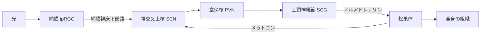

# メラトニン

脳内の**松果体**から分泌されるホルモン。[[serotonin|セロトニン]]から2段階の酵素反応で作られる。血中濃度は昼間に低く夜間に高いという顕著な日内変動を示し、睡眠・体温・ホルモン分泌などの**概日リズム（サーカディアンリズム）**、および渡り鳥の飛来や季節性繁殖のような季節リズムの調節に関わる。

「眠くなる薬」というより、**体内時計に「今は夜だ」という信号を伝える物質**と捉えたほうが役割を掴みやすい。

## 生合成

原料は必須アミノ酸のトリプトファン。トリプトファンからセロトニンが作られ、そこからさらに2段階でメラトニンになる。

```
トリプトファン → 5-HTP → セロトニン (5-HT)
  ↓ アリールアルキルアミンN-アセチル転移酵素 (AANAT)   ← 律速段階
N-アセチルセロトニン
  ↓ アセチルセロトニンO-メチル基転移酵素 (ASMT / HIOMT)
メラトニン
```

律速酵素であるAANATの活性は、体内時計と外界の光の両方の調節を受ける。これがメラトニン分泌の日内変動の実体になっている。

## 分泌を制御する経路



体内時計の中枢は視床下部の**視交叉上核 (SCN)** にあり、網膜からの光情報を網膜視床下部路経由で受け取る。暗くなるとSCNからの信号が室傍核・上頸神経節を経て松果体に達し、交感神経から放出されたノルアドレナリンが松果体細胞のβアドレナリン受容体を刺激、cAMP依存的にAANATが上昇してメラトニンが合成される。光が入るとこの経路が遮断される。

分泌されたメラトニンは逆にSCNの受容体に作用して体内時計にフィードバックする。SCNが親時計、メラトニンがその出力かつフィードバック入力、という循環構造になっている。

## 光による抑制

日中の太陽光のような強い照度ではメラトニン分泌は著しく低下する。厚生労働省 e-ヘルスネットでは、夜間の人工照明、特に家庭照明レベルの光でも分泌が抑制されうると指摘されている。

- 網膜側の受容体は、桿体・錐体ではなくメラノプシンを持つ**内因性光感受性網膜神経節細胞 (ipRGC)** が主役。メラノプシンは短波長（青色）光に最も感度が高い。これがいわゆる「寝る前のブルーライト」の話の生理学的な根拠になっている。
- PNAS (2019) の研究では、夕方の30ルクス程度の薄暗い光でも群平均で50%以上のメラトニン抑制が観察された。ただし光感受性の**個人差が非常に大きい**ことも同時に示されている。

## DLMO — 概日位相のバイオマーカー

**DLMO (dim light melatonin onset)** は、薄暗い環境下でメラトニン濃度が立ち上がる時刻。その人の「生物学的な夜の始まり」を示す指標として、概日リズム睡眠障害の評価に使われる、体内時計の位相を測るもっとも信頼される方法とされる。

測定は18時頃から30〜120分おきに唾液を採取し、メラトニン濃度が閾値（通常3 pg/mL）を超える時刻を求める。測定中に光でメラトニンが抑制されると値が壊れるため、非常に暗い環境が必要になる。

## 受容体

高親和性の膜受容体として**MT1**と**MT2**の2つのサブタイプがあり、いずれもGタンパク質共役受容体 (GPCR)。SCN・その他の脳領域・末梢組織に分布し、光周期情報を伝える。SCNではMT1が主役とされる。

## 薬としてのメラトニン

投与のタイミングによって体内時計を前進させたり後退させたりする（位相反応曲線が知られている）。単に飲めば眠くなるというより、時差ぼけや概日リズム睡眠・覚醒障害のような**位相のずれ**を扱う文脈で意味を持つ。

日本での扱いは海外と異なり、次のようになっている。

- **メラトニンそのものは医薬品成分**であり、食品（サプリメント）として販売することは認められていない。米国では1994年のDSHEA法によりホルモンでもサプリメントとして販売しやすい制度になっており、この違いが「日本でメラトニンのサプリが売っていない」理由。
- 医療用としては、成人の不眠症（入眠困難）に対してMT1/MT2受容体作動薬の**ラメルテオン（ロゼレム）**が使われてきた。
- メラトニン製剤としては、2020年3月に**メラトベル顆粒小児用0.2%**が「小児期の神経発達症に伴う入眠困難の改善」を効能・効果として国内承認された（同年6月発売）。国内初のメラトニン製剤。

## 加齢による低下

メラトニン分泌は成人期以降、加齢とともに漸減する。松果体の加齢性変化に伴うものとされ、70〜90歳にかけて低下が続く。高齢者の睡眠が浅くなる・早寝早起きになるといった変化の背景要因のひとつとして議論される。

## 出典

- [メラトニン | e-ヘルスネット（厚生労働省）](https://www.e-healthnet.mhlw.go.jp/information/dictionary/heart/yk-062.html)
- [Physiology of the Pineal Gland and Melatonin - Endotext, NCBI Bookshelf](https://www.ncbi.nlm.nih.gov/books/NBK550972/)
- [MT1 and MT2 Melatonin Receptors: A Therapeutic Perspective - PubMed](https://pubmed.ncbi.nlm.nih.gov/26514204/)
- [Clinical Implications of the Melatonin Phase Response Curve - PMC](https://pmc.ncbi.nlm.nih.gov/articles/PMC2928905/)
- [High sensitivity and interindividual variability in the response of the human circadian system to evening light | PNAS](https://www.pnas.org/doi/10.1073/pnas.1901824116)
- [小児の神経発達症に伴う睡眠障害に初のメラトニン製剤 | 日経メディカル](https://medical.nikkeibp.co.jp/leaf/all/series/drug/update/202007/566470.html)
- [メラトニン受容体作動性入眠改善剤「メラトベル顆粒小児用0.2%」新発売のお知らせ（ノーベルファーマ, 2020-06-23）](https://www.nobelpharma.co.jp/_cms/wp-content/uploads/2020/06/0904ede02edbf3e7cac5f3103662687e.pdf)
- [医薬品成分(メラトニン)が検出されたいわゆる健康食品について（厚生労働省）](https://www.mhlw.go.jp/kinkyu/diet/other/080611-1.html)
- [The human pineal gland and melatonin in aging and Alzheimer's disease - Journal of Pineal Research](https://onlinelibrary.wiley.com/doi/10.1111/j.1600-079X.2004.00196.x)

#生物 #医療 #睡眠
