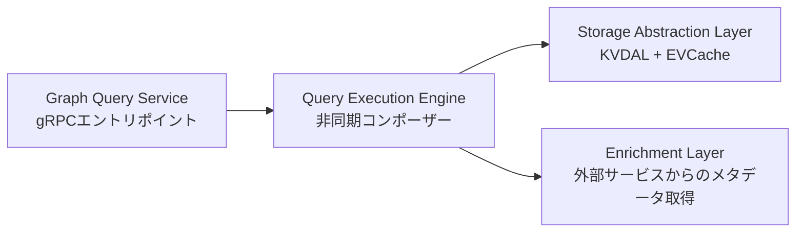

# Netflixのリアルタイム分散グラフDB: gRPCによるクエリ層設計

Netflix Tech Blogの3部作記事のPart 3。「どのデバイスがこのアカウントから視聴したか」のような質問に、数十億ノード・1500億エッジ規模でリアルタイム・サブ100msで答える必要があるという課題に対し、グラフの検索(クエリ)層をどう設計したかを扱う。Part 1はApache Flinkによるデータ取り込み、Part 2は単一ノードでのミリ秒級ストレージ層設計。

## アーキテクチャ

gRPCをエントリポイントとする3層構成。

- **Graph Query Service** — gRPCリクエストを受け、検索仕様を検証して実行エンジンに渡す
- **Query Execution Engine** — 幅優先探索(BFS)でグラフを1レベルずつ展開し、各ホップの並列I/Oを非同期に構成する
- **Storage Abstraction Layer** — ノード検索・エッジ取得・ストリーミング・キャッシングを担当
- **Enrichment Layer** — 外部Netflixサービスからメタデータをオンデマンド取得。バッチ化し、失敗時はグレースフルに降級(fail-open)する

記事はgRPC自体の採用理由(protobufスキーマ設計、[[microservices|マイクロサービス]]間通信としての選定理由など)には触れておらず、上記の非同期設計とスレッドプール戦略に紙幅を割いている。

## なぜ深さ優先ではなく幅優先(BFS)か

分散システムでは各ホップがネットワーク呼び出しになる。深さ優先(DFS)で1本のパスを最後まで追跡してから次に移ると、レイテンシがホップ数だけ直列に積み上がる。BFSなら1レベル分のノードを並列にバッチ検索してから次レベルに進めるため、レイテンシがホップ数ではなく「最も遅い1ホップ」に近づく。

例: Account X → 5つのProfile → 各Profileが数百件視聴、という構造なら、BFSは5つのProfileの次のエッジを同時に取得できる。

## 隣接リストによるエッジ検索

各ノードが接続先を明示的に持つ隣接リスト形式(`Account_X: has_profile → [Profile_Alex, Profile_Kids, ...]`)でエッジを保持し、グローバルスキャンを避けて数ミリ秒でのエッジ検索を実現している。

## ソース側でのストリーミング・フィルタリング

大きな隣接リスト(例: 500件の視聴エッジ)は100件単位でバッチストリーミングし、各バッチ到着時にフィルタ(例: 直近30日・特定コンテンツ)を適用、条件を満たすエッジが十分集まった時点で読み込みを打ち切る。フィルタリングをストレージ層＝ソース側で行うことで、不要なデータを転送しないのがポイント。

フィルタは4段階の優先順位でオーバーライドできる。

1. アプリケーションレベルのデフォルト(例: 100日ルックバック、300エッジ/ホップ)
2. グローバルオーバーライド
3. ホップごとの制限
4. エッジタイプ別の制限

より狭い制限が優先される(例: グローバルデフォルトが100日でも、特定エッジタイプに30日指定があれば30日が採用される)。これにより機能追加のたびにコードを変更するのではなく、チームごとにクエリのパラメータ調整で要件に対応できるようにしている。

エッジ選択には2モードがある。

- **LATEST** — タイムスタンプでソートし最新のものを上限件数まで保持。「最近何を見たか」向き
- **ANY** — 最初に見つかったものを返す(ソート不要)。「一度でも見たことがあるか」向きで高速

## 非同期ファースト設計

thread-per-requestではなく、16〜24スレッドの専用スレッドプールを複数用意し、I/O待ちでスレッドをブロックしない非同期構成にすることで、数千の並行リクエストを少数のスレッドで捌く。スレッド数を数百から16〜24まで圧縮でき、インフラコスト削減に直結した一方、非同期スタックトレースが読みにくくなりデバッグが難化するというトレードオフがある。これは各ステージ(検証・ストレージ・enrichment・end-to-end)のメトリクスで補っている。

過負荷防止のため、適応的な同時実行数制限(adaptive concurrency limiting)も併用している。健全な状態では制限を徐々に引き上げ、エラーやタイムアウトが出ると急激に絞る。

## キャッシング戦略

当初はすべてのノードをTTL付きで一律キャッシュしていたが、メモリを浪費していた。改善策として、データの揮発性に応じてキャッシュ対象を絞るスマートTTLに変更した。

- Account/Profile/Contentのようなノードは比較的安定(数時間〜数日単位でしか変わらない)のでキャッシュ対象
- グラフの保持期間に基づき、例えばノードの最終アクティビティが99日前なら30日TTLでのキャッシュは無駄なので対象外にする

結果として70〜80%のキャッシュヒット率を達成し、ストレージ呼び出しを3〜4倍削減した。

## Enrichmentのオプトイン設計

デフォルトでは外部サービスによるメタデータ拡張(enrichment)を行わない。クライアントが明示的に要求したデータのみ非同期・並列でフェッチし、失敗時はグラフデータのみを返すfail-open方式にしている。

## パフォーマンス

- 単一ホップ: P50 15〜30ms、P99 100ms未満
- 3ホップ: 100〜150ms

## 出典

- [How and Why Netflix Built a Real-Time Distributed Graph, Part 3: Querying the Graph with gRPC - Netflix Tech Blog](https://netflixtechblog.com/how-and-why-netflix-built-a-real-time-distributed-graph-part-3-querying-the-graph-with-grpc-0f3468349607)
