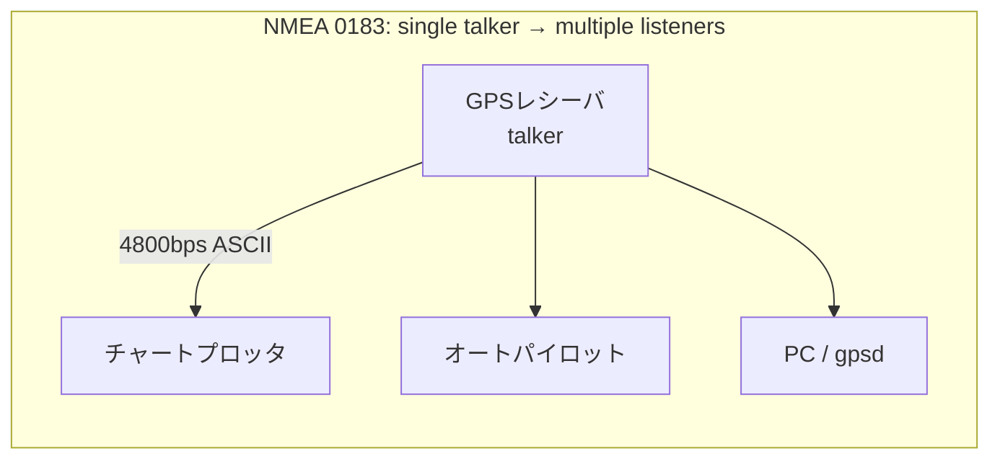

# NMEA 0183

NMEA 0183 は、米国の業界団体 NMEA (National Marine Electronics Association) が策定した舶用電子機器間の通信規格。GPSレシーバ・魚探・オートパイロット・AIS などが、ASCIIの1行テキスト（センテンス）をシリアル回線に垂れ流すという極めて素朴な仕様で、結果としてGNSSレシーバの出力フォーマットの事実上の共通語になっている。

`$GPGGA,...` で始まるあの行のことである。

## 歴史とバージョン

- NMEA 0180 / 0182 という先行規格があり、それを置き換える形で 1983年に v1.0 が出た。
- v2.0 (1992) で電気的仕様が EIA-232 から **EIA-422 (RS-422)** ベースに変わった。
- v3.0 (2000) で 38400bps の高速版 **NMEA 0183-HS** が追加された。AIS や ARPA が扱うデータ量が 4800bps に収まらなくなったため。
- v4.0 (2008)、そして最新は **v4.30 (2023年12月)**。GNSSセンテンス群が全面改訂され、GPS/GLONASS/Galileo/BDS/QZSS/NavIC のマルチコンステレーションに対応した。

規格書自体は有料で、NMEAメンバー価格でも1,150ドル、一般だと業種によって7,500〜10,000ドルする。にもかかわらず広く実装されているのは、gpsdプロジェクトの [NMEA Revealed](https://gpsd.gitlab.io/gpsd/NMEA.html) のように、公開情報とリバースエンジニアリングから再構成されたドキュメントが出回っているから。逆に言うと「規格書を読んだ実装」が少なく、後述の方言・非互換の温床になっている。

## 物理層とトポロジ

- 基本は **4800bps, 8bit, パリティなし, ストップビット1 (8N1)** の差動シリアル (EIA-422)。
- **single talker / multiple listeners** の一方向バス。1本のバスに喋る機器は1台だけで、聞く側は何台でもぶら下がれる。双方向のネゴシエーションは存在しない。
- 複数の talker のデータを1つのポートに集めたい場合は、外部のマルチプレクサ（コンバイナ）を使う。
- 民生のGNSSモジュール（u-bloxなど）はRS-422ではなくTTLレベルのUARTやUSB CDCで出してくることが多く、ボーレートも9600bpsがデファクトになっている。
- 中身はただの行指向テキストなので、TCP/UDPでそのまま流すデファクト運用も一般的（OpenCPNやSignal Kなどの構成でよく見る）。



## センテンスの構造

```
$GPGGA,123519,4807.038,N,01131.000,E,1,08,0.9,545.4,M,46.9,M,,*47<CR><LF>
 ^^ ^^^                                                          ^^
 |  |                                                            チェックサム
 |  センテンスID (3文字)
 talker ID (2文字)
```

- 先頭は `$`。**AISのようにバイナリをエンコードして運ぶ「カプセル化センテンス」は `!` で始まる**（`!AIVDM,...`）。
- talker ID の1文字目が `P` のものはベンダ独自拡張（proprietary / private）。`$PUBX,...`（u-blox）、`$PGRM...`（Garmin）などがこれ。
- フィールドはカンマ区切り。**値が無いフィールドは空のまま連続するカンマになる**（`,,`）。
- 1センテンスは `$`/`!` から `<CR><LF>` まで含めて **最大82文字**。
- 使えるのは印字可能ASCII + CR/LF のみ。

## チェックサム

`$`（または`!`）と `*` の間の全文字の **8bit XOR** を、16進2桁の大文字で書く。規格上はオプション扱いだが、RMA/RMB/RMC では必須とされている。

実際にPerlで確認してみると、gpsdのドキュメントに載っている実例と一致する:

```perl
perl -e '
for my $s (
  "GNGGA,001043.00,4404.14036,N,12118.85961,W,1,12,0.98,1113.0,M,-21.3,M,,",
  "GNRMC,001031.00,A,4404.13993,N,12118.86023,W,0.146,,100117,,,A",
) {
  my $c = 0;
  $c ^= ord($_) for split //, $s;
  printf "%s => *%02X\n", (split /,/, $s)[0], $c;
}'
# GNGGA => *47
# GNRMC => *7B
```

計算対象に含めるのはあくまで `$` と `*` に挟まれた部分で、末尾の空フィールド（上の例の `,,`）も当然含む。ここを取りこぼすと合わない。

## 主なセンテンス

| ID | 内容 |
| --- | --- |
| GGA | 測位の基本セット。時刻・緯度経度・fix品質・衛星数・HDOP・標高・ジオイド高 |
| RMC | "Recommended Minimum"。時刻・**日付**・緯度経度・対地速度・進路・磁気偏差 |
| GSA | 測位に使った衛星のIDと DOP (PDOP/HDOP/VDOP) |
| GSV | 可視衛星の一覧（PRN・仰角・方位角・SNR）。4衛星ずつ複数センテンスに分割される |
| VTG | 対地進路と速度 |
| GLL | 緯度経度と時刻 |
| ZDA | UTC日時とローカルタイムゾーンオフセット |

位置と時刻だけ欲しいなら **RMC 1本でだいたい足りる**（日付が入っているのはRMCとZDAだけなので、GGAだけ見ていると日付が取れない）。

### GGA

```
$GNGGA,001043.00,4404.14036,N,12118.85961,W,1,12,0.98,1113.0,M,-21.3,M,,*47
       |         |          |            | | |  |    |        |
       |         |          |            | | |  |    |        ジオイド高 -21.3m
       |         |          |            | | |  |    標高 1113.0m (MSL)
       |         |          |            | | |  HDOP 0.98
       |         |          |            | | 使用衛星数 12
       |         |          |            | fix品質 1 = GPS fix
       |         |          経度 121°18.85961' W
       |         緯度 44°04.14036' N
       UTC 00:10:43.00
```

fix品質のコードは `0`=測位不能, `1`=GPS, `2`=DGPS, `3`=PPS, `4`=RTK Fixed, `5`=RTK Float, `6`=推測航法, `7`=手動, `8`=シミュレーション。RTKを使う場合はここの4/5を見る。

### RMC

```
$GNRMC,001031.00,A,4404.13993,N,12118.86023,W,0.146,,100117,,,A*7B
       |         | |                          |     | |      |
       |         | |                          |     | |      FAAモードインジケータ A=Autonomous
       |         | |                          |     | 日付 10 Jan 2017 (ddmmyy)
       |         | |                          |     進路（空）
       |         | |                          対地速度 0.146ノット
       |         | 緯度経度
       |         ステータス A=有効 / V=警告
       UTC
```

## 緯度経度の形式に注意

NMEAの緯度経度は10進度ではなく **`ddmm.mmmm`（度＋分）** 形式。`4404.14036` は 44.0414度ではなく 44度4.14036分。10進度に直すには分を60で割って足す:

```perl
perl -e 'printf "%.6f %.6f\n", 44+4.14036/60, 121+18.85961/60'
# 44.069006 121.314327
```

そのままfloatとして地図に投げるとオレゴンあたりの座標が数十km飛ぶ。NMEAパーサを自作するときに最初に踏むバグ。

## Talker ID とマルチGNSS

| ID | コンステレーション |
| --- | --- |
| GP | GPS |
| GL | GLONASS |
| GA | Galileo |
| GB / BD | BeiDou |
| GQ | QZSS（みちびき） |
| GI | NavIC (IRNSS) |
| GN | 複数を組み合わせた測位結果 |

昔のレシーバはGPS専用だったので `$GPGGA` 決め打ちのパーサでも動いていたが、現代のマルチコンステレーション対応レシーバは組み合わせ測位の結果を **`$GNGGA`** として出す。`$GPGGA` を literal に比較している実装は、新しいレシーバをつないだ瞬間に「1行も測位が取れない」という症状になる。センテンスIDの3文字（`GGA`/`RMC`…）でマッチし、talker IDは別途見るのが正解。

## 実装上のハマりどころ

- **82文字前提でバッファを切らない**。ベンダ独自センテンスは平気で超えてくるので、受信バッファは256バイト以上取って、長すぎる行はクラッシュせずログに落とす。
- **バージョンによってフィールド数が増える**。NMEA 2.3でFAAモードインジケータが、4.1でNav Statusが末尾に足された。フィールド数を固定長で assert すると古い/新しいレシーバで死ぬ。VTGは特にバージョン間で形が変わる。
- **規格違反だが「空にすべきフィールドに0を詰める」実装が実在する**。値の有効性はステータスフィールド（RMCの`A`/`V`、GGAのfix品質）で判断する。
- **RMCの日付は2桁年** (`ddmmyy`)。世紀の解釈は実装依存。
- **チェックサムはオプション**扱いなので、無い行を捨てると動かない機器がある。逆に、あるなら必ず検証すべき（元々ノイズの多い環境向けの規格）。
- **GSVは分割される**。「3本中1本目」といったヘッダを見て組み立てないと、可視衛星の全体像にならない。

## NMEA 2000 との関係

後継として **NMEA 2000 (N2K)** がある。こちらは CAN (Controller Area Network) ベースで、250kbps・バイナリのPGN (Parameter Group Number) メッセージ・multi-talker/multi-listenerのマルチドロップネットワーク・電源線込みのバックボーンケーブル、と全く別物。プレジャーボート向けでは 0183 から 2000 への置き換えが進んでいるが、商船や既存機器の相互接続では 0183 が依然として現役で、0183↔2000 のゲートウェイ製品が売られている。

一方、**「GNSSレシーバからアプリケーションへ座標を渡す」用途に限れば 0183 は今も圧倒的に使われている**。テキストで人間が読めて、`cat /dev/ttyUSB0` で中身が確認でき、実装が数十行で済むという利点が効く領域だから。gpsd、OpenCPN、Signal K、QGIS、Google Earth などが軒並みサポートしている。

同じ「機体・船体のテレメトリを運ぶプロトコル」でも、[[mavlink|MAVLink]] がバイナリパケットで双方向のコマンド送信まで面倒を見るのに対し、NMEA 0183 はASCIIの一方向垂れ流しに徹している。役割の違いというより、策定された年代（1983年 vs 2009年）と、当時のマイコンで扱える複雑さの違いが大きい。

## 出典

- [NMEA 0183 | NMEA](https://www.nmea.org/nmea-0183.html)
- [NMEA Revealed | gpsd](https://gpsd.gitlab.io/gpsd/NMEA.html)
- [NMEA 0183 - Wikipedia](https://en.wikipedia.org/wiki/NMEA_0183)
- [AIVDM/AIVDO protocol decoding | gpsd](https://gpsd.gitlab.io/gpsd/AIVDM.html)
- [Everything you need to know about NMEA 0183 | Actisense](https://actisense.com/wp-content/uploads/2021/01/Everything-you-need-to-know-about-NMEA-0183-1.pdf)

#nmea #gnss #gps #protocol #serial
