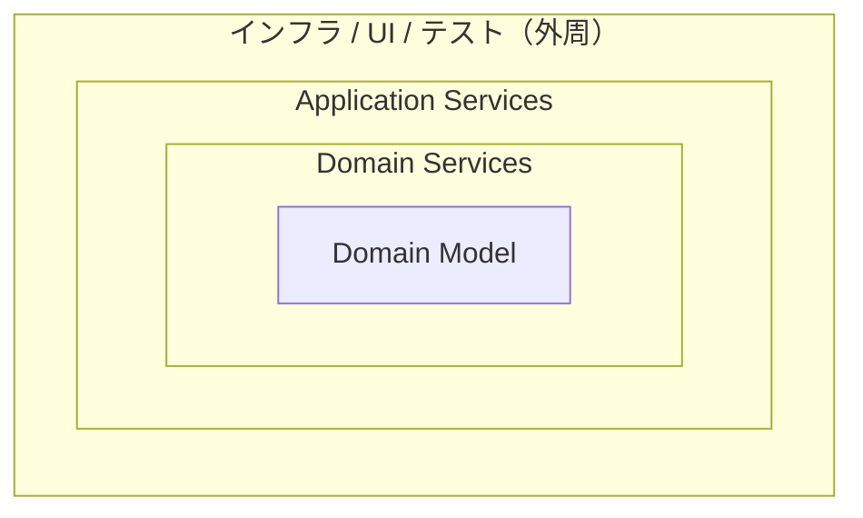

# オニオンアーキテクチャ (Onion Architecture)

#software-engineering #architecture

Jeffrey Palermoが2008年7月からのブログ連載で提唱したアーキテクチャ。従来のn層アーキテクチャ（UI → ビジネスロジック → データアクセス）の結合の向きを反転させ、ドメインモデルを中心に置く。

## 従来のレイヤードアーキテクチャの何が問題か

Palermoの指摘は結合度に集中している。

> Each layer is coupled to the layers below it, and each layer is often coupled to various infrastructure concerns.
> （各層はその下の層に結合し、さらに各層はしばしば様々なインフラの関心事に結合している）

上から下へ依存が流れるため、推移的にUIがデータアクセスに結合してしまう。そして「データアクセスの手法は業界的に少なくとも3年ごとに変わってきた」ので、そこに強く結合したシステムは段階的にアップグレードできず、いずれ書き直しになる、という論法。

## 基本方針

- **結合は中心に向かう** — 「すべてのコードはより中心寄りの層に依存してよいが、コアより外の層に依存してはならない」
- **中心はドメインモデル** — 「組織にとっての真実をモデル化した、状態と振る舞いの組み合わせ」。結合が中心へ向かうため、ドメインモデルは自分自身にしか結合しない
- **インターフェースは内側で定義する** — リポジトリのインターフェースはアプリケーションコア側に置き、実装は外側の層に置く
- **インフラは外周へ** — 「データベースは中心ではない。外部である」

外周には、DBアクセスの実装・Web UI・テストが**同じ距離で**並ぶ。この「テストが最外周にインフラと並ぶ」点が図としてわかりやすい。

## 実行時の組み立て

インターフェースを内側、実装を外側に置いた結果、実行時にどこかで両者を繋ぐ必要が出る。ここで[[dependency-injection|依存性注入]]（IoCコンテナ）を使って実装を注入する、というのが前提になっている。これは[[solid-principles|DIP]]をアーキテクチャ全体に適用した形。

## [[software-architecture-styles]]の中での位置づけ

[[hexagonal-architecture|ヘキサゴナル]]が「内 vs 外」の2分割で止めるのに対し、オニオンは内側をドメインモデル／ドメインサービス／アプリケーションサービスの同心円に割る。この「内側を割る」構造を引き継いで、Entities / Use Cases という名前を与えたのが[[clean-architecture|クリーンアーキテクチャ]]。

中心にドメインモデルを置く点で[[domain-driven-design|DDD]]との親和性が高く、実際にDDD実装の文脈で参照されることが多い。

## 出典

- [The Onion Architecture : part 1 (Jeffrey Palermo, 2008)](https://jeffreypalermo.com/2008/07/the-onion-architecture-part-1/)
- [Hexagonal architecture (software) - Wikipedia](https://en.wikipedia.org/wiki/Hexagonal_architecture_(software))
