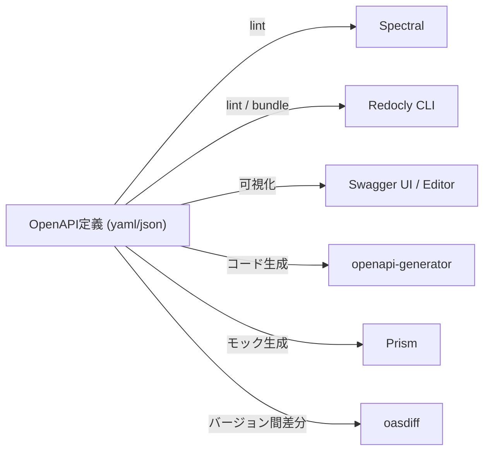

# OpenAPI関連ツールエコシステム

[[openapi|OpenAPI]]仕様を中心に育ったツール群を束ねるハブノート。「定義の品質を静的にチェックする」「定義を可視化・文書化する」「定義からコードやモックを生成する」「バージョン間の互換性を見る」という役割ごとに整理する。

## 各ツール

- [[spectral|Spectral]] — Stoplight製のOSSリンター。JSONPathベースのルールでOpenAPI/AsyncAPI文書の書き方の品質をチェックする
- [[redocly-cli|Redocly CLI]] — Redocly製のlint/bundle CLI。Spectralと競合するリンター機能を持つ
- [[swagger-ui-editor|Swagger UI / Swagger Editor]] — SmartBear製、API設計とドキュメント可視化の定番
- [[openapi-generator|openapi-generator]] — 定義からクライアントSDK・サーバースタブ・ドキュメントを自動生成。swagger-codegenからのfork
- [[prism-mock-server|Prism]] — OpenAPI定義からHTTPモックサーバーを起動。Spectralと同じStoplight系
- [[oasdiff|oasdiff]] — 2つの仕様間の破壊的変更を検出。CIでの互換性チェックに使う

## Stoplight系とRedocly系

SmartBearが2023年にStoplightを買収したことで、Spectral・[[prism-mock-server|Prism]]・Swagger(UI/Editor/Hub)が同じSmartBear傘下のOSSポートフォリオに集約されている。これに対しRedocly社は独立系で、Spectralの代替となるlint/bundle機能を持つRedocly CLIを提供し、公式に移行ガイドまで用意している。

#openapi #moc #devtools
