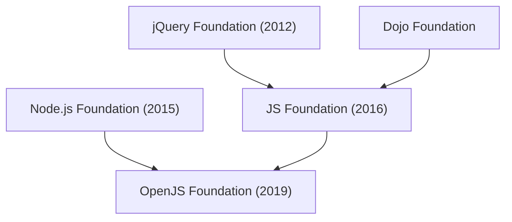

# OpenJS Foundation

JavaScriptエコシステムのOSSプロジェクトをホストする非営利財団。2019年3月にNode.js FoundationとJS Foundationが合併して発足した。Linux Foundation傘下のサブファウンデーションとして運営されている。 #javascript #oss

## 系譜

複数の財団の合併を重ねてできた組織。

## ホストするプロジェクト

Node.js・jQuery・webpack・Appium・Node-RED・[[eslint|ESLint]]・[[electron|Electron]]など、約38のOSSプロジェクトをホストする（2025年時点）。設立時のメンバーにはGoogle・Microsoft・IBM・PayPal・GoDaddy・Joyentなどが名を連ねる。ドイツのSovereign Tech Fundから80万ユーロ超の資金提供を受けるなど、公的資金によるOSS支援の受け皿にもなっている。

## 役割

特定企業に属さない中立的な組織としてプロジェクトの商標・ガバナンスを引き受け、JavaScriptエコシステム全体の持続的な成長を支えることを使命とする。個人が始めたプロジェクトが広く使われるようになったとき、その資産（商標など）と運営を引き継ぐ受け皿として機能している（例: [[eslint|ESLint]]は2016年にjQuery Foundationに参加し、合併を経て現在はOpenJS Foundation傘下）。

## 出典

- [OpenJS Foundation - Wikipedia](https://en.wikipedia.org/wiki/OpenJS_Foundation)
- [Node.js Foundation and JS Foundation Merge to Form OpenJS Foundation - Linux Foundation](https://www.linuxfoundation.org/press/press-release/node-js-foundation-and-js-foundation-merge-to-form-openjs-foundation)
- [OpenJS Foundation](https://openjsf.org/)
