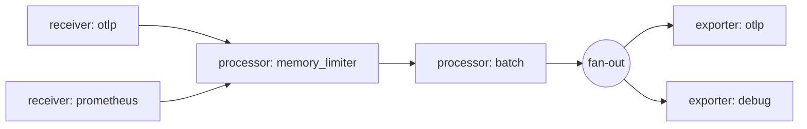

# OpenTelemetry Collector

テレメトリ(トレース・メトリクス・ログ)をベンダー非依存の形で**受信・処理・エクスポート**する単一のバイナリ。アプリケーション側は「OTLPでCollectorに送る」ことだけを知っていればよく、実際の保存先(Datadog / Grafana / Elastic / 自前のDB…)の切り替えはCollectorの設定変更だけで済む。バックエンドごとに専用エージェントを並べる必要がなくなるのが主な存在意義。

#opentelemetry #observability #cncf

## パイプライン構造

Collectorの設定は「パイプライン」の集合として書く。パイプラインはtraces / metrics / logsのデータ種別ごとに定義され、以下のコンポーネントを繋いだデータ経路を表す。

| コンポーネント | 役割 |
|---|---|
| **receiver** | データの入口。ポートで待ち受ける(OTLP等)か、能動的にスクレイプしに行く(Prometheus形式のエンドポイント等) |
| **processor** | パイプライン内で順番に繋がれ、データを変換する。属性の追加・削除、サンプリングによる間引き、バッチ化など |
| **exporter** | データの出口。ネットワーク越しのバックエンドへ転送する、あるいは標準出力やファイルへ吐く |
| **connector** | あるパイプラインのexporterとして振る舞い、同時に別のパイプラインのreceiverとして振る舞う。パイプライン同士の接続に使う(スパンからメトリクスを生成する等) |
| **extension** | パイプラインの外側の機能。ヘルスチェックエンドポイント、認証、pprofなど |

receiverの`prometheus`は[[prometheus|Prometheus]]サーバーと同じスクレイプ設定を書いて`/metrics`を取りに行くもので、これによりPrometheus用に計装済みのシステムをそのままOTelのパイプラインに載せられる。



## fan-in / fan-out の挙動

- 複数のreceiverが同じパイプラインに繋がる場合、それらは最初のprocessorに合流する(fan-in)。
- 1つのreceiverを**複数のパイプラインが参照した場合**、Collectorはreceiverのインスタンスを1つだけ作り、「fan-outコンシューマ」経由で各パイプラインの先頭processorへデータを配る。このとき、**どれか1つのprocessorが処理をブロックすると、そのreceiverに繋がっている他のパイプラインもデータ受信をブロックされる**。遅いエクスポート先が他系統を巻き込みうるので、パイプラインの共有には注意が要る。
- パイプラインの末尾では各exporterへデータのコピーが配られる(fan-out)。複数パイプラインが同じexporterを参照することもできる。

## デプロイパターン

- **エージェント(agent)** — アプリケーションと同じホスト/Pod/サイドカーに同居させ、アプリからはローカルへ即座にオフロードさせる。アプリ側のバッファリング責務を減らせる。
- **ゲートウェイ(gateway)** — 複数のエージェントやSDKからのデータを集約する中央のCollector。テールベースサンプリングや、複数バックエンドへのルーティングといった「全体を見ないとできない処理」を担わせる。

両者は排他ではなく、agent → gateway → バックエンド の二段構成がよく採られる。

## ディストリビューション

Collectorは「どのコンポーネントを同梱するか」でビルドが変わるため、複数のディストリビューションが公式に配布されている。

- **core** — 最小構成。OTLPを中心とした基本コンポーネントのみ。
- **contrib** — コミュニティ製を含む大量のコンポーネント入り。とりあえず試すならこれ。
- **k8s** — [[kubernetes|Kubernetes]]環境向けの構成。
- **otlp** — OTLPに特化した構成。
- **eBPFプロファイリング向け** — プロファイリングシグナル対応。

各ディストリビューションの同梱コンポーネントは、リリースリポジトリの`manifest.yaml`で確認できる。AWS・Datadog・Grafana・Splunk・Elastic・Dynatrace等のベンダーも独自ディストリビューションを配っているが、これらはOpenTelemetryプロジェクトが検証・承認したものではなく、一覧として紹介されているだけである。

## ocb でカスタムディストリビューションを作る

既製のディストリビューションが要件に合わない場合、**ocb (OpenTelemetry Collector Builder)** でマニフェストに列挙したコンポーネントだけを含むバイナリを生成できる。バイナリサイズと攻撃面を減らせるほか、自作コンポーネントを組み込めるのが利点。

```yaml
# builder-config.yaml
dist:
  name: otelcol-dev
  description: Basic OTel Collector distribution for Developers
  output_path: ./otelcol-dev

exporters:
  - gomod:
      go.opentelemetry.io/collector/exporter/debugexporter v0.159.0
  - gomod:
      go.opentelemetry.io/collector/exporter/otlpexporter v0.159.0

processors:
  - gomod:
      go.opentelemetry.io/collector/processor/batchprocessor v0.159.0

receivers:
  - gomod:
      go.opentelemetry.io/collector/receiver/otlpreceiver v0.159.0
```

```sh
./ocb --config builder-config.yaml
```

これで`output_path`にGoのソースと実行可能バイナリが生成される。ocb自体は「コンポーネントのマニフェストを、動くCollectorバイナリに変換する」だけの小さなツールで、コンポーネントは`gomod`でGoモジュールとして指定する。

この仕組みを使って作られたローカル開発用ディストリビューションの例が[[otel-desktop-viewer]]。DuckDBへ書き込む独自exporterを組み込んでいる。

## 出典

- [OpenTelemetry Collector](https://opentelemetry.io/docs/collector/)
- [Architecture | OpenTelemetry](https://opentelemetry.io/docs/collector/architecture/)
- [Distributions | OpenTelemetry](https://opentelemetry.io/docs/collector/distributions/)
- [Build a custom Collector with OpenTelemetry Collector Builder | OpenTelemetry](https://opentelemetry.io/docs/collector/extend/ocb/)
