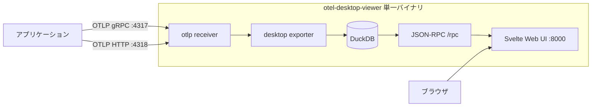

# otel-desktop-viewer

ローカル開発中にOpenTelemetryのテレメトリを受け取って眺めるためのCLIツール。トレース・メトリクス・ログをベンダーのSaaSに送らずに手元で確認できる。Go製、Apache License 2.0。[CtrlSpice/otel-desktop-viewer](https://github.com/CtrlSpice/otel-desktop-viewer)。

#opentelemetry #observability #golang

## 実体はカスタムCollectorディストリビューション

単なるビューアではなく、[[opentelemetry-collector|OpenTelemetry Collector]]に独自の`desktop` exporterを組み込んだカスタムディストリビューションとして作られている。この`desktop` exporterが以下の3つを担う。

1. 受け取ったテレメトリを[[duckdb|DuckDB]]へ取り込む
2. `POST /rpc`のJSON-RPC APIとして公開する
3. バイナリに埋め込まれたSvelte製のWeb UIを配信する

つまり「Collector + 組み込みDB + 組み込みUI」が単一バイナリに収まっている。ローカルにJaegerのall-in-oneやバックエンド一式を立てるのに比べて、依存が単一バイナリで済むのが利点。



## 使い方

```sh
otel-desktop-viewer
```

これだけで以下が立ち上がる。

- Web UI: `localhost:8000`
- OTLP gRPCレシーバー: `localhost:4317`
- OTLP HTTPレシーバー: `localhost:4318`

アプリ側は`OTEL_EXPORTER_OTLP_ENDPOINT`をここに向けるだけでよい。Docker Composeに1サービスとして足し、他のサービスからOTLPで送らせる使い方も想定されている。

### 主なフラグ

| フラグ | 意味 | デフォルト |
|---|---|---|
| `--db string` | DuckDBファイルへ永続化する | 指定なし(インメモリ) |
| `--db-max-size string` | 保存容量の上限 | メモリ512MB / ディスク2GB |
| `--browser-port int` | Web UIとJSON-RPC APIのポート | 8000 |
| `--grpc int` | OTLP gRPCの待ち受けポート | 4317 |
| `--http int` | OTLP HTTPの待ち受けポート | 4318 |
| `--host string` | OTLPとWeb UIのバインド先ホスト | localhost |
| `--open-browser` | 起動時にブラウザを開く | true |

## ストレージ

デフォルトはインメモリで、プロセスを終了するとデータは消える。残したい場合だけ`--db path.db`でDuckDBのファイルに永続化する。`--db-max-size`の上限を超えると古いテレメトリから自動的に削除される。デバッグ中に垂れ流し続けても際限なく膨らまないようになっている。

## インストール

| 方法 | コマンド |
|---|---|
| Homebrew (macOS) | `brew tap ctrlspice/otel-desktop-viewer && brew install --cask otel-desktop-viewer` |
| Linux | GitHub Releasesの`.deb` / `.rpm`、またはビルド済みバイナリ |
| Go | `go install github.com/CtrlSpice/otel-desktop-viewer@latest` |
| Docker | `docker pull ghcr.io/ctrlspice/otel-desktop-viewer:latest` |

注意点として、DuckDBを使う都合上ビルドには`CGO_ENABLED=1`が必要(Windowsの場合はMSYS2でのビルド環境が要る)。またLinuxのリリースバイナリはglibc 2.39以上を要求するため、Ubuntu 24.04以降・Debian 13以降・Fedora 40以降が対象になる。

## 位置づけ

「ローカル開発中に自分のテレメトリを見る」という用途の道具で、本番のオブザーバビリティ基盤を置き換えるものではない。同種のものとしてはTUIで同じことをする`otel-tui`や、開発フレームワーク側にダッシュボードを内蔵する[[aspire|Aspire]]がある。計装側と組み合わせるなら、[[go-compile-time-instrumentation|Goのコンパイル時計装]]で吐かせたテレメトリの送り先をここに向けると、コードを書き換えずに手元で中身を確認できる。

## 出典

- [CtrlSpice/otel-desktop-viewer (GitHub)](https://github.com/CtrlSpice/otel-desktop-viewer)
- [otel-desktop-viewer README](https://github.com/CtrlSpice/otel-desktop-viewer/blob/main/README.md)
- [otel-desktop-viewer command - Go Packages](https://pkg.go.dev/github.com/CtrlSpice/otel-desktop-viewer)
