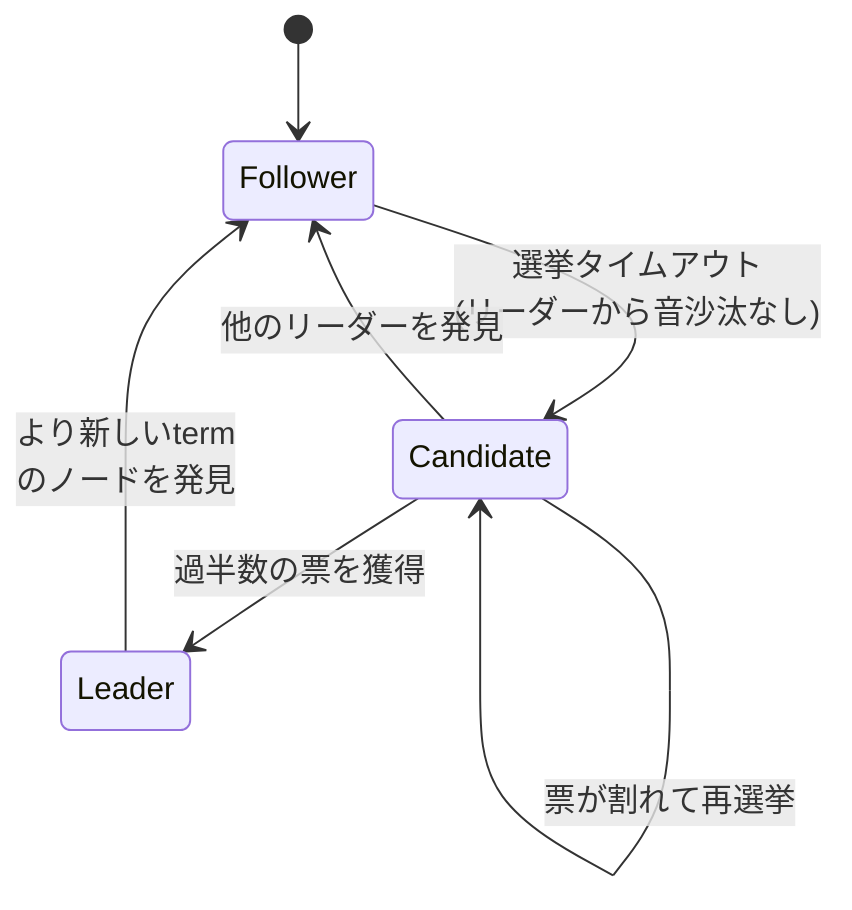

# Raft (合意アルゴリズム)

複製ログ（replicated log）を複数ノード間で一貫させるための合意（コンセンサス）アルゴリズム。StanfordのDiego OngaroとJohn Ousterhoutが設計し、USENIX ATC 2014の論文「In Search of an Understandable Consensus Algorithm」で発表された。 #distributed-systems

## 設計目標: 理解しやすさ

先行する[[paxos|Paxos]]と等価な結果を同等の効率で出せるが、構造がまったく異なる。Paxosが「難解で、実システムを作るには大きなギャップがある」とされてきたのに対し、Raftは**理解しやすさ**そのものを第一の設計目標にした。論文には2大学の学生43名にPaxosとRaftを両方教えたユーザースタディが載っており、33名がPaxosよりRaftの設問に良い成績を出した。

そのために問題を独立したサブ問題に分解している:

- **リーダー選出（leader election）** — 強いリーダーを1人選び、ログの書き込みをリーダー経由に一本化する
- **ログ複製（log replication）** — リーダーがクライアントの要求をログに追記し、フォロワーへ複製する
- **安全性（safety）** — コミット済みエントリが失われない・食い違わないことの保証

## ノードの状態遷移

## 採用例

[[etcd]]がRaftで一貫性を保っているのが代表例（つまり[[kubernetes|Kubernetes]]のクラスタ状態はRaftの上に載っている）。ほかにHashiCorpの[[consul|Consul]]やTiKV、[[cockroachdb|CockroachDB]]（MultiRaftとして拡張して採用）など、Go/Rust系の分散システムでの採用が多い。

## ビジュアルデモ

ノードの状態遷移やログ複製の様子をブラウザ上で動かして体感できるデモがいくつかある。

- [The Secret Lives of Data: Raft](https://thesecretlivesofdata.com/raft/) — 一番有名で完成度が高いインタラクティブデモ。リーダー選挙・ログレプリケーション・ネットワーク分断をボタン一つで再生でき、各ノードの状態(Follower/Candidate/Leader)がアニメーションで見える
- [Raft Visualization Demo (kanaka.github.io/raft.js)](https://kanaka.github.io/raft.js/) — タイムライン形式でクラスタの状態遷移を自由に眺められるデモ
- [RAFT Consensus Algorithm Visualizer (toolkit.whysonil.dev)](https://toolkit.whysonil.dev/tools/simulators/raft-consensus) — 障害耐性シナリオのシミュレートに強いツール
- [Raft Consensus Simulator (Observable)](https://observablehq.com/@stwind/raft-consensus-simulator) — Observableのノートブック形式のシミュレータ

## 出典

- [In Search of an Understandable Consensus Algorithm (Extended Version)](https://raft.github.io/raft.pdf)
- [In Search of an Understandable Consensus Algorithm - USENIX ATC 2014](https://www.usenix.org/conference/atc14/technical-sessions/presentation/ongaro)
- [The Raft Consensus Algorithm](https://raft.github.io/)
