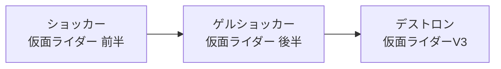

# 昭和仮面ライダーの悪の組織の系譜

#tokusatsu #kamen-rider

昭和の仮面ライダーシリーズでは作品ごとに敵の秘密結社が入れ替わるが、初期3組織は同一の首領が率いているという連続性がある。

- **ショッカー** — 『仮面ライダー』(1971年)の敵。ナチス残党という設定の、世界征服を目的とする秘密結社。第79話で壊滅。
- **ゲルショッカー** — ショッカー壊滅後、首領が再建した後継組織。『仮面ライダー』最終回で壊滅。
- **[[destron|デストロン]]** — ゲルショッカー壊滅後、同じ首領が結成。[[kamen-rider-v3|仮面ライダーV3]]の敵。

首領の正体は昭和シリーズの映像作品中では明かされずじまいで、各作品の最終回で骸骨や一つ目の怪物といった「姿」を見せてもなお正体は謎のまま、という引きが繰り返された。

## 岩石大首領による後付けの統合

その後のシリーズの敵組織(『X』のGOD、『アマゾン』のゲドン・ガランダー帝国、『ストロンガー』のブラックサタン・デルザー軍団)は表向き別組織だが、『仮面ライダーストロンガー』最終話で登場した岩石大首領が「ショッカーからデルザー軍団までを操っていた黒幕」であることが明かされ、昭和第1期シリーズの敵組織はすべて同一の大首領の支配下にあったと統合された。

## 出典

- [ショッカー首領 - Wikipedia](https://ja.wikipedia.org/wiki/%E3%82%B7%E3%83%A7%E3%83%83%E3%82%AB%E3%83%BC%E9%A6%96%E9%A0%98)
- [ショッカー - Wikipedia](https://ja.wikipedia.org/wiki/%E3%82%B7%E3%83%A7%E3%83%83%E3%82%AB%E3%83%BC)
- [ゲルショッカー - Wikipedia](https://ja.wikipedia.org/wiki/%E3%82%B2%E3%83%AB%E3%82%B7%E3%83%A7%E3%83%83%E3%82%AB%E3%83%BC)
