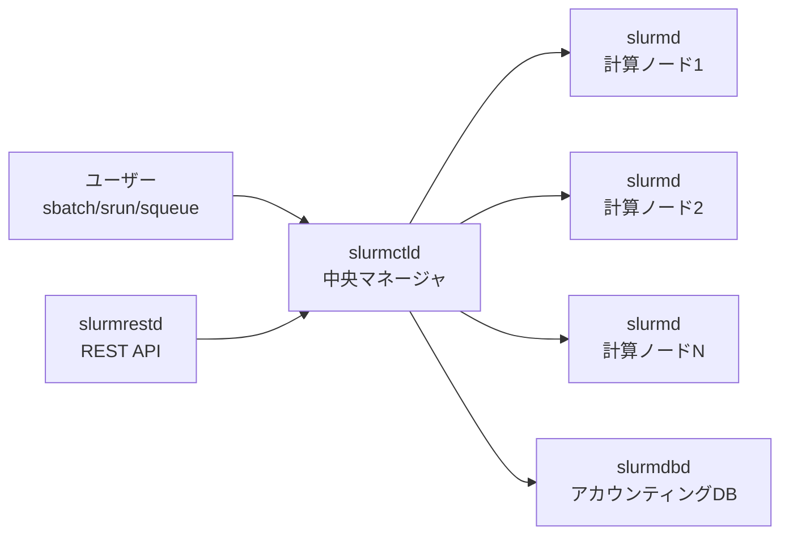

# Slurm

HPCクラスタ向けのオープンソースのジョブスケジューラ／リソースマネージャ。公式の説明は "an open source, fault-tolerant, and highly scalable cluster management and job scheduling system for large and small Linux clusters"。スパコンやGPUクラスタで「ログインノードにsshして`sbatch`でジョブを投げる」あの世界の標準。

## 役割

公式overviewによると主な機能は3つ。

1. ユーザーに計算資源（ノード）を一定時間、排他的/非排他的に割り当てる
2. 割り当てたノード上で並列ジョブ（典型的にはMPI）を起動・監視する枠組みを提供する
3. 資源の取り合いをキュー（待ち行列）で調停する

## 歴史

- 2002年、Lawrence Livermore National Laboratory (LLNL) 中心に最初のリリース。元は "Simple Linux Utility for Resource Management" の略で、プロプライエタリなQuadrics RMSに触発されたもの。今は「Slurm Workload Manager」と呼ばれ、略語扱いではない。
- 2010年、元の開発者たちがSchedMDを設立し、以後SchedMDが本家ソースをメンテ。
- ライセンスはGPLv2。C言語で書かれ、約100個のオプショナルなプラグインを持つモジュラー設計。
- 2021年11月時点でTOP500の約60%のシステムで使われている（Wikipedia）。
- 2025年12月15日、NVIDIAがSchedMDを買収したと発表。NVIDIAはSlurmをオープンソース・ベンダーニュートラルなソフトウェアとして開発・配布し続けるとしている。発表時点でTOP500のトップ10・トップ100のそれぞれ半数超で使われているとのこと。

## アーキテクチャ



- **slurmctld** — 中央のマネージャ。資源とジョブを監視・スケジュールする。バックアップを置ける。
- **slurmd** — 各計算ノードで動くデーモン。ジョブを実行し状態を報告する。
- **slurmdbd** — オプション。複数クラスタのアカウンティング情報をDBに記録する（`sacct`や fair share の元データ）。
- **slurmrestd** — オプション。REST APIでSlurmを操作するためのデーモン。

## 概念

- **node** — 計算資源の単位
- **partition** — ノードの論理グループ。実質ジョブキュー（例: `gpu`, `debug`, `long`）。パーティションごとに最大実行時間やアクセス権を設定する
- **job** — ユーザーに一定時間割り当てられた資源
- **job step** — ジョブ内で起動される並列タスクの集合（ジョブの中で`srun`するたびに1ステップ）

GPUなどは **GRES (generic resources)** として扱い、`--gres=gpu:2`や`--gpus=8`で要求する。

## 主なコマンド

| コマンド | 役割 |
|---|---|
| `sbatch` | バッチスクリプトを投入 |
| `srun` | ジョブ/ジョブステップを起動（対話的にも使う） |
| `salloc` | 資源だけ確保してシェルを得る |
| `squeue` | キュー中のジョブの状態 |
| `sinfo` | ノード・パーティションの状態 |
| `scancel` | ジョブのキャンセル |
| `sacct` | 終了したジョブを含む実行履歴（アカウンティング） |
| `scontrol` | 管理用。ジョブやノードの詳細表示・変更 |

## バッチスクリプトの例

`#SBATCH`コメントでオプションを書き、`sbatch job.sh`で投げる。

```sh
#!/bin/bash
#SBATCH --job-name=train
#SBATCH --partition=gpu
#SBATCH --nodes=2
#SBATCH --ntasks-per-node=8
#SBATCH --gres=gpu:8
#SBATCH --time=1-00:00:00      # days-hours:minutes:seconds
#SBATCH --output=logs/%j.out   # %j = ジョブID

srun python train.py
```

- `--array=0-99%10` — ジョブ配列。100個のタスクを同時最大10個で流す。各タスクでは`$SLURM_ARRAY_TASK_ID`が添字、出力名は`%A_%a`（配列ジョブID_添字）が使える。パラメータスイープの定番。
- `--dependency=afterok:<jobid>` — 指定ジョブが成功したら開始。前処理→学習→評価のようなパイプラインを組める。

## Kubernetesとの違い（感覚的なメモ）

[[kubernetes|Kubernetes]]（やその祖先の[[google-borg|Borg]]）が「常駐するサービスを望ましい状態に保つ」ことを主眼にしているのに対し、Slurmは「有限時間で終わるバッチジョブに、ノードをまとめて（MPIならギャングで）割り当てる」ことに特化している。`--time`で実行時間の上限を申告させるのも、それを使ってバックフィル（大きいジョブの待ち時間の隙間に短いジョブを詰める）をするためである。※この節は公式資料の対比ではなく自分の整理。

## 関連

- HPCクラスタでは、Slurmで割り当てたノード群から共有の並列ファイルシステム（[[lustre|Lustre]]など）を`/scratch`的にマウントして読み書きするのが典型構成。

## 出典

- [Slurm Workload Manager - Overview](https://slurm.schedmd.com/overview.html)
- [Slurm Workload Manager - sbatch](https://slurm.schedmd.com/sbatch.html)
- [Slurm Workload Manager - Wikipedia](https://en.wikipedia.org/wiki/Slurm_Workload_Manager)
- [NVIDIA Acquires Open-Source Workload Management Provider SchedMD | NVIDIA Blog](https://blogs.nvidia.com/blog/nvidia-acquires-schedmd)
- [What Does Nvidia's Acquisition of SchedMD Mean for Slurm? - HPCwire](https://www.hpcwire.com/2026/01/06/what-does-nvidias-acquisition-of-schedmd-mean-for-slurm/)

#hpc #scheduler #infrastructure
