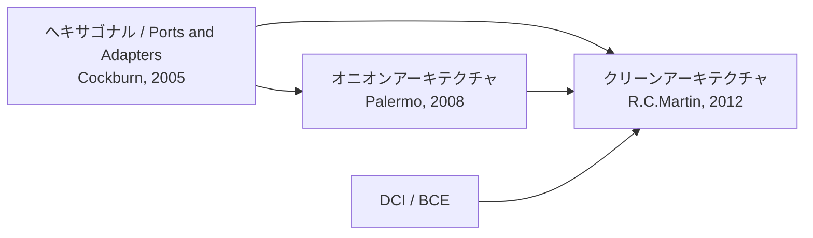

# アプリケーションアーキテクチャの様式

#software-engineering #architecture #moc

「業務ロジックを、UIやDBやフレームワークからどう引き剥がすか」という同じ問題に対する answers を並べたハブノート。歴史的には後発が先発を取り込む形で発展しており、[[clean-architecture|クリーンアーキテクチャ]]の原文自体が「これらは同じことを言っている」と明言している。

## 系譜

## 各様式

- **[[hexagonal-architecture|ヘキサゴナルアーキテクチャ（ポートとアダプタ）]]** — 「内と外」の非対称性だけを言う最小形。外部（UI・DB・テスト）を対等に扱い、目的単位で切ったポートに技術固有のアダプタを差す。内側の構造には踏み込まない。
- **[[onion-architecture|オニオンアーキテクチャ]]** — 内側をドメインモデル／ドメインサービス／アプリケーションサービスの同心円に割る。「データベースは中心ではない、外部である」が標語。
- **[[clean-architecture|クリーンアーキテクチャ]]** — 上記を統合し、内側をEntities（企業全体のルール）とUse Cases（アプリ固有のルール）に整理したうえで「依存は内向きのみ」という1本のルールにまとめたもの。

## 土台になっている原則

- **[[solid-principles|SOLID原則]]** — とくにD（依存性逆転の原則）が、上記3つすべての骨格。制御の流れを変えずにソースコード依存の向きだけを反転させる。
- **[[dependency-injection|依存性注入]]** — 内側で定義したインターフェースに外側の具象を差し込む、実行時の組み立て手段。原則（DIP）と実装手段（DI）は別物。

## 隣接するもの

- **[[domain-driven-design|DDD]]** — アーキテクチャの様式ではなく、中心に置く「ドメインモデル」の作り方の話。オニオン／クリーンとは補完関係で、組み合わせて語られることが多い。
- **[[microservices|マイクロサービス]]** — 分離の単位をプロセス／デプロイの境界にまで押し広げたもの。ヘキサゴナルの「目的で切る」発想が影響を与えたとされる。
- **[[architecture-decision-record|ADR]]** — 「どの様式をどこまで適用するか」自体が意思決定なので、記録の対象になる。過剰適用の批判（[[clean-architecture|クリーンアーキテクチャ]]の「批判・限界」節）を踏まえるなら、明文化しておく価値が高い。
