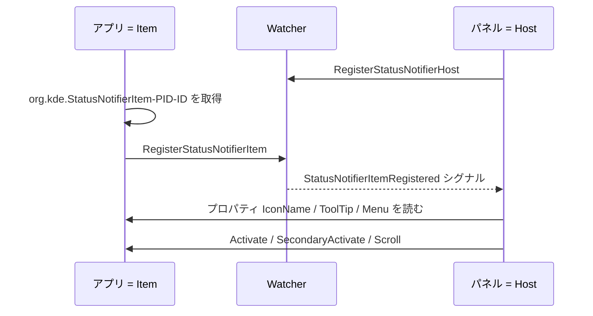

# StatusNotifierItem (SNI)

#linux #protocol #gui

Linuxデスクトップでトレイアイコン(インジケータ)を出すためのD-Busベースの規格。KDE発で、X11のウィンドウ埋め込みに依存する旧来のfreedesktop System Tray Protocol(XEmbed方式)の置き換えとして提案された。D-Bus越しに「モデル」を渡すだけなので、**Waylandでも動く**のが最大の違い。全体の位置づけは[[system-tray|システムトレイ / インジケータ]]を参照。

## 3つの役者

- **StatusNotifierItem** — アプリ側。D-Bus上に`org.kde.StatusNotifierItem`インターフェイスを公開し、`org.kde.StatusNotifierItem-<PID>-<連番>`というwell-knownな名前を持つ。
- **StatusNotifierWatcher** — 仲介役。サービス名`org.kde.StatusNotifierWatcher`、オブジェクトパス`/StatusNotifierWatcher`。ItemとHostの両方から登録を受け付ける。
- **StatusNotifierHost** — 表示側(パネル/シェル)。Watcherに登録し、Item一覧を受け取って描画する。

Watcherのインターフェイスは小さい。

| 種別 | 名前 |
| --- | --- |
| メソッド | `RegisterStatusNotifierItem(service)` / `RegisterStatusNotifierHost(service)` |
| プロパティ | `RegisteredStatusNotifierItems` / `IsStatusNotifierHostRegistered` / `ProtocolVersion` |
| シグナル | `StatusNotifierItemRegistered` / `...Unregistered` / `StatusNotifierHostRegistered` / `...Unregistered` |

## Itemが公開するもの

プロパティが本体で、Hostがこれを読んで自由に描画する(モデル/ビュー分離)。

| プロパティ | 用途 |
| --- | --- |
| `Category` / `Id` / `Title` | 分類と識別 |
| `Status` | `Passive` / `Active` / `NeedsAttention` |
| `IconName` / `IconPixmap` | アイコン。テーマ内の名前か、生のピクセルデータ |
| `IconThemePath` | 自前のアイコンを置いたディレクトリ |
| `OverlayIconName` / `OverlayIconPixmap` | 重ねる小さなバッジ |
| `AttentionIconName` / `AttentionIconPixmap` / `AttentionMovieName` | 注意喚起時の表示 |
| `ToolTip` | ツールチップ |
| `Menu` | メニューのオブジェクトパス |
| `ItemIsMenu` | クリックしたら即メニューを出すか |
| `WindowId` | 関連付けるウィンドウ(不要なら0) |

メソッドは4つ。

- `Activate(x, y)` — 主クリック
- `SecondaryActivate(x, y)` — 中クリック相当
- `Scroll(delta, orientation)` — ホイール
- `ContextMenu(x, y)` — アプリが自前で描いたメニューを出す(実装しないライブラリもある)

**メニューそのものはこの規格に含まれない。** `Menu`プロパティが指すのは`com.canonical.dbusmenu`という別インターフェイスのオブジェクトで、Ubuntu(Canonical)由来のDBusMenu規格に丸投げされている。

## 名前が`org.kde.`のまま

freedesktopのwikiに仕様が置かれているにもかかわらず、実装が実際に使うインターフェイス名は`org.freedesktop.StatusNotifierItem`ではなく**`org.kde.StatusNotifierItem`**。freedesktopへの提案は2009年に出されたが正式な標準として批准されておらず、KDEの名前空間のまま普及した。仕様文書と実装で型が食い違っている箇所すらある(`WindowId`は仕様上`u32`だが実装は`i32`)。

## 落とし穴

**Hostがいないと、登録に成功しても何も表示されない。** Watcherへの`RegisterStatusNotifierItem`が通っても、表示側が誰も登録していなければアイコンは出ない。デスクトップ環境の初期化が終わる前にアプリを起動すると起きる。[[system-tray|ksni]]はこれを`WontShow`という専用のエラーで区別しており、仕様はこの場合「旧来のFreedesktop System tray仕様にフォールバックすべき」としている。

**`ItemIsMenu`を効かせるには`Activate`でエラーを返す必要がある。** 「クリックで即メニュー」を実現する`ItemIsMenu`プロパティは、実装によっては見てもらえない。GNOMEのappindicator拡張とKDE Plasma 6.4未満は、`Activate`が`UnknownMethod`エラーを返したときに初めてメニュー表示にフォールバックする。ksniはこの互換ハックをコード内で明示的にやっている。Plasma 6.4以降は`ItemIsMenu`がtrueなら`Activate`を呼ばなくなったので、このハックを残したままでも問題ない。

**アイコンをピクセルで渡せても通らないことがある。** `IconPixmap`があるので理屈上は生データを渡せるが、`libappindicator`のような中間層は名前かファイルパスしか受け付けない。そのため[[system-tray|tray-icon]]は一時ディレクトリにPNGを書き出して`IconThemePath`経由で渡す、という回り道をしている。

## 出典

- [StatusNotifierItem - freedesktop.org wiki](https://www.freedesktop.org/wiki/Specifications/StatusNotifierItem/)
- [Proposing the StatusNotifier specification - xdg mailing list (2009-12)](https://lists.freedesktop.org/archives/xdg/2009-December/011179.html)
- [iovxw/ksni - GitHub](https://github.com/iovxw/ksni) — `src/dbus_interface.rs`、`src/lib.rs`、`src/service.rs`(インターフェイス定義と互換ハックの実物)
- [System Tray Protocol Specification (旧規格)](https://specifications.freedesktop.org/systemtray-spec/0.4/)
