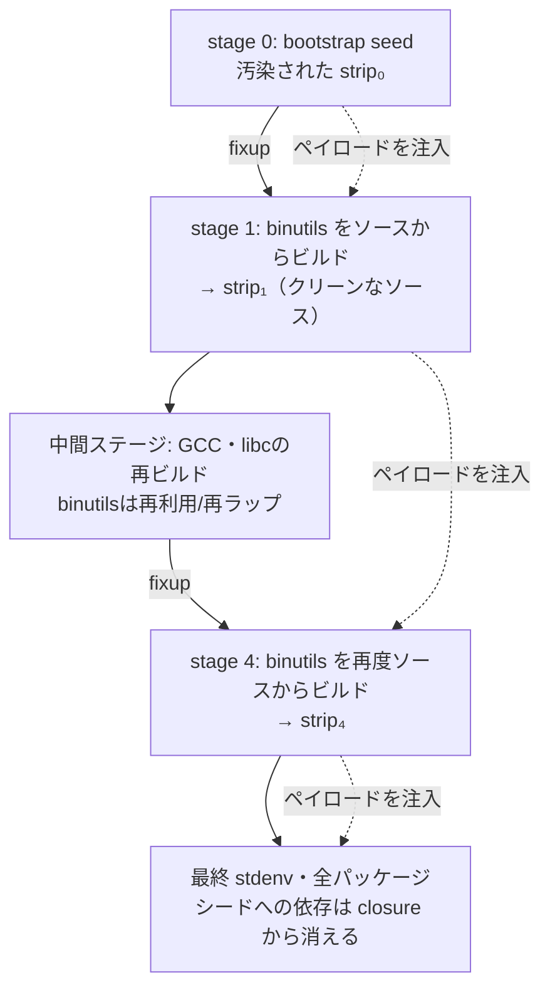

# stripを運び屋にしたtrusting trust攻撃

GNU binutilsの`strip`（ビルド成果物からシンボルを削るだけの、ソースを読みも書きもしないユーティリティ）に自己増殖するペイロードを仕込み、[[nixos|NixOS]]のブートストラップ全体を通して汚染を伝播させた研究。[[trusting-trust-attack]]がコンパイラ固有の脅威ではないことを、実ディストリビューションでのend-to-endな実装で示している。Julien Malka、Aman Sharma、Martin Monperrus、Stefano Zacchiroli、Théo Zimmermannによる2026年7月のarXivプレプリント。 #security #supply-chain-attack #nix #linux #elf

要点は「コンパイラを守っても足りない」。汚染された`strip`をシードに1つ置くだけで、クリーンなソースからビルドされたグラフィカルインストーラのバイナリ3,790個が、ビルド失敗ゼロのままバックドア入りになった。

## 脅威モデル

- 攻撃者はディストリビューションの**ブートストラップシード内の実行ファイルを1つだけ差し替えられる**。
- パッケージのレシピやソースは一切変更できない。

シード生成・公開システムの侵害、シードの更新PRの正規マージ、メンテナへのソーシャルエンジニアリングなどを想定している。

## なぜstripなのか — 自己増殖の3条件

論文は、あるビルドユーティリティが運び屋になれる条件を3つ挙げる。

- **C1**: そのユーティリティ自身をソースからビルドする前に、ブートストラップがそれを信用している（＝シードに入っている）。
- **C2**: 古い世代が、新しい世代の**バイナリ表現に書き込む**。
- **C3**: 書き換えられた後継が、後で同じ役割を引き継ぐ（**後継辺 / successor edge**）。

nixpkgsのgeneric builderは、全パッケージ共通の`fixup`フェーズで`strip`を走らせる。`strip`はシードに入っており（C1）、成果物バイナリに書き込む権限を常に持ち（C2）、`strip`自身の再ビルド時にもfixupが走る（C3）。3条件を全て満たす。

`gcc`との決定的な違いは射程で、gccが汚染できるのは自分がコンパイルする言語のプログラムだけなのに対し、`strip`は完成したELFを直接触るので**言語・ツールチェインを問わず**ディストリビューションの全出力に届く。

## nixpkgsブートストラップ上での伝播

nixpkgsはシードへの実行時依存を段階的に切るため、binutils（したがって`strip`）をstage 1とstage 4で2回ソースからビルドする。ところがビルド直後の`fixup`フェーズを回すのは**一つ前の世代の`strip`**なので、新しい`strip`は store に入る前に汚染される。最終stdenvではシードバイナリが依存クロージャから消えているのに、汚染だけが残る。

## ELFレベルの3つの変換

ソースには一切触れず、完成したELFファイルへの**加算的な**編集だけで実現している（既存のコードやデータは1バイトも書き換えない）。

- **Append** — ペイロードのバイト列をファイル末尾に追加する。この時点ではメモリにマップされないので実行に影響しない。
- **Repurpose** — ローダが実行に必要としない`PT_NOTE`プログラムヘッダを、追加したペイロードを指す`PT_LOAD`（実行可能セグメント）に付け替える。リンカがデフォルトで`.note.gnu.build-id`を吐くので、ツールチェインのバイナリには必ず余りの`PT_NOTE`がある。
- **Redirect** — ELFヘッダの`e_entry`をペイロード側へ向け、カーネルがそこから実行を始めるようにする。元の`e_entry`はペイロード内に埋め込んでおき、処理後にそこへジャンプする。

加えて、セクションテーブルから見ても整合していないとnixpkgsの後処理で追加コードが捨てられてしまうため、ペイロードを`.payload`セクションとして記述した**新しいセクションヘッダテーブル**をファイル末尾に作り、`e_shoff`をそちらへ向ける。元のテーブルはファイルに残るが到達不能になる。

## ペイロードの挙動

エントリポイントに寄生するので、言語ランタイムの初期化より前、`_start`よりも前に走る。何も前提にできないため、libcにもホストの動的シンボルにもリンクしない**freestanding**なコードとして書かれている。

1. カーネルが渡したレジスタを保存し、x86-64の呼び出し規約に合わせてスタックをアラインする。
2. `NIX_BUILD_TOP`環境変数を見てNixのビルドサンドボックス内かを判定し、**中では黙る**（ビルド中のテストを落とさないため）。外では悪意ある動作を行う。
3. 自分のbasenameを読み、`strip`として実行されているときだけ、引数のファイルにペイロードを注入する。
4. レジスタを復元し、ホスト本来のエントリポイントへジャンプする。

fork も exec もせずジャンプするだけなので、PID・ファイルディスクリプタ・シグナルコンテキスト・初期スタックがそのまま保たれる。プロトタイプの「悪意ある動作」は`You've been pwned!\n`を標準出力に書くだけだが、これは資格情報やトークンの窃取など任意の動作の置き換え可能なプレースホルダ。

## 評価結果

nixpkgs revision `fef9403a3e4d`（GNU binutils 2.44）、x86_64-linuxで、グラフィカルISOインストーラ（約2,000パッケージ）をビルドしている。

- **ビルド可能性**: ISOイメージが最後まで成功。汚染によるビルド失敗はゼロ。クロージャは1,199パッケージ出力・3,799個のユーザ実行可能ELF、合計6.16GB。
- **到達範囲**: 3,799個のうちCLIから起動できる3,791個を実行したところ、**3,790個が感染マーカーを表示**した。唯一の例外はfirefox 147.0.3で、レシピが`--disable-strip --disable-install-strip`を渡してstripフェーズを丸ごと無効化していたため。
- **言語非依存性**: C/C++（bash, git, sudo, curl）、Python（pydoc3.13, idle3.13）、Rust（rsvg-convert）、Go（captree）、Luaのバイナリが等しく感染した。
- **実行時の挙動**: NixOSのグラフィカルイメージ向け機能テストスイート（VMを起動してGNOME環境の実操作を行うもの）が全て通った。gnome-shell・mutter・nautilus・GNOMEコントロールセンターも全て汚染された`strip`によってビルドされている。

## 既存の対策がなぜ効かないか

- **再現可能ビルド** — 保証するのは決定性であってビルド環境の正直さではない。同じシードを使う限り、リビルドは同じ埋め込みをビット単位で再現するだけ。
- **DDC（diverse double-compiling）** — 多様化されるのはコンパイラであって`strip`ではないため、汚染されたユーティリティが比較の**両側**に居座り、差分が相殺されて消える。
- **bootstrappable builds** — Guixのfull-source bootstrapがシードを数百バイトまで縮めても、コンパイラだけをソースから積み上げてポストビルドユーティリティを再ビルドしないなら、運び屋は残る。
- **in-toto等のattestation** — 各ビルドステップが意図通り実行されたことを証明する枠組みだが、この攻撃ではレシピも依存記録もソースも無傷なので何も発火しない。

SolarWinds（SUNSPOTがビルド中にソースを書き換える）やxz/liblzmaのバックドア、npmのShai-Huludワームと比べても性質が違う、と論文は整理している。それらは悪意あるソースが依存クロージャの中に残っており、クリーンな再ビルドで修復される。この攻撃は悪意あるソースを一切持たず、シードがクロージャから消えた後も自己増殖し続ける。

## 他の運び屋の候補

サンドボックスビルドはPATHが空の状態から始まるため、ビルダーが素の名前で呼ぶコマンドはシードかシード由来のステージ産物に限られる。9つの標準フェーズが素の名前で呼ぶユーティリティ約40個をC1/C2/C3で評価した結果は以下。

| ユーティリティ | フェーズ | C1 シード | C2 バイナリを書く | C3 後継辺 |
| --- | --- | --- | --- | --- |
| `strip` | fixup | ✓ | ✓ | ✓ |
| `patchelf` | fixup | ✓ | ✓ | ✓ |
| `install`, `cp` | install | ✓ | ✓ | (✓) |
| `make` | build/install | ✓ | — | — |
| `sed`, `grep`, `patch` | patch/configure | ✓ | — | — |
| `tar`, `gzip`, `xz` | unpack/patch | ✓ | — | — |

`patchelf`も`strip`と同様にfixupで走り、新しくビルドされた`patchelf`のRPATHをstoreに入る前に書き換えるので、同じ後継辺を持つ。`install`/`cp`は`make install`経由でほぼ全パッケージのバイナリを書き込むが、後継辺の成立が個々のMakefileに依存するので「可能性が高い」止まり。

## 限界と、実際にはもっと見つけにくいという指摘

現状のインジェクタはリトルエンディアン・余りの`PT_NOTE`あり・`ET_EXEC`またはインタプリタ付き`ET_DYN`を前提としており、共有ライブラリや静的PIEは対象外。実装がそのまま他ディストリビューションに移るとも限らない（後継辺が build graph にあるかどうか次第）。

一方でプロトタイプは**わざと見つけやすく作られている**とも明言されている。感染マーカーの出力、`.payload`というセクション名、basenameチェックはいずれも実験用の計装であって伝播に必要な条件ではない。実際の攻撃者なら、全パッケージに広げず`strip`の将来世代にだけ潜伏させ、何年も後に最終目標に届いてから発火させる、という運用ができてしまう。

なお論文は、実装アーキテクチャとして**寄生型（parasite）**と**ラッパー型（wrapper）**を比較し、後者（本物のstripをバイト列として抱え込む別プログラムに置き換える）のほうが攻撃者の自由度は高いが、前者を採用したと述べている。本物の`strip`をそのまま残すので調べても`strip`に見え、挙動も本物をそのまま継承するので、ビルドを壊すリスクが小さいため。

## 出典

- [Trusting-Trust Attack against an Entire Linux Distribution through Binary Manipulation — arXiv:2607.24888](https://arxiv.org/abs/2607.24888)
