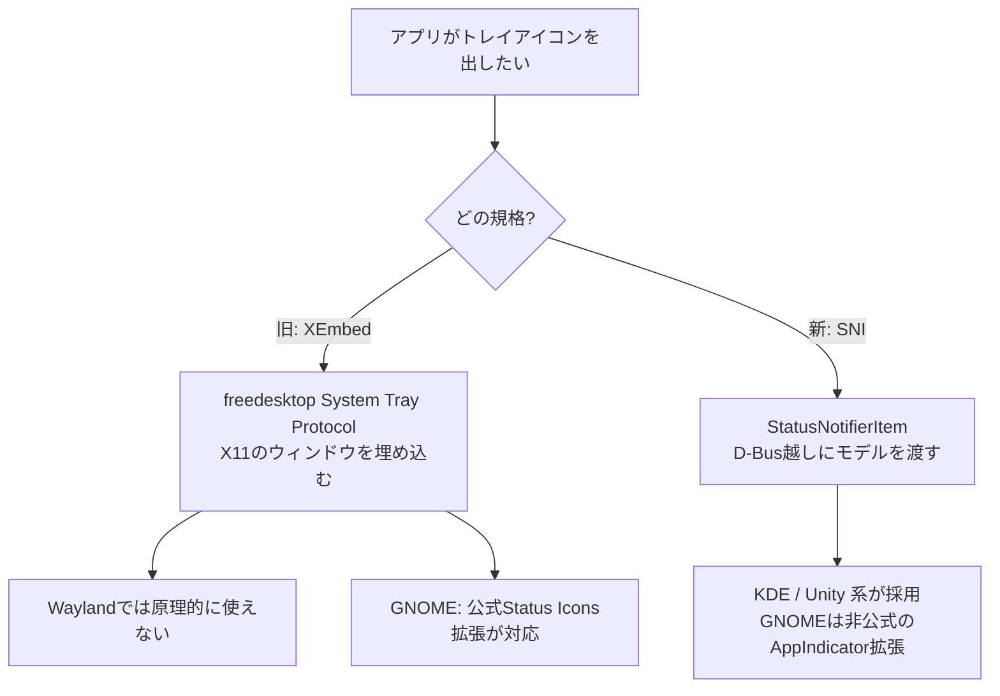

# システムトレイ / インジケータ

#gui #linux #macos

画面の隅に小さなアイコンを常駐させ、クリックでメニューを出したり状態を表示したりするUI。デスクトップアプリを3プラットフォームに出すとき、ウィンドウやメニューバー以上に実装が割れる部分。特にLinuxは「どの規格に乗るか」からして決まっていない。

## 呼び名が3つある

| プラットフォーム | 呼び名 | 場所 |
| --- | --- | --- |
| macOS | メニューバーエクストラ / ステータスアイテム | 画面上部メニューバーの右側 |
| Windows | 通知領域(notification area)、俗にシステムトレイ | タスクバー右端 |
| Linux | システムトレイ / インジケータ / ステータスアイコン | パネル(DEによる) |

「システムトレイ」はWindows由来の俗称がそのまま各所で使われている状態で、Microsoftの公式ドキュメントは "notification area" と呼ぶ。

## macOS

`NSStatusBar::systemStatusBar()`から`statusItemWithLength:`で`NSStatusItem`を1つもらい、それに`NSImage`と`NSMenu`を付ける、という単純な話。`NSStatusItem`を保持している間だけ表示され、解放すると消える。

Dockアイコンを出さずにメニューバーだけに常駐したい場合は、Info.plistの`LSUIElement`を`YES`にするか、実行時に activation policy を accessory にする。[[gpui-ce]]が`MacActivationPolicy::Accessory`を足しているのはこの用途。

このジャンルのアプリについては[[macos-menu-bar-utilities|macOSメニューバー常駐ユーティリティ]]を参照。

## Windows

`Shell_NotifyIcon`(Unicode版は`Shell_NotifyIconW`)に`NOTIFYICONDATA`を渡して`NIM_ADD` / `NIM_MODIFY` / `NIM_DELETE`する。アイコン・ツールチップ・コールバックメッセージのID・状態(`NIS_HIDDEN`など)を構造体で指定し、クリック等はウィンドウメッセージとして飛んでくる。

厄介なのは、**既定でオーバーフロー(「隠されているアイコンを表示します」)に入る**こと。ユーザーが明示的に出さない限りタスクバーに直接は出ない。「アイコンを出したのに見えない」の大半はこれ。

## Linuxが一番ややこしい

2つの規格が併存している。

- **XEmbed方式**(freedesktop の System Tray Protocol) — アプリ側がX11のウィンドウを作り、パネル側がそれを自分の中に埋め込む。X11の仕組みそのものなので**Waylandでは使えない**。
- **[[status-notifier-item|StatusNotifierItem (SNI)]]** — KDE発。D-Busでアプリがオブジェクトを公開し、`StatusNotifierWatcher`に登録する。表示はパネル側の裁量(モデル/ビュー分離)。メニューは`com.canonical.dbusmenu`で渡す。D-Busベースなので**Waylandでも動く**。freedesktopのwikiに置かれているが、正式な標準として批准されたわけではない。

GNOMEは3.26(2017年)で従来のトレイ表示を削除した。2024年に公式の「Status Icons」拡張(作者はFlorian Müllner)がGNOME Shell Extensionsパッケージに入ったが、**これはXEmbedのみ対応でAppIndicator/SNIには対応しない**。作者は「もっと良い標準が出てくれば対応するかもしれないが、AppIndicatorsはそれではない」と述べている。しかもこの拡張は既定で有効ではなく、ディストリが同梱するかどうかによる。SNIを使いたい場合はコミュニティ製の「AppIndicator and KStatusNotifierItem Support」拡張を入れることになる。

つまりLinuxでは、**規格を1つ選んでも全部のデスクトップ環境で出る保証がない**。SNIに乗るのが今の主流だが、素のGNOMEでは拡張なしには出ない。

## Rustでの実装

デファクトは[tray-icon](https://github.com/tauri-apps/tray-icon)([[tauri|Tauri]]チームが管理。メニュー側は同チームの[[muda]]が担当する)。3プラットフォームのバックエンドはこうなっている(v0.24.2のソースで確認)。

| プラットフォーム | 使っているもの |
| --- | --- |
| macOS | `NSStatusBar::systemStatusBar().statusItemWithLength()` |
| Windows | `Shell_NotifyIconW` + `NOTIFYICONDATAW` |
| Linux/BSD | `libappindicator`(または`libayatana-appindicator`)+ GTK3 |

Linux側の実装で目を引くのが**アイコンをメモリから渡せない**点。`libappindicator`はアイコンをテーマ内の名前かファイルパスでしか受け取らないので、tray-iconは一時ディレクトリにPNGを書き出し、その親ディレクトリを`set_icon_theme_path()`に、ファイルを`set_icon_full()`に渡している。アイコンを差し替えるたびに連番付きの新しいファイルを書く。

イベントループの制約も強い。Windowsではwin32のイベントループ、Linux/FreeBSDではGTKのイベントループが同一スレッドで回っている必要があり、macOSではメインスレッドでイベントループが回っている必要がある。自前のイベントループを持つGUIフレームワークに後付けする場合、ここが最初の障害になる。

もう一つの選択肢が[ksni](https://github.com/iovxw/ksni)。KDE/freedesktopの[[status-notifier-item|StatusNotifierItem仕様]]を**純Rust + D-Busで実装**していて、GTKにもlibappindicatorにも依存しない。`org.kde.StatusNotifierItem`と`com.canonical.dbusmenu`を自前で喋る。tray-iconのLinuxバックエンドをksniに置き換える提案([Issue #11293](https://github.com/tauri-apps/tauri/issues/11293))は出ているが、2026年9月時点では採用されていない。

crates.ioのダウンロード数(2026-09時点)。

| クレート | 最新 | total | recent |
| --- | --- | --- | --- |
| `tray-icon` | 0.24.2 | 27,243,206 | 11,788,630 |
| `libappindicator` | 0.9.0 | 23,581,746 | 9,182,780 |
| `ksni` | 0.3.6 | 1,351,007 | 456,267 |
| `tray-item` | 0.10.0 | 167,881 | 16,136 |

`tray-icon`と`libappindicator`の数字が近いのは、前者が後者を引いているため。

## GPUIには無い

[[gpui|GPUI]]本体にも、コミュニティフォークの[[gpui-ce]]にもトレイ対応は無い。`NSStatusBar`・`Shell_NotifyIcon`・`StatusNotifierItem`のいずれの実装も、2026年9月初旬時点でどちらのツリーにも見当たらない。

「Zed本体のスコープ外の機能はgpui-ceへ」という案内の文脈でトレイ対応が例に挙がる(GPUI Kitの[Discussion #1856](https://github.com/longbridge/gpui-component/discussions/1856)など)ため、gpui-ceにはあると思われがちだが、要望として挙がっただけで実装はされていない。

GPUIアプリにトレイを付けるなら`tray-icon`か`ksni`を別途組み合わせることになるが、上記のイベントループ制約とGPUI自身のイベントループの同居が課題になる。実際に噛み合うかは未検証。

同じく、macOS以外でOSのメニューバーを出す手段もGPUIには無い([[gpui-kit-cross-platform-menu|GPUI Kitでのクロスプラットフォームなメニュー]])。

## 出典

- [StatusNotifierItem - freedesktop.org wiki](https://www.freedesktop.org/wiki/Specifications/StatusNotifierItem/)
- [Notifications and the Notification Area - Win32 apps | Microsoft Learn](https://learn.microsoft.com/en-us/windows/win32/shell/notification-area)
- [NSStatusItem | Apple Developer Documentation](https://developer.apple.com/documentation/appkit/nsstatusitem)
- [NSStatusBar | Apple Developer Documentation](https://developer.apple.com/documentation/appkit/nsstatusbar)
- [GNOME Now Has an Official Extension for Legacy Tray Icons - OMG! Ubuntu](https://www.omgubuntu.co.uk/2024/08/gnome-official-status-icons-extension)
- [tauri-apps/tray-icon - GitHub](https://github.com/tauri-apps/tray-icon) — `src/platform_impl/{macos,windows,gtk}/mod.rs`、README
- [iovxw/ksni - GitHub](https://github.com/iovxw/ksni)
- [Use ksni crate for tray icons on Linux · tauri-apps/tauri Issue #11293](https://github.com/tauri-apps/tauri/issues/11293)
