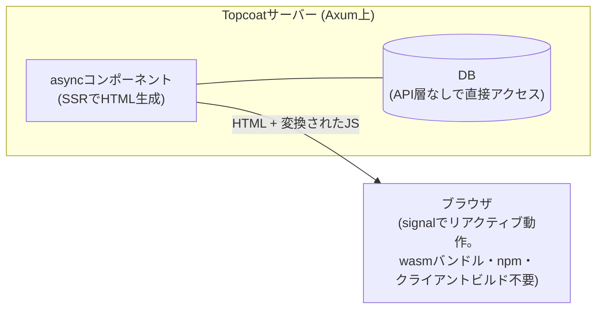

# Topcoat

Tokioチーム(tokio-rs)が2026年7月22日に発表した、Rust製の「バッテリー同梱」フルスタックWebフレームワーク。サーバーサイドレンダリング(SSR)中心で、バックエンド+フロントエンド+API層+ビルドパイプラインという「組み合わせ一式」を1つのRustプロジェクトで置き換えることを狙う。HTTPルータとしては内部でAxumを使っており、Axum/Actixの競合ではなくその上に載る層。早期実験段階で、破壊的変更ありと明言されている。 #rust #web

## 最大の特徴: RustからJSへのクロスコンパイル

LeptosやDioxusのようにWebAssemblyをブラウザに送るのではなく、**マクロで選択したRust式だけをJavaScriptに変換する**方式。

- Rustとして型チェックされる
- 初回レンダリングはサーバー側で評価される
- ブラウザ上ではJSとしてsignalベースでリアクティブに動く
- npm・frontend用ディレクトリ・クライアントビルド工程が不要で、最小構成なら1つのRustファイルからWebページを起動できる

## 設計思想

「locality of behavior」を掲げる。コンポーネントが自分のデータ取得・認証・メモ化を自己完結的に持つ構造で、人間の推論にもAI支援開発にも扱いやすくすることを意図している。コンポーネントはasyncで、API層を挟まず直接DBに問い合わせられる。

## 同梱物

- コンテンツハッシュ付きURLのアセットパイプライン
- Node.js不要のTailwind CSS組み込み、shadcn/ui風コンポーネントライブラリ
- セッション/クッキー管理、リクエスト単位のメモ化
- htmx / Fontsource / Iconify 連携

同じくtokio-rs製のasync ORM「Toasty」(2026年4月公開)との統合強化、バリデーション、メール機能がロードマップに載っている。

## 検証記事での評価

きっかけは[nwiizo氏によるTopcoat 0.5.0の検証記事](https://syu-m-5151.hatenablog.com/entry/2026/08/12/163644)。実際にアプリケーションを構築した上で、signal(ブラウザ側)・procedure(サーバー側検証)・shard(部分SSR)という実行場所の使い分けを整理しつつ、認証・パスワード管理・DBマイグレーションはアプリケーション側の責任として残ると限界を明確化していた。結論は「SSR中心の業務画面や小規模サービス向き、複雑なクライアント状態管理が必要なアプリには不向き」というもの。

なお、10年以上前にAdobeが公開していた同名のCSSライブラリ「Topcoat」があるが、無関係。

## 出典

- [Announcing Topcoat: a framework for building full-stack reactive web apps with Rust - Tokio公式ブログ](https://tokio.rs/blog/2026-07-22-announcing-topcoat)
- [tokio-rs/topcoat - GitHub](https://github.com/tokio-rs/topcoat)
- [topcoat - crates.io](https://crates.io/crates/topcoat)
- [Topcoat 0.5.0 検証記事 (syu-m-5151.hatenablog.com)](https://syu-m-5151.hatenablog.com/entry/2026/08/12/163644)
